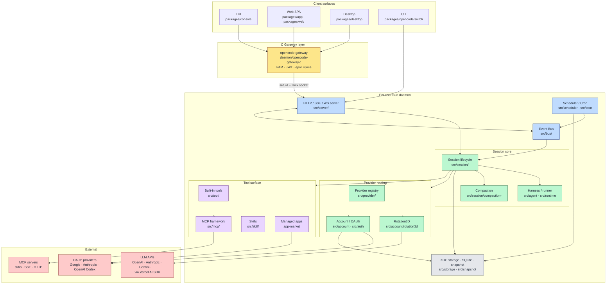
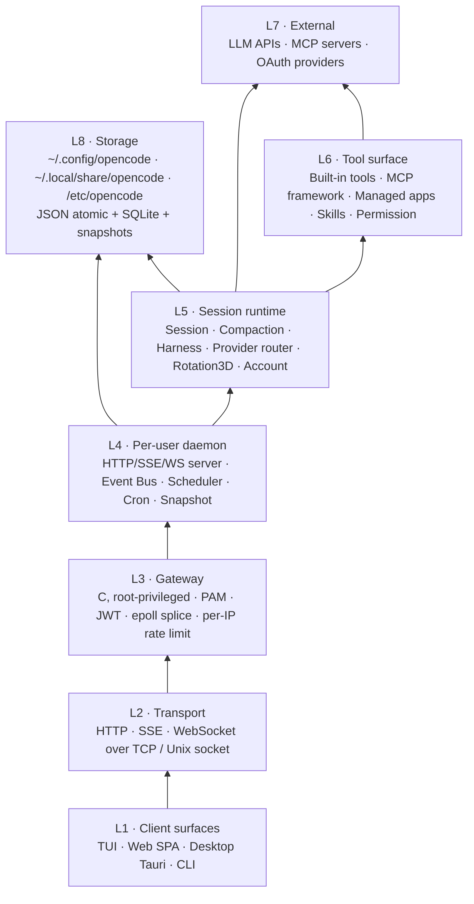
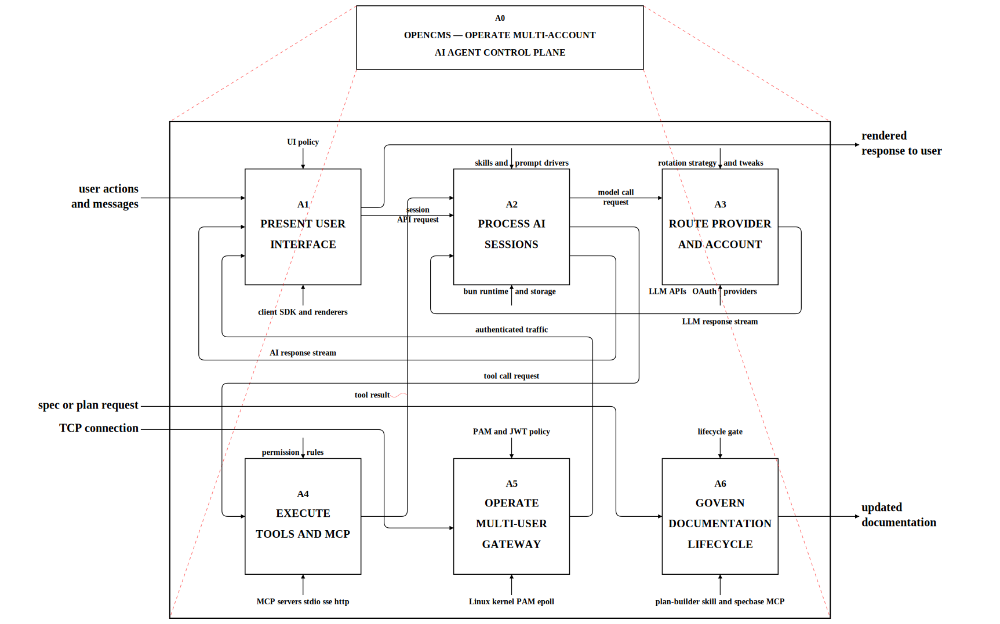
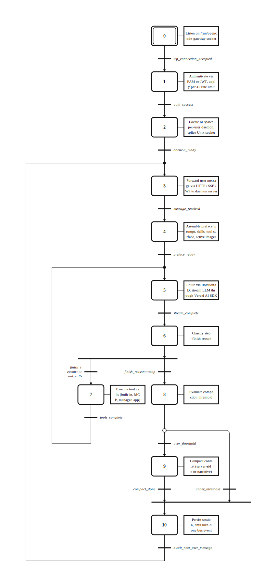

# OpenCMS

OpenCMS 是一套 **多帳號、多 Provider、多模型** 的 AI 編碼代理控制平面，將原本單機/單入口的 agent runtime 產品化為可持續操作的生產級系統。

---

## 系統架構

依 [miatdiagram](https://github.com/Raw1mage/drawmiat) 規範交付的雙視角架構圖：**block view** 描述子系統與資料流、**stack view** 描述分層依賴。每個子系統再展開為一個獨立的 IDEF0 / GRAFCET 章節（IEEE 1320.1 + IEC 60848），位於 [`specs/<chapter>/`](specs/)。

### Block view — 子系統與資料流



### Stack view — 分層依賴



### IDEF0 A0 — 系統上下文（formal MIAT view）

依 IEEE 1320.1 標準的 A0 上下文圖，將前述 mermaid block view 對映為六個子系統的功能活動 + ICOM（Input / Control / Output / Mechanism）箭頭。每個 A_n 對應若干個 chapter wiki。



| 活動 | 標題 | 對應 chapter |
|---|---|---|
| **A1** | Present User Interface | [`webapp/`](specs/webapp/README.md) |
| **A2** | Process AI Sessions | [`session/`](specs/session/README.md), [`compaction/`](specs/compaction/README.md), [`attachments/`](specs/attachments/README.md), [`harness/`](specs/harness/README.md) |
| **A3** | Route Provider And Account | [`provider/`](specs/provider/README.md), [`account/`](specs/account/README.md) |
| **A4** | Execute Tools And MCP | [`mcp/`](specs/mcp/README.md), [`app-market/`](specs/app-market/README.md) |
| **A5** | Operate Multi-User Gateway | [`daemon/`](specs/daemon/README.md) |
| **A6** | Govern Documentation Lifecycle | [`meta/`](specs/meta/README.md) |

### GRAFCET — 主流程（一輪使用者 turn 的執行時序）

依 IEC 60848 標準的 GRAFCET 圖，描述從 TCP 連線進入 → 認證 → daemon 找/spawn → session turn loop（preface → LLM stream → tool call 迴圈 → compaction → persist → 等下一輪）的離散事件演化。



每個 Step 帶 `ModuleRef` 指向上述 A0 IDEF0 的功能活動（A1-A5），維持兩標準之間的可追溯性。原始 JSON 與 SVG 位於 [`specs/diagrams/`](specs/diagrams/)，可由 drawmiat 重生。

### 子系統章節索引（per-chapter IDEF0 + GRAFCET）

每個 chapter 都是一個 **單一交付目的** 的 functional purpose，附 A0/A1.. 遞迴 IDEF0、配對 GRAFCET 與相關 sub-spec 包。

| 章節 | 交付目的 | 主要源碼 |
|---|---|---|
| [`account/`](specs/account/README.md) | 管理帳號身分與 OAuth token | `src/account · src/auth` |
| [`app-market/`](specs/app-market/README.md) | 統一三類安裝來源（mcp-server / managed-app / mcp-app） | `src/mcp · /admin` |
| [`attachments/`](specs/attachments/README.md) | 接收與生命週期管理檔案附件 | `src/incoming · src/file` |
| [`compaction/`](specs/compaction/README.md) | 在 token 預算內壓縮對話狀態 | `src/session/compaction*` |
| [`daemon/`](specs/daemon/README.md) | 透過本機 IPC 服務多使用者 session | `daemon/ · src/daemon · src/server` |
| [`harness/`](specs/harness/README.md) | 編排 plan 驅動的自主執行 | `src/agent · src/runtime · src/skill` |
| [`mcp/`](specs/mcp/README.md) | 統一 MCP 傳輸、manifest、idle unload | `src/mcp` |
| [`meta/`](specs/meta/README.md) | 治理 config / plan-builder / architecture 流程 | meta layer |
| [`provider/`](specs/provider/README.md) | 解析 provider 並路由 LLM 呼叫（含 Rotation3D） | `src/provider · src/account/rotation3d` |
| [`session/`](specs/session/README.md) | 執行一次使用者發起的 AI turn | `src/session · src/storage` |
| [`webapp/`](specs/webapp/README.md) | SolidJS SPA 與 Admin Panel 介面層 | `packages/app · packages/web` |

跨章節決策日誌與層級設計理由：[`specs/architecture.md`](specs/architecture.md)。

> 全域 `_archive/global-architecture/` 是 2026-04 之前一次性整體 reverse-engineering 的歷史快照，已被上述 per-chapter wiki 取代，僅作參照保留。

---

## 核心特色

### 多帳號控制平面

- 以 canonical provider key（`openai`、`claude-cli`、`gemini-cli`、`google-api` 等）統一管理帳號
- 帳號資料集中於 `~/.config/opencode/accounts.json`
- 三層架構：Storage → Auth Service → Presentation

### Rotation3D 多維輪替

- **Provider / Account / Model** 三維座標執行 fallback
- 在 rate limit、配額不足、模型不可用時，自動進行可預測的降級與切換
- 關鍵路徑：`packages/opencode/src/account/rotation3d.ts`

### 自主執行堆疊

- **Smart Runner Governor**：per-turn 決策引擎，bounded adoption + risk pause + replan
- **Workflow Runner**：continuation queue、blocker detection、supervisor lease
- **Dialog Trigger Framework**：確定性、rule-first 觸發偵測，非 AI-based
- **Planning Agent**：透過 `plan-builder` skill 規劃，結構化 todo + IDEF0/Grafcet companion artifacts

### MCP 整合

- 內建 MCP managed apps（Gmail、Google Calendar）
- 狀態機驅動的 app lifecycle
- Google OAuth 共享 token storage + scope merging

### Gateway-Daemon 架構與多使用者閘道

- C 語言 gateway（`daemon/opencode-gateway.c`），root-privileged，non-blocking epoll
- PAM 認證 + JWT session + per-IP rate limiting
- Per-user daemon 隔離（fork+setuid+execvp，Unix socket）
- 雙層責任分工：**Gateway 負責邊界**（接連線、認證、路由），**Daemon 負責執行**（每個 Linux user 一個 bun 程序，獨立 session/state）

### Gateway 作為應用平台 — registered webapps

OpenCMS 的 Gateway 不只代理自己的 Web App；任何本機 dev server 都可以**註冊到同一個 host 下的 `/prefix` 路徑**，馬上獲得統一的反向代理 + 認證 + UI 入口。對開發者的價值：**寫一個新功能不用自己接認證、不用搞 nginx、不用開新 port，立刻有界面可以調試**。

- **使用者宣告**：`~/.config/web_registry.json` 描述要掛載的應用（`entryName` / `publicBasePath` / `primaryPort` / `webctlPath` / `access: public|protected`）
- **路由表**：Gateway 維護的 `/etc/opencode/web_routes.conf` 由 `web-route` API 自動產生，longest-prefix match
- **認證一致**：`access: protected` 的應用直接走 Gateway 的 PAM/JWT 驗證；`public` 則無需登入
- **管理 API**：`packages/opencode/src/server/routes/web-route.ts` 提供註冊、移除、健康檢查（TCP-probe）
- 已掛載示例：`/cecelearn`、`/linebot`、`/lifecollection`、`/cisopro`、`/warroom`

> **Roadmap — Remote Gateway-Gateway 擴充**（構思中）：在多台機器之間以 gateway-to-gateway 串接，讓某一節點上註冊的 webapp 可被其他節點的 Gateway 透明代理，形成跨主機的 registered-app 網絡。設計細節待定。

---

## 使用方式

### 先決條件

- `git`、`curl`、`bun`（主要 runtime / package manager）
- Desktop（Tauri）另需 Rust toolchain + [Tauri 系統套件](https://v2.tauri.app/start/prerequisites/)

### 初始化

```bash
chmod +x ./install.sh
./install.sh              # 基本初始化
./install.sh --with-desktop --yes  # 含 Desktop 開發依賴
./install.sh --system-init         # Linux 系統級部署（systemd service）
```

### 推薦開發流程

```bash
# 1) 初始化
./webctl.sh install --dev --yes

# 2) 前端建置（首次或前端改動後）
./webctl.sh build-frontend

# 3) 啟動 Web App
./webctl.sh dev-start

# 4) 需要 TUI 時
bun run dev
```

### TUI 操作

```bash
bun run dev              # Standalone 模式（自帶 server）
bun run dev --attach     # Attach 模式（連到現有 daemon）
opencode attach http://localhost:4096  # 連到遠端 server
```

### Web App 操作

```bash
./webctl.sh dev-start    # 開發模式
./webctl.sh web-start    # Production systemd service
./webctl.sh status       # 查看狀態
./webctl.sh logs         # 查看日誌
./webctl.sh dev-refresh  # 熱重啟
./webctl.sh flush        # 清理 stale runtime process
```

### Desktop（Tauri）

```bash
./install.sh --with-desktop --yes
bun run --cwd packages/desktop tauri dev
```

### 驗證

```bash
bun install
bun run typecheck
bun test
```

---

## 核心設計原則

1. **身分解析 canonical**：所有 provider 身分以 canonical `providerKey` 為準
2. **禁止靜默 fallback**：失敗必須明確報錯，不可悄悄退回備用路徑
3. **Provider 組裝順序固定**：models.dev → config → env/auth → account overlays → plugins
4. **`disabled_providers` 為唯一可見性來源**
5. **Event Bus 優先**：禁止 setTimeout/polling loop 跨模組協調，改用 Bus.publish/subscribe
6. **Per-round tool 解析**：dirty-flag 延遲到下一輪，不在 mid-stream 打斷
7. **確定性控制**：Dialog triggers 是 rule-based，非 AI-governed

---

## 專案結構

```
packages/
├── opencode/          核心 runtime（session, provider, account, tool, mcp, server, bus, auth, cron）
├── app/               SolidJS Web 前端（Solid Start + Vite）
├── web/               Astro web templates
├── ui/                共用 UI 元件庫（Kobalte + Tailwind 4）
├── desktop/           Tauri 2.x 桌面 app
├── mcp/               內建 MCP servers（branch-cicd, gcp-grounding, system-manager）
├── opencode-claude-provider/   Claude AI SDK 整合
├── opencode-codex-provider/    Codex WebSocket + delta 整合
├── sdk/js/            JavaScript SDK
├── plugin/            Plugin 系統
├── util/              共用工具
├── script/            建置/腳本輔助
└── slack/             Slack 整合

daemon/                C Gateway（PAM auth, splice proxy）
specs/                 per-chapter 規格 wiki（IDEF0 + GRAFCET）
plans/                 活躍規劃套件
docs/                  延伸文件與事件記錄
config/                系統組態
scripts/               部署/建置腳本
templates/             XDG 部署模板
```

---

## 資料持久化路徑

| 路徑 | 用途 |
|------|------|
| `~/.config/opencode/accounts.json` | 帳號與 provider 設定 |
| `~/.config/opencode/managed-apps.json` | MCP app 安裝狀態 |
| `~/.config/opencode/gauth.json` | Google OAuth 共享 token |
| `~/.config/opencode/cron/jobs.json` | Scheduler job 持久化 |
| `/etc/opencode/opencode.cfg` | Gateway runtime 設定 |
| `/etc/opencode/google-bindings.json` | Google OAuth ↔ Linux user binding |
| `/run/opencode-gateway/jwt.key` | JWT secret（file-backed, 0600） |
| `$XDG_RUNTIME_DIR/opencode/daemon.json` | Per-user daemon discovery |
| `$XDG_RUNTIME_DIR/opencode/daemon.sock` | Per-user daemon Unix socket |

---

## 分支與整合策略

- `cms` 是本環境主要產品線
- 來自 `origin/dev` 或 `refs/*` 外部來源的變更，採 **分析後重構移植**，不可直接 merge
- 本 repo 已作為獨立產品線維護，預設不需要建立 PR
- `beta/*`、`test/*` 分支與其 worktree 僅作一次性實作/驗證用，完成後必須立即刪除

---

## 延伸文件

- [系統架構總覽](specs/architecture.md)
- [per-chapter 規格 wiki](specs/README.md)
- [事件記錄與運維文件](docs/)
- [專案開發指引（AGENTS.md）](AGENTS.md)
