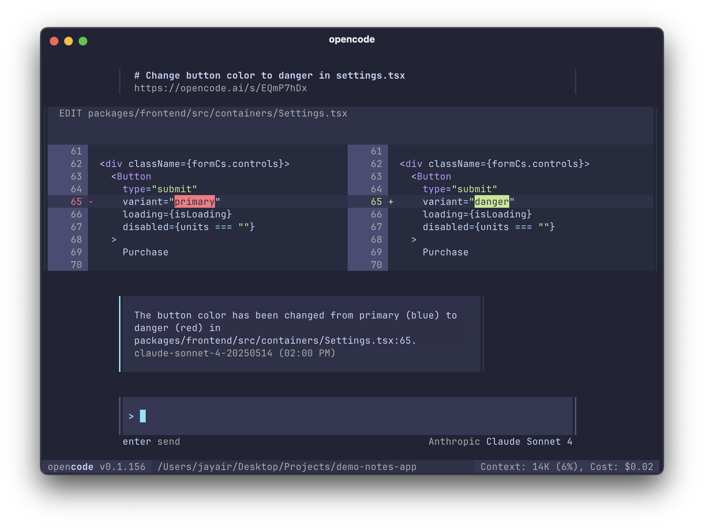

<p align="center">
  <a href="https://opencode.ai">
    <picture>
      <source srcset="packages/console/app/src/asset/logo-ornate-dark.svg" media="(prefers-color-scheme: dark)">
      <source srcset="packages/console/app/src/asset/logo-ornate-light.svg" media="(prefers-color-scheme: light)">
      
    </picture>
  </a>
</p>
<p align="center">開源的 AI Coding Agent。</p>
<p align="center">
  <a href="https://opencode.ai/discord"></a>
  <a href="https://www.npmjs.com/package/opencode-ai"></a>
  <a href="https://github.com/anomalyco/opencode/actions/workflows/publish.yml"></a>
</p>

<p align="center">
  <a href="README.md">English</a> |
  <a href="README.zh.md">简体中文</a> |
  <a href="README.zht.md">繁體中文</a> |
  <a href="README.ko.md">한국어</a> |
  <a href="README.de.md">Deutsch</a> |
  <a href="README.es.md">Español</a> |
  <a href="README.fr.md">Français</a> |
  <a href="README.it.md">Italiano</a> |
  <a href="README.da.md">Dansk</a> |
  <a href="README.ja.md">日本語</a> |
  <a href="README.pl.md">Polski</a> |
  <a href="README.ru.md">Русский</a> |
  <a href="README.ar.md">العربية</a> |
  <a href="README.no.md">Norsk</a> |
  <a href="README.br.md">Português (Brasil)</a>
</p>

[](https://opencode.ai)

---

### 安裝

```bash
# 直接安裝 (YOLO)
curl -fsSL https://opencode.ai/install | bash

# 套件管理員
npm i -g opencode-ai@latest        # 也可使用 bun/pnpm/yarn
scoop install opencode             # Windows
choco install opencode             # Windows
brew install anomalyco/tap/opencode # macOS 與 Linux（推薦，始終保持最新）
brew install opencode              # macOS 與 Linux（官方 brew formula，更新頻率較低）
paru -S opencode-bin               # Arch Linux
mise use -g opencode               # 任何作業系統
nix run nixpkgs#opencode           # 或使用 github:anomalyco/opencode 以取得最新開發分支
```

> [!TIP]
> 安裝前請先移除 0.1.x 以前的舊版本。

### 桌面應用程式 (BETA)

OpenCode 也提供桌面版應用程式。您可以直接從 [發佈頁面 (releases page)](https://github.com/anomalyco/opencode/releases) 或 [opencode.ai/download](https://opencode.ai/download) 下載。

| 平台                  | 下載連結                              |
| --------------------- | ------------------------------------- |
| macOS (Apple Silicon) | `opencode-desktop-darwin-aarch64.dmg` |
| macOS (Intel)         | `opencode-desktop-darwin-x64.dmg`     |
| Windows               | `opencode-desktop-windows-x64.exe`    |
| Linux                 | `.deb`, `.rpm`, 或 AppImage           |

```bash
# macOS (Homebrew Cask)
brew install --cask opencode-desktop
# Windows (Scoop)
scoop bucket add extras; scoop install extras/opencode-desktop
```

#### 安裝目錄

安裝腳本會依據以下優先順序決定安裝路徑：

1. `$OPENCODE_INSTALL_DIR` - 自定義安裝目錄
2. `$XDG_BIN_HOME` 或 `$XDG_BIN_DIR` - 符合 XDG 基礎目錄規範的路徑
3. `$HOME/.local/bin` - Unix 系統的預設路徑
4. `$LOCALAPPDATA/bin` - Windows 系統的預設路徑

```bash
# 範例
# 安裝至系統全域目錄 (需要 sudo)
OPENCODE_INSTALL_DIR=/usr/local/bin curl -fsSL https://opencode.ai/install | bash

# 安裝至符合 XDG 規範的目錄
XDG_BIN_HOME=$HOME/.local/bin curl -fsSL https://opencode.ai/install | bash
```

<!-- @event_2026-02-06_xdg-install -->

### 原始碼編譯與安裝

使用原始碼編譯後可透過 Bun 一次完成建置與安裝：

```bash
bun run install
```

此命令會：

1. 執行 `bun run build --single --skip-install`，為當前作業系統與架構產生原生執行檔。
2. 將對應的 `dist/opencode-<platform>-<arch>/bin/opencode` 拷貝進上方指定的安裝目錄（預設為 `~/.local/bin`）。
3. 設定可執行權限，若安裝目錄需要 root 權限會顯式提示您使用 `sudo` 重新執行。
4. **清理與初始化 XDG 目錄**：
   - 依 `templates/manifest.json` 的 `target`（config/state/data）初始化設定檔。
   - 自動將 legacy `~/.opencode/` 與 XDG 目錄內非必要雜物移至 `~/.local/state/opencode/cyclebin/`。
   - 補齊必要的預設設定檔（僅在目標檔案不存在時寫入），包括帳號、認證、模型忽略清單、AGENTS 規範等。

#### XDG 配置說明

根據 `templates/manifest.json`，以下是 XDG 目錄結構與關鍵檔案：

| 位置                      | 檔案/資料夾                      | 用途描述                                             | 備註             |
| :------------------------ | :------------------------------- | :--------------------------------------------------- | :--------------- |
| `~/.config/opencode`      | `accounts.json`                  | 主要帳號資訊、權杖 (Tokens) 與配額狀態。             | **敏感檔案**     |
| `~/.config/opencode`      | `mcp-auth.json`                  | MCP 伺服器連線憑證。                                 | **敏感檔案**     |
| `~/.config/opencode`      | `opencode.json`                  | 全域使用者設定檔（Provider、Keybinds、Plugins 等）。 |                  |
| `~/.config/opencode`      | `AGENTS.md`                      | 定義 AI Agent 的全域指令與行為規範。                 |                  |
| `~/.config/opencode`      | `CONFIG-README.md`               | 設定檔說明與範例。                                   |                  |
| `~/.local/state/opencode` | `ignored-models.json`            | 模型選擇或自動輪詢中應忽略的模型清單。               |                  |
| `~/.local/state/opencode` | `cyclebin/`                      | 安裝程序清理出的過時或不明檔案。                     | **Runtime 產生** |
| `~/.local/share/opencode` | `package.json` / `node_modules/` | 自定義工具或插件安裝位置。                           |                  |
| `~/.local/share/opencode` | `generated-images/`              | 生成圖片輸出。                                       | **Runtime 產生** |
| `~/.local/share/opencode` | `log/`                           | 系統執行軌跡與錯誤診斷資訊。                         | **Runtime 產生** |

如需覆寫安裝路徑，請事先設定 `OPENCODE_INSTALL_DIR` 或 `XDG_BIN_HOME`，安裝腳本會依照優先順序決定安裝位置。

### Agents

OpenCode 內建了兩種 Agent，您可以使用 `Tab` 鍵快速切換。

- **build** - 預設模式，具備完整權限的 Agent，適用於開發工作。
- **plan** - 唯讀模式，適用於程式碼分析與探索。
  - 預設禁止修改檔案。
  - 執行 bash 指令前會詢問權限。
  - 非常適合用來探索陌生的程式碼庫或規劃變更。

此外，OpenCode 還包含一個 **general** 子 Agent，用於處理複雜搜尋與多步驟任務。此 Agent 供系統內部使用，亦可透過在訊息中輸入 `@general` 來呼叫。

了解更多關於 [Agents](https://opencode.ai/docs/agents) 的資訊。

### 線上文件

關於如何設定 OpenCode 的詳細資訊，請參閱我們的 [**官方文件**](https://opencode.ai/docs)。

### 參與貢獻

如果您有興趣參與 OpenCode 的開發，請在提交 Pull Request 前先閱讀我們的 [貢獻指南 (Contributing Docs)](./CONTRIBUTING.md)。

### 基於 OpenCode 進行開發

如果您正在開發與 OpenCode 相關的專案，並在名稱中使用了 "opencode"（例如 "opencode-dashboard" 或 "opencode-mobile"），請在您的 README 中加入聲明，說明該專案並非由 OpenCode 團隊開發，且與我們沒有任何隸屬關係。

### 常見問題 (FAQ)

#### 這跟 Claude Code 有什麼不同？

在功能面上與 Claude Code 非常相似。以下是關鍵差異：

- 100% 開源。
- 不綁定特定的服務提供商。雖然我們推薦使用透過 [OpenCode Zen](https://opencode.ai/zen) 提供的模型，但 OpenCode 也可搭配 Claude, OpenAI, Google 甚至本地模型使用。隨著模型不斷演進，彼此間的差距會縮小且價格會下降，因此具備「不限廠商 (provider-agnostic)」的特性至關重要。
- 內建 LSP (語言伺服器協定) 支援。
- 專注於終端機介面 (TUI)。OpenCode 由 Neovim 愛好者與 [terminal.shop](https://terminal.shop) 的創作者打造。我們將不斷挑戰終端機介面的極限。
- 客戶端/伺服器架構 (Client/Server Architecture)。這讓 OpenCode 能夠在您的電腦上運行的同時，由行動裝置進行遠端操控。這意味著 TUI 前端只是眾多可能的客戶端之一。

---

**加入我們的社群** [Discord](https://discord.gg/opencode) | [X.com](https://x.com/opencode)
