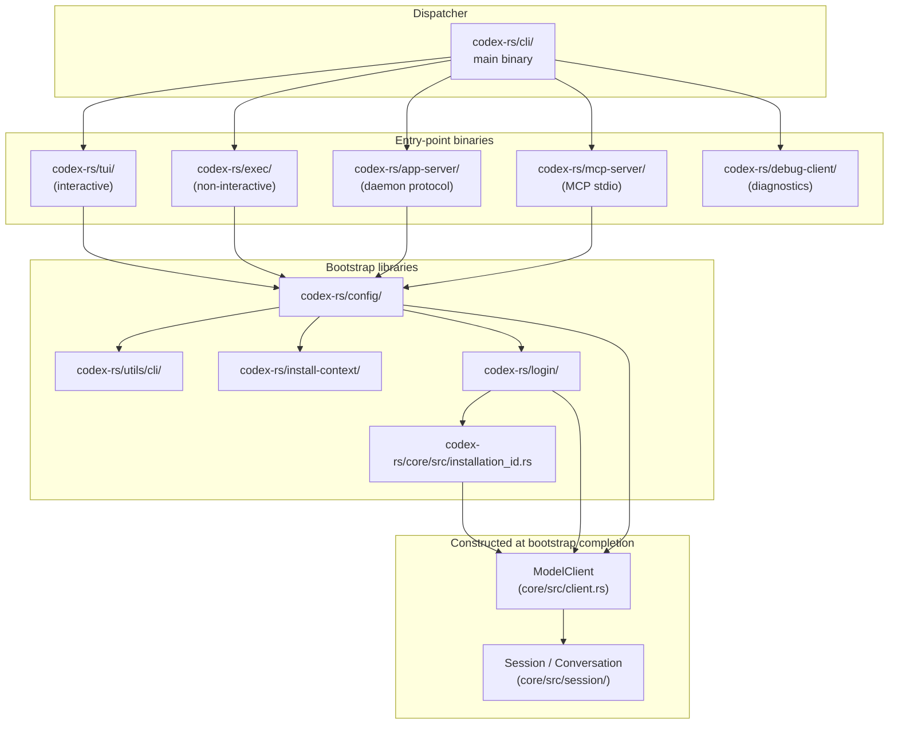

# Chapter 01: Entry Points & Process Bootstrap

> Status: **audited (2026-05-11)** | refs/codex SHA `76845d716b` | 12 claims / 12 anchors / 0 open questions

## Scope

Covers how a codex process starts, parses CLI arguments, loads config, resolves auth, and constructs the `ModelClient` that subsequent chapters operate on. Five entry-point binaries fall under this chapter — `tui`, `exec`, `app-server`, `mcp-server`, plus the unified `cli` dispatcher in `codex-rs/cli/`. Auth + identity resolution is **touched** here (to establish where in the bootstrap order it sits) but **detailed in Chapter 02**. Session/turn lifecycle is **deferred to Chapter 03**.

## Module architecture



Stack view (process invocation → first turn ready):

```
┌─────────────────────────────────────────────┐
│ user / shell                                │
├─────────────────────────────────────────────┤
│ codex-rs/cli  (dispatcher, argv[0])         │ ← arg0_dispatch routing → per-binary main
├─────────────────────────────────────────────┤
│ tui / exec / app-server / mcp-server / ...  │ ← pub async fn run_main(cli, arg0_paths, …)
├─────────────────────────────────────────────┤
│ codex_utils_cli + config + install_context  │ ← CliConfigOverrides → Config struct
├─────────────────────────────────────────────┤
│ login (oauth + api key) + installation_id   │ ← AuthManager + per-install UUID file
├─────────────────────────────────────────────┤
│ core: ModelClient::new                      │ ← 11 stable-per-session params → ModelClientState
├─────────────────────────────────────────────┤
│ core/session: Session::new                  │ ← session_id / thread_id / Turn state init
└─────────────────────────────────────────────┘
                  │ (Chapter 03 onward)
                  ▼
            first turn dispatched
```

## IDEF0 decomposition

See [`idef0.01.json`](idef0.01.json). Activities A1.1–A1.6 cover argv-parse / auth / installation_id resolve / ModelClient construct / Session construct / per-binary main loop. ICOM per activity in the JSON.

## GRAFCET workflow

See [`grafcet.01.json`](grafcet.01.json). Steps S0–S7 happy path, S9 error sink. Every transition guarded by an explicit success/fail condition; error sink propagates without silent fallback.

## Controls & Mechanisms

Each A1.* activity has ≤ 3 mechanisms; ICOM cells in the IDEF0 are sufficient. No separate diagram needed.

## Protocol datasheet

This chapter is **partial wire-touching**. The bootstrap itself does NOT emit any Responses API requests — that begins after Session::new completes (Chapter 03). The on-disk artifacts read/written during bootstrap (`config.toml`, `auth.json`, `installation_id`) are persisted-file formats; their datasheets belong to Chapter 02 (Auth & Identity) which owns those file formats end-to-end.

→ **N/A for Chapter 01.** See Chapter 02 datasheets `D2-1 auth.json`, `D2-2 installation_id`.

## Claims & anchors

| Claim | Anchor | Kind |
|---|---|---|
| **C1**: codex ships multiple entry-point binaries — `cli` (unified dispatcher), `tui`, `exec`, `app-server`, `mcp-server`, plus auxiliary (`responses-api-proxy`, `cloud-tasks`, `execpolicy`). The `cli` binary fronts them. | [`refs/codex/codex-rs/cli/src/main.rs:1`](refs/codex/codex-rs/cli/src/main.rs#L1) | use-import block (compiled) |
| **C2**: All entry-point binaries dispatch through `arg0_dispatch_or_else` from the `arg0` crate, enabling one physical binary to serve multiple subcommands keyed off `argv[0]`. | [`refs/codex/codex-rs/app-server/src/main.rs:51`](refs/codex/codex-rs/app-server/src/main.rs#L51) | fn call |
| **C3**: Each binary exposes a public async entry `run_main(cli, arg0_paths, …)`. TUI variant takes additional `loader_overrides`, `remote`, `remote_auth_token`; exec variant takes only `cli, arg0_paths`. | [`refs/codex/codex-rs/tui/src/lib.rs:709`](refs/codex/codex-rs/tui/src/lib.rs#L709) | fn signature |
| **C4**: `ModelClient::new` is the session-scoped constructor; its 11 parameters are documented as "expected to be stable for the lifetime of a Codex session". Per-turn values are passed separately to `ModelClientSession::stream(...)`. | [`refs/codex/codex-rs/core/src/client.rs:311`](refs/codex/codex-rs/core/src/client.rs#L311) | fn + doc comment |
| **C5**: `installation_id` enters `ModelClient::new` as a pre-resolved `String` — confirms it MUST be resolved by an earlier bootstrap step before construction. | [`refs/codex/codex-rs/core/src/client.rs:315`](refs/codex/codex-rs/core/src/client.rs#L315) | param type |
| **C6**: The session-stable state lives in `ModelClientState` struct: `session_id`, `thread_id`, `window_generation` (AtomicU64), `installation_id`, provider, auth telemetry, session_source, attestation, etc. Identity dimensions are co-located in this single type. | [`refs/codex/codex-rs/core/src/client.rs:164`](refs/codex/codex-rs/core/src/client.rs#L164) | **struct (TYPE)** |
| **C7**: Bootstrap finishes without any network I/O. `ModelClient::new_session()` doc comment: "This constructor does not perform network I/O itself; the session opens a websocket lazily when the first stream request is issued." | [`refs/codex/codex-rs/core/src/client.rs:357`](refs/codex/codex-rs/core/src/client.rs#L357) | fn + doc comment |
| **C8**: `resolve_installation_id(codex_home)` is the canonical resolver — opens `$CODEX_HOME/installation_id` with read+write+create, advisory file-lock, mode 0o644; reads existing UUID v4 or generates a fresh `Uuid::new_v4()` and persists it. | [`refs/codex/codex-rs/core/src/installation_id.rs:19`](refs/codex/codex-rs/core/src/installation_id.rs#L19) | fn |
| **C9**: The file format invariants (UUID v4, file contents == returned UUID, mode 0o644) are pinned by an executed `tokio::test`. | [`refs/codex/codex-rs/core/src/installation_id.rs:79`](refs/codex/codex-rs/core/src/installation_id.rs#L79) | **test (TEST)** |
| **C10**: `resolve_installation_id` is called in bootstrap across multiple entry-point flavours: `mcp-server`, `thread-manager-sample`, `memories/write/runtime`, `core/prompt_debug`. Canonical pre-ModelClient step. | [`refs/codex/codex-rs/mcp-server/src/lib.rs:118`](refs/codex/codex-rs/mcp-server/src/lib.rs#L118) | fn call |
| **C11**: `app-server` binary supports five transport endpoints via `--listen`: `stdio://` (default), `unix://`, `unix://PATH`, `ws://IP:PORT`, `off`. Enumerated in `AppServerArgs.listen` doc-comment + `AppServerTransport` type. | [`refs/codex/codex-rs/app-server/src/main.rs:23`](refs/codex/codex-rs/app-server/src/main.rs#L23) | **struct (TYPE)** + doc comment |
| **C12**: `app-server` binary defaults `--session-source` to `"vscode"`, parsed via `SessionSource::from_startup_arg`. The chosen `SessionSource` is propagated to `ModelClient::new` (matches C4 param 6). Each entry binary names its own default identity surface. | [`refs/codex/codex-rs/app-server/src/main.rs:32`](refs/codex/codex-rs/app-server/src/main.rs#L32) | struct field + value_parser |

Anchor totals: 12 claims, 12 anchors. TEST/TYPE diversity: **2 TYPE anchors (C6 struct, C11 struct) + 1 TEST anchor (C9 tokio::test)** — exceeds the ≥1 TEST-or-TYPE requirement from §10 of SKILL.md.

## Open questions

None for Chapter 01. The bootstrap path is mechanically explicit in the source; ambiguity is deferred to Chapter 02 (where auth + identity files have richer state machines) and Chapter 03 (where Session::new internals live).

## OpenCode delta map

For each A1.* activity, what OpenCode currently does in its codex-provider bootstrap path:

- **A1.1 Parse argv + load config** — OpenCode is not a codex-CLI clone; the "entry-point bootstrap" responsibility is split between the opencode daemon (`packages/opencode/src/global/index.ts`) and the codex auth plugin (`packages/opencode/src/plugin/codex-auth.ts`). Config is loaded once per daemon process, not per codex turn. **Aligned**: yes (functionally equivalent — both load before constructing a client). **Drift**: codex-cli has a strict bootstrap order per-binary; OpenCode amortises bootstrap across the daemon lifetime, with per-provider lazy loaders firing on first use.
- **A1.2 Resolve auth** — OpenCode uses the auth-plugin `loader(getAuth, provider, accountRecordId)` pattern; OAuth token state lives in `~/.config/opencode/accounts.json` (multi-account) rather than `~/.codex/auth.json` (single account). **Aligned**: partial. **Drift**: per-account credential rotation, multi-account state — captured in `specs/provider/codex-installation-id/` DD-1/DD-2 + sibling `provider_codex-prompt-realign/`.
- **A1.3 Resolve / generate installation_id** — OpenCode now does this via `resolveCodexInstallationId()` ([packages/opencode/src/plugin/codex-installation-id.ts](packages/opencode/src/plugin/codex-installation-id.ts)) called once at codex-auth loader bootstrap, persisted at `${OPENCODE_DATA_HOME}/codex-installation-id`. **Aligned**: yes (post `specs/provider/codex-installation-id/` graduation, commit `9096e69a0`). **Drift**: file path differs (`~/.config/opencode/` vs `~/.codex/`) — operator can symlink to share identity across the two CLIs.
- **A1.4 Construct ModelClient** — OpenCode does NOT construct a `ModelClient` object equivalent. Instead, per-turn `createCodex({ credentials, installationId, … })` from `@opencode-ai/codex-provider` is called in `getModel(...)` at [packages/opencode/src/plugin/codex-auth.ts:303](packages/opencode/src/plugin/codex-auth.ts#L303). **Aligned**: no — OpenCode lacks the upstream's session-stable `ModelClientState` co-location. **Drift**: identity dimensions (session_id, thread_id, window_generation, installation_id) are passed per-call rather than held in a session-scoped state struct. Tracked implicitly through provider options; risk surface for future drift. **Consumer**: this is the topic the **session/turn-lifecycle chapter (Chapter 03)** will fully unpack — Chapter 01 only flags the architectural divergence.
- **A1.5 Construct Session** — OpenCode session lifecycle lives in `packages/opencode/src/session/`; not a 1:1 mirror of upstream's `Session::new`. Deferred to Chapter 03 delta map.
- **A1.6 Per-binary main loop** — OpenCode has one daemon process (`opencode-runtime`) that multiplexes all provider work over its own HTTP / SSE / WS server; codex-cli has per-binary main loops. **Aligned**: no — fundamentally different process model. **Drift**: not a regression target; documented for context. OpenCode's gateway architecture is intentionally different and lives outside this spec.

Activities A1.4 and A1.5 are the most consequential drift sites. They feed into Chapter 03 (Session & Turn Lifecycle), which inherits this delta map as its starting point.
