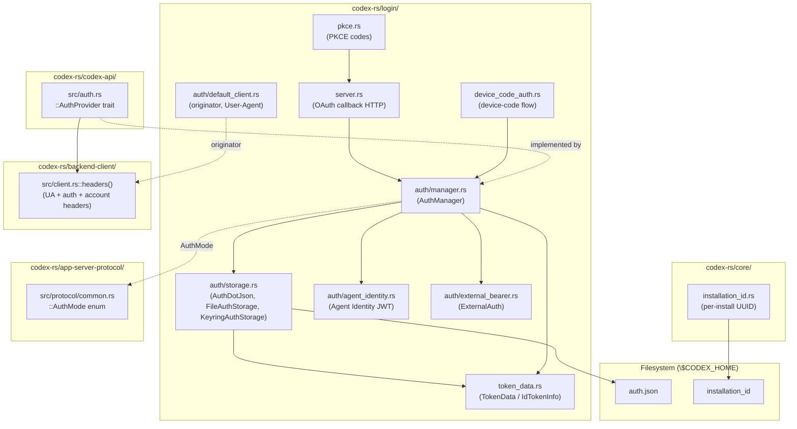

# Chapter 02: Auth & Identity

> Status: **audited (2026-05-11)** | refs/codex SHA `76845d716b` | 12 claims / 12 anchors / 0 open questions

## Scope

Covers everything that establishes **who** a codex process is when it talks to the backend: OAuth login flows, on-disk credential persistence (`auth.json`), per-install identity (`installation_id` file), originator + User-Agent string composition, and the unified header-injection trait that ultimately emits `Authorization`, `ChatGPT-Account-Id`, and `X-OpenAI-Fedramp` on every outbound HTTP / WS request.

What's **here**: AuthMode enum, AuthDotJson schema, TokenData / IdTokenInfo claims, AuthStorageBackend abstraction, default_client (originator + UA), AuthProvider trait + backend-client header injection.

**Deferred**:
- Request body assembly (Chapter 06).
- Per-turn body headers like `session_id` / `thread_id` / `x-codex-window-id` (Chapter 06).
- WebSocket handshake headers (Chapter 08).
- Subagent identity headers — `x-codex-parent-thread-id`, `x-openai-subagent` (Chapter 10).
- Token refresh state machine internals (covered briefly here; full flow in Chapter 03 lifecycle).

## Module architecture



Stack view (request-time identity composition — bottom-up):

```
┌──────────────────────────────────────────────────────────┐
│ outbound HTTP request                                    │
├──────────────────────────────────────────────────────────┤
│ backend-client::Client::headers()                        │ ← assembles headers
│   • User-Agent      ← default_client::get_codex_user_agent
│   • Authorization   ← auth_provider.add_auth_headers (Bearer / ApiKey)
│   • ChatGPT-Account-Id  ← TokenData.id_token.chatgpt_account_id (when present)
│   • X-OpenAI-Fedramp    ← TokenData.id_token.chatgpt_account_is_fedramp (when true)
├──────────────────────────────────────────────────────────┤
│ auth_provider (AuthProvider trait impl)                  │ ← varies by AuthMode
│   • ApiKey            → "Authorization: Bearer <api_key>"
│   • Chatgpt           → "Authorization: Bearer <access_token>"
│   • ChatgptAuthTokens → external-supplied tokens
│   • AgentIdentity     → ed25519-signed JWT bearer
├──────────────────────────────────────────────────────────┤
│ AuthManager  (in-memory cache of AuthDotJson + refresh)  │
│   ← loads from FileAuthStorage or KeyringAuthStorage
│   ← refreshes OAuth tokens via PKCE / device-code servers
├──────────────────────────────────────────────────────────┤
│ AuthDotJson  ($CODEX_HOME/auth.json)                     │
│   { auth_mode?, OPENAI_API_KEY?, tokens?, last_refresh?, agent_identity? }
└──────────────────────────────────────────────────────────┘
```

## IDEF0 decomposition

See [`idef0.02.json`](idef0.02.json). Activities:

- **A2.1** OAuth login flow — PKCE + browser callback OR device-code polling.
- **A2.2** auth.json persistence — load / save / delete via `AuthStorageBackend` trait; backends: `FileAuthStorage` (plain on-disk) and `KeyringAuthStorage` (OS keyring with `compute_store_key`-derived key).
- **A2.3** installation_id resolve — already in Chapter 01 (C8, C9); this chapter owns the **datasheet** D2-2.
- **A2.4** originator + User-Agent computation — `DEFAULT_ORIGINATOR = "codex_cli_rs"`, optional override via env, composed UA string includes os_info + terminal.
- **A2.5** AuthMode + header injection — `AuthProvider::add_auth_headers` is the unified trait; `backend-client::Client::headers()` is the canonical assembler.
- **A2.6** Token refresh — `AuthManager` triggers refresh when `last_refresh` is stale or response signals expiry; persisted back to `auth.json` (file mode) or keyring (keyring mode).

## GRAFCET workflow

See [`grafcet.02.json`](grafcet.02.json). Two parallel paths: identity-load (S0→S5) and identity-emit-per-request (S6→S9). Error sink S10 covers EROFS / invalid JWT / token refresh failed.

## Controls & Mechanisms

A2.5 has 4 mechanisms (AuthProvider trait + concrete impls × 4 AuthMode variants + backend-client::headers + default_client). Inline diagram captured in module-architecture stack view above; no separate control diagram needed.

## Protocol datasheet

### D2-1: `$CODEX_HOME/auth.json` (persisted file)

**Transport**: filesystem (UTF-8 JSON, file mode controlled by OS umask; not enforced 0o600 in upstream).
**Triggered by**: A2.2 — every login completes by writing this file; every refresh updates `tokens.access_token` + `last_refresh`.
**Source**: [`refs/codex/codex-rs/login/src/auth/storage.rs:84`](refs/codex/codex-rs/login/src/auth/storage.rs#L84) (`get_auth_file(codex_home)`).

| Field | Type / Encoding | Required | Source (file:line) | Stability | Notes |
|---|---|---|---|---|---|
| `auth_mode` | enum string `"apiKey"` \| `"chatgpt"` \| `"chatgptAuthTokens"` \| `"agentIdentity"` | optional | [`storage.rs:35`](refs/codex/codex-rs/login/src/auth/storage.rs#L35) + [`common.rs:21`](refs/codex/codex-rs/app-server-protocol/src/protocol/common.rs#L21) | stable-per-session | Distinguishes which credential branch applies. Skipped if None. |
| `OPENAI_API_KEY` | string | optional | [`storage.rs:38`](refs/codex/codex-rs/login/src/auth/storage.rs#L38) | stable-per-session | Used when `auth_mode == "apiKey"`. SCREAMING_SNAKE serialised name. |
| `tokens` | object (TokenData) | optional | [`storage.rs:41`](refs/codex/codex-rs/login/src/auth/storage.rs#L41) → [`token_data.rs:11`](refs/codex/codex-rs/login/src/token_data.rs#L11) | per-refresh | OAuth tokens block (see TokenData sub-shape below). |
| `last_refresh` | RFC 3339 datetime (DateTime\<Utc>) | optional | [`storage.rs:44`](refs/codex/codex-rs/login/src/auth/storage.rs#L44) | per-refresh | Drives the next-refresh heuristic. |
| `agent_identity` | string (PEM-encoded private key or JWT — depends on registration flow) | optional | [`storage.rs:47`](refs/codex/codex-rs/login/src/auth/storage.rs#L47) | stable-per-install | Used when `auth_mode == "agentIdentity"`. |

`tokens` sub-shape (TokenData):

| Field | Type / Encoding | Required | Source (file:line) | Stability | Notes |
|---|---|---|---|---|---|
| `id_token` | JWT string (serialised as raw JWT; deserialised into IdTokenInfo) | required when present | [`token_data.rs:13-17`](refs/codex/codex-rs/login/src/token_data.rs#L13-L17) | per-refresh | Custom serde — string in/out, parsed `IdTokenInfo` in memory. |
| `access_token` | JWT string | required | [`token_data.rs:20`](refs/codex/codex-rs/login/src/token_data.rs#L20) | per-refresh | Becomes `Authorization: Bearer <…>`. |
| `refresh_token` | string | required | [`token_data.rs:22`](refs/codex/codex-rs/login/src/token_data.rs#L22) | per-rotation | Sent to OAuth endpoint to obtain a new access_token. |
| `account_id` | string | optional | [`token_data.rs:24`](refs/codex/codex-rs/login/src/token_data.rs#L24) | stable-per-account | Distinct from `id_token.chatgpt_account_id`; opencode internal account id. |

Claims parsed from `id_token` JWT into `IdTokenInfo`:

| Field | Type / Encoding | Required | Source (file:line) | Stability | Notes |
|---|---|---|---|---|---|
| `email` | string | optional | [`token_data.rs:30`](refs/codex/codex-rs/login/src/token_data.rs#L30) | stable-per-account | |
| `chatgpt_plan_type` | enum `PlanType` (known: free/plus/pro/business/enterprise/edu) | optional | [`token_data.rs:34`](refs/codex/codex-rs/login/src/token_data.rs#L34) | stable-per-account | |
| `chatgpt_user_id` | string | optional | [`token_data.rs:36`](refs/codex/codex-rs/login/src/token_data.rs#L36) | stable-per-account | |
| `chatgpt_account_id` | string | optional | [`token_data.rs:38`](refs/codex/codex-rs/login/src/token_data.rs#L38) | stable-per-account | **Sourced into `ChatGPT-Account-Id` request header**. |
| `chatgpt_account_is_fedramp` | bool | required | [`token_data.rs:40`](refs/codex/codex-rs/login/src/token_data.rs#L40) | stable-per-account | **Sourced into `X-OpenAI-Fedramp` request header when true**. |
| `raw_jwt` | string | required | [`token_data.rs:41`](refs/codex/codex-rs/login/src/token_data.rs#L41) | per-refresh | The original encoded JWT for re-serialisation. |

**Example payload** (sanitized — no real tokens):
```json
{
  "auth_mode": "chatgpt",
  "tokens": {
    "id_token": "eyJhbGciOi...header...payload...sig",
    "access_token": "eyJhbGciOi...redacted...",
    "refresh_token": "rt_REDACTED",
    "account_id": "acct_REDACTED"
  },
  "last_refresh": "2026-05-11T08:14:32Z"
}
```

### D2-2: `$CODEX_HOME/installation_id` (persisted file)

**Transport**: filesystem (UTF-8 text, exactly one v4 UUID, no trailing newline guaranteed).
**Triggered by**: A2.3 — created on first bootstrap when file is absent; read on every subsequent bootstrap.
**Source**: [`refs/codex/codex-rs/core/src/installation_id.rs:19`](refs/codex/codex-rs/core/src/installation_id.rs#L19) (`resolve_installation_id`).

| Field | Type / Encoding | Required | Source (file:line) | Stability | Notes |
|---|---|---|---|---|---|
| _file body_ | UUID v4 string (36 chars, lowercase hex with hyphens, regex `^[0-9a-f]{8}-[0-9a-f]{4}-4[0-9a-f]{3}-[89ab][0-9a-f]{3}-[0-9a-f]{12}$`) | required | [`installation_id.rs:51-56`](refs/codex/codex-rs/core/src/installation_id.rs#L51-L56) | stable-per-install | One UUID per `$CODEX_HOME`. Rewritten if existing content fails UUID parse. |
| _file mode_ | POSIX 0o644 (set explicitly on Unix; ignored on Windows) | enforced on Unix | [`installation_id.rs:27`](refs/codex/codex-rs/core/src/installation_id.rs#L27) | invariant | Test `resolve_installation_id_generates_and_persists_uuid` asserts mode after write. |
| _file name_ | `"installation_id"` (no extension) | required | [`installation_id.rs:17`](refs/codex/codex-rs/core/src/installation_id.rs#L17) `INSTALLATION_ID_FILENAME` constant | invariant | |

**Example payload** (sanitized):
```
42dbf4ca-fda0-44f9-ba52-2e4618b727c5
```

(Single line, 36 bytes. No JSON wrapper, no key.)

## Claims & anchors

| Claim | Anchor | Kind |
|---|---|---|
| **C1**: codex supports 4 `AuthMode` variants — `ApiKey`, `Chatgpt`, `ChatgptAuthTokens` (FOR OPENAI INTERNAL USE), `AgentIdentity`. Defined in shared app-server protocol so all binaries agree. | [`refs/codex/codex-rs/app-server-protocol/src/protocol/common.rs:21`](refs/codex/codex-rs/app-server-protocol/src/protocol/common.rs#L21) | **enum (TYPE)** |
| **C2**: `AuthDotJson` is the canonical schema for `$CODEX_HOME/auth.json` — fields: `auth_mode?`, `OPENAI_API_KEY?`, `tokens?` (TokenData), `last_refresh?` (DateTime\<Utc>), `agent_identity?`. | [`refs/codex/codex-rs/login/src/auth/storage.rs:33`](refs/codex/codex-rs/login/src/auth/storage.rs#L33) | **struct (TYPE)** |
| **C3**: Auth file path is **fixed** as `codex_home.join("auth.json")` — no configuration knob. | [`refs/codex/codex-rs/login/src/auth/storage.rs:84`](refs/codex/codex-rs/login/src/auth/storage.rs#L84) | fn (one-liner) |
| **C4**: `TokenData` holds `id_token` (custom serde — JWT string ↔ parsed `IdTokenInfo`), `access_token` (JWT), `refresh_token`, and optional `account_id`. | [`refs/codex/codex-rs/login/src/token_data.rs:11`](refs/codex/codex-rs/login/src/token_data.rs#L11) | **struct (TYPE)** |
| **C5**: `IdTokenInfo` carries the claim subset codex actually uses — `email`, `chatgpt_plan_type` (PlanType enum), `chatgpt_user_id`, `chatgpt_account_id`, `chatgpt_account_is_fedramp`, plus `raw_jwt` for re-serialise. | [`refs/codex/codex-rs/login/src/token_data.rs:29`](refs/codex/codex-rs/login/src/token_data.rs#L29) | **struct (TYPE)** |
| **C6**: Storage is abstracted via the `AuthStorageBackend` trait (load / save / delete). Concrete impls: `FileAuthStorage` (plain file) and `KeyringAuthStorage` (OS keyring keyed by `compute_store_key(codex_home)` hash). | [`refs/codex/codex-rs/login/src/auth/storage.rs:97`](refs/codex/codex-rs/login/src/auth/storage.rs#L97) | **trait (TYPE)** |
| **C7**: Round-trip — saving an `AuthDotJson` via `FileAuthStorage` creates `auth.json` on disk; `delete()` removes it. Verified by `tokio::test`-equivalent `#[test]` in storage_tests.rs. | [`refs/codex/codex-rs/login/src/auth/storage_tests.rs:116`](refs/codex/codex-rs/login/src/auth/storage_tests.rs#L116) | **test (TEST)** |
| **C8**: Default originator = `"codex_cli_rs"`; overridable via `CODEX_INTERNAL_ORIGINATOR_OVERRIDE` env var. Stored in a process-wide `LazyLock<RwLock<Option<Originator>>>`. | [`refs/codex/codex-rs/login/src/auth/default_client.rs:36`](refs/codex/codex-rs/login/src/auth/default_client.rs#L36) | const + static |
| **C9**: User-Agent string format: `{originator}/{build_version} ({os_type} {os_version}; {arch}) {terminal_user_agent}`. Built by `get_codex_user_agent()`. | [`refs/codex/codex-rs/login/src/auth/default_client.rs:133`](refs/codex/codex-rs/login/src/auth/default_client.rs#L133) | fn |
| **C10**: First-party originator filter accepts `"codex_cli_rs"`, `"codex-tui"`, `"codex_vscode"`, or any string starting with `"Codex "`. Backend uses this to classify first-party vs third-party requests. Behaviour pinned by `#[test]`. | [`refs/codex/codex-rs/login/src/auth/default_client_tests.rs:15`](refs/codex/codex-rs/login/src/auth/default_client_tests.rs#L15) | **test (TEST)** |
| **C11**: `AuthProvider` trait is the unified injection point. Required method `add_auth_headers(&mut HeaderMap)` for header-only auth; overridable `apply_auth(Request) -> Request` for request-signing auth (e.g. AgentIdentity). | [`refs/codex/codex-rs/codex-api/src/auth.rs:30`](refs/codex/codex-rs/codex-api/src/auth.rs#L30) | **trait (TYPE)** |
| **C12**: Backend-client `Client::headers()` is the canonical assembler — emits `User-Agent`, calls `auth_provider.add_auth_headers(&mut h)`, conditionally adds `ChatGPT-Account-Id` (when account id present) and `X-OpenAI-Fedramp: true` (when fedramp flag set). | [`refs/codex/codex-rs/backend-client/src/client.rs:205`](refs/codex/codex-rs/backend-client/src/client.rs#L205) | fn |

Anchor totals: 12 claims, 12 anchors. TEST/TYPE diversity: **6 TYPE anchors (C1 enum, C2 struct, C4 struct, C5 struct, C6 trait, C11 trait) + 2 TEST anchors (C7, C10)** — substantially exceeds the ≥1 floor.

## Cross-diagram traceability (per miatdiagram §4.7)

- Module architecture box `login::auth/storage.rs` → A2.2 → D2-1 datasheet (verified).
- Module architecture box `core::installation_id.rs` → A2.3 → D2-2 datasheet (verified; reuses Chapter 01 C8/C9 anchors).
- Module architecture box `login::auth/default_client.rs` → A2.4 (verified via C8/C9/C10).
- Module architecture box `backend-client::client.rs::headers` → A2.5 (verified via C11/C12).
- Every IDEF0 Mechanism cell in `idef0.02.json` names an architecture box from the diagram. Every datasheet's `Source` line points to a real file:line. Audit pass walked the cross-links.

## Open questions

None for Chapter 02. The header trio (`Authorization` / `ChatGPT-Account-Id` / `X-OpenAI-Fedramp`) is fully accounted for by the cited types and the backend-client emitter. AgentIdentity JWT signing path is briefly touched (A2.5 mechanism list) but its full ed25519 signing details are non-essential to wire shape (the result is just a Bearer token); deferred to Chapter 11 if it surfaces as a cache-dimension concern.

## OpenCode delta map

- **A2.1 OAuth login flow** — OpenCode reuses upstream codex-cli's OAuth surface (browser + device-code). Login UI lives in opencode admin panel; tokens persist through OpenCode's multi-account `accounts.json`. **Aligned**: partial. **Drift**: OpenCode multi-account architecture vs upstream single-account. Documented in `specs/provider/codex-installation-id/` design DD-1/DD-2.
- **A2.2 auth.json persistence** — OpenCode uses `~/.config/opencode/accounts.json` (multi-account) instead of `~/.codex/auth.json` (single account). Schema is OpenCode-owned, not upstream-compatible. **Aligned**: no. **Drift**: by design. Each OpenCode codex account stores `accessToken`/`refreshToken`/`accountId`/`expiresAt`/`email`/`name`/`type`/`addedAt` — superset of upstream `TokenData` fields, missing `id_token` JWT claims breakdown.
- **A2.3 installation_id resolve** — Aligned ✅ (`specs/provider/codex-installation-id/` graduated). OpenCode persists at `${OPENCODE_DATA_HOME}/codex-installation-id`; same UUID v4, same 0o644, same read-or-create semantics. Operator may symlink to share with upstream's `~/.codex/installation_id`.
- **A2.4 originator + User-Agent** — OpenCode emits `originator: "codex_cli_rs"` via [`packages/opencode-codex-provider/src/headers.ts:38`](packages/opencode-codex-provider/src/headers.ts#L38) and UA via `buildCodexUserAgent()` in [`packages/opencode/src/plugin/codex-auth.ts`](packages/opencode/src/plugin/codex-auth.ts) mirroring the `{originator}/{ver} ({os}; {arch}) terminal` shape. **Aligned**: yes. **Drift**: minor — codex-cli builds UA from `os_info` crate + `terminal_detection`; OpenCode uses Node.js `os` module + hardcoded `"terminal"` suffix. Acceptable since first-party classifier only checks UA prefix.
- **A2.5 AuthMode + header injection** — OpenCode emits `Authorization: Bearer <access_token>` + `ChatGPT-Account-Id` via [`packages/opencode-codex-provider/src/headers.ts:38-52`](packages/opencode-codex-provider/src/headers.ts#L38-L52). `X-OpenAI-Fedramp` is **not currently emitted** — `chatgpt_account_is_fedramp` from id_token JWT is not parsed in OpenCode's auth flow. **Aligned**: partial. **Drift**: missing `X-OpenAI-Fedramp` header. Impact: workspace accounts that require FedRAMP routing would mis-route. Open item for a future spec — flag in Chapter 02 of this reference; do NOT cite as cache-related drift (it's a routing dimension, not a cache dimension).
- **A2.6 Token refresh** — OpenCode handles refresh in [`packages/opencode/src/plugin/codex-auth.ts:321-332`](packages/opencode/src/plugin/codex-auth.ts#L321-L332) `onTokenRefresh` callback, writing back to `accounts.json` via `authClient.auth.set`. **Aligned**: functionally yes. **Drift**: refresh policy is OpenCode-internal (per-account schedule + cooldown rules); upstream uses `last_refresh` + token expiry. Both produce equivalent results.

Key insight from A2.5: **OpenCode does not emit `X-OpenAI-Fedramp`**, which would matter for FedRAMP-restricted workspace accounts. Not in scope for the cache-4608 chase (that's GPT-5.5 server bug), but worth a future bug-track ticket if any operator hits routing weirdness with a workspace account.
