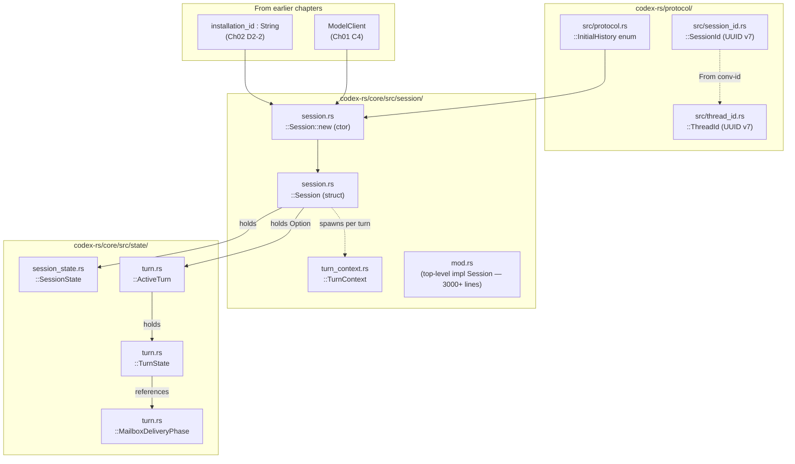

# Chapter 03: Session & Turn Lifecycle

> Status: **audited (2026-05-11)** | refs/codex SHA `76845d716b` | 12 claims / 12 anchors / 0 open questions

## Scope

Covers the runtime state that exists **between** the bootstrapped `ModelClient` (Chapter 01) and any single outbound Responses-API request (Chapter 06). This includes:

- Session identifier types: `SessionId`, `ThreadId` (both UUID v7).
- Session construction (`Session::new`): InitialHistory branching, window_generation initial value, identity threading.
- `TurnContext` (per-turn config + telemetry) and how it differs from session-scoped state.
- `ActiveTurn` slot (`Mutex<Option<ActiveTurn>>` on the Session) and the `TurnState` machine inside it.
- `MailboxDeliveryPhase` (CurrentTurn / NextTurn) — the small but load-bearing state machine that governs whether child-mailbox messages join the current request or wait for the next one.

What's **here**: identifier types, Session struct layout, TurnContext per-turn shape, ActiveTurn + TurnState, MailboxDeliveryPhase, window_generation initial value rules.

**Deferred**:
- `build_initial_context()` — wire-level `input[]` composition (Chapter 04).
- `ModelClient::stream_request` and friends — request build (Chapter 06).
- Conversation persistence / rollout file format (Chapter 12).
- Sub-agent variants of Session (Chapter 10).
- Compact endpoint sub-request (Chapter 09).

## Module architecture



Stack view (per-session lifetime → per-turn lifetime):

```
┌─────────────────────────────────────────────┐  ← Session-scoped (lifetime = whole conversation)
│ Session (Arc<Self>)                         │
│   conversation_id: ThreadId                 │  ← stable per session
│   installation_id: String                   │  ← stable per install (Ch02)
│   state: Mutex<SessionState>                │  ← rate limits, credits, connector selection, ...
│   active_turn: Mutex<Option<ActiveTurn>>    │  ← Some(...) while a turn runs; None when idle
│   conversation: Arc<RealtimeConversation…>  │  ← message history
│   services: SessionServices                 │  ← auth_manager, models_manager, exec_policy, …
├─────────────────────────────────────────────┤  ← Per-turn (lifetime = one user→assistant cycle)
│ ActiveTurn (in the Mutex<Option<…>> above)  │
│   tasks: IndexMap<String, RunningTask>      │
│   turn_state: Arc<Mutex<TurnState>>         │
│     pending_approvals / pending_input / …   │
│     mailbox_delivery_phase                  │  ← CurrentTurn → NextTurn after final output
│     tool_calls: u64                         │
│     token_usage_at_turn_start               │
│ TurnContext (Arc, threaded into RunningTask)│
│   sub_id / trace_id / model_info / provider │
│   reasoning_effort / environments / tools…  │
│   developer_instructions / user_instructions│  ← carried into build_initial_context (Ch04)
└─────────────────────────────────────────────┘
```

## IDEF0 decomposition

See [`idef0.03.json`](idef0.03.json). Activities:

- **A3.1** Mint session identifiers — `SessionId::new()` and `ThreadId::new()` both call `Uuid::now_v7()`. Convertible via `From<ThreadId> for SessionId`.
- **A3.2** Initialize SessionConfiguration — provider, base_instructions, collaboration_mode, approval_policy, permission_profile, cwd, codex_home, etc.
- **A3.3** Compute window_generation from InitialHistory — 0 for New/Cleared/Forked; count of `RolloutItem::Compacted` items for Resumed.
- **A3.4** Build TurnContext per turn — fresh per turn; bundles per-turn config + telemetry + dynamic tools spec.
- **A3.5** Execute turn — install ActiveTurn into `Session.active_turn` slot; run tasks; emit events; clear slot.
- **A3.6** Manage MailboxDeliveryPhase — start in CurrentTurn (child mail folds into next request); switch to NextTurn after final visible output emits; can reopen CurrentTurn on explicit same-turn continuation.

## GRAFCET workflow

See [`grafcet.03.json`](grafcet.03.json). Steps S0–S9 cover: idle → user input → turn-context build → active turn install → tool loop → mailbox phase transition → final output → idle. S10 error sink.

## Controls & Mechanisms

A3.4 (TurnContext build) has 6+ mechanisms (Config, AuthManager, ModelsManager, ExecPolicy, EnvironmentManager, SkillsManager). Captured in IDEF0 ICOM cells; no separate diagram needed because the relationships are passthrough (TurnContext is a struct that aggregates references, not a control flow).

## Protocol datasheet

**N/A** — this chapter describes internal runtime state. No wire-level messages are emitted directly from Session / TurnContext / ActiveTurn / TurnState. Wire emission begins when a `RunningTask` invokes `ModelClient::stream_request` (Chapter 06) which composes the body, and when transports ship it (Chapter 07 HTTP / Chapter 08 WS).

The two identifier values minted here, `session_id` and `thread_id`, surface in outbound headers per Chapter 06 (datasheet D6-1, headers); they are NOT emitted into the request body except as part of `prompt_cache_key` derivation (also Chapter 06).

## Claims & anchors

| Claim | Anchor | Kind |
|---|---|---|
| **C1**: `SessionId` is a thin newtype around `uuid::Uuid`, constructed via `Uuid::now_v7()` (time-ordered v7 UUIDs). `pub struct SessionId { uuid: Uuid }`. | [`refs/codex/codex-rs/protocol/src/session_id.rs:13`](refs/codex/codex-rs/protocol/src/session_id.rs#L13) | **struct (TYPE)** |
| **C2**: `ThreadId` has the **identical shape** to SessionId — also a newtype over `uuid::Uuid` with `Uuid::now_v7()` constructor. Distinct type, same internal representation. | [`refs/codex/codex-rs/protocol/src/thread_id.rs:11`](refs/codex/codex-rs/protocol/src/thread_id.rs#L11) | **struct (TYPE)** |
| **C3**: `SessionId` and `ThreadId` are zero-cost convertible via `From<ThreadId> for SessionId` (and back via parsing). Same underlying UUID can be addressed as either. | [`refs/codex/codex-rs/protocol/src/session_id.rs:55`](refs/codex/codex-rs/protocol/src/session_id.rs#L55) | impl |
| **C4**: `Session` struct fields (top-level): `conversation_id: ThreadId`, `installation_id: String`, `tx_event: Sender<Event>`, `state: Mutex<SessionState>`, `features: ManagedFeatures`, `conversation: Arc<RealtimeConversationManager>`, `active_turn: Mutex<Option<ActiveTurn>>`, `mailbox`/`idle_pending_input`, `services: SessionServices`. Session has at most 1 running task at a time (per doc comment line 13). | [`refs/codex/codex-rs/core/src/session/session.rs:14`](refs/codex/codex-rs/core/src/session/session.rs#L14) | **struct (TYPE)** |
| **C5**: `Session::new` takes 19 arguments (auth_manager, installation_id, models_manager, exec_policy, tx_event, agent_status, initial_history, session_source, skills_manager, plugins_manager, mcp_manager, agent_control, environment_manager, analytics_events_client, thread_store, parent_rollout_thread_trace, attestation_provider, plus session_configuration and config). Returns `anyhow::Result<Arc<Self>>`. | [`refs/codex/codex-rs/core/src/session/session.rs:353`](refs/codex/codex-rs/core/src/session/session.rs#L353) | fn |
| **C6**: `thread_id` initialization branches on `InitialHistory`: New / Cleared / Forked → `ThreadId::default()` (fresh UUID v7); Resumed → preserves `resumed_history.conversation_id`. | [`refs/codex/codex-rs/core/src/session/session.rs:386`](refs/codex/codex-rs/core/src/session/session.rs#L386) | match expression |
| **C7**: `InitialHistory` enum has 4 variants: `New`, `Cleared`, `Resumed(ResumedHistory)`, `Forked(Vec<RolloutItem>)`. Helper methods: `scan_rollout_items`, `forked_from_id`. | [`refs/codex/codex-rs/protocol/src/protocol.rs:2371`](refs/codex/codex-rs/protocol/src/protocol.rs#L2371) | **enum (TYPE)** |
| **C8**: `window_generation` initial value: for `Resumed` it counts `RolloutItem::Compacted` items in the resumed history; for `New`/`Cleared`/`Forked` it is 0. Stored as `AtomicU64` in `ModelClientState` (Ch01 C6). | [`refs/codex/codex-rs/core/src/session/session.rs:392`](refs/codex/codex-rs/core/src/session/session.rs#L392) | match expression |
| **C9**: `TurnContext` aggregates per-turn config + telemetry — 50+ fields including sub_id, trace_id, model_info, session_telemetry, provider, reasoning_effort, environments, cwd, current_date, timezone, developer_instructions, user_instructions, tools_config, dynamic_tools, turn_metadata_state, turn_timing_state. Built fresh for each turn via `make_turn_context` / `new_default_turn`. | [`refs/codex/codex-rs/core/src/session/turn_context.rs:55`](refs/codex/codex-rs/core/src/session/turn_context.rs#L55) | **struct (TYPE)** |
| **C10**: `ActiveTurn` struct holds `tasks: IndexMap<String, RunningTask>` and `turn_state: Arc<Mutex<TurnState>>`. The slot lives at `Session.active_turn: Mutex<Option<ActiveTurn>>` — `Some(...)` while a turn runs, `None` when the session is idle. | [`refs/codex/codex-rs/core/src/state/turn.rs:29`](refs/codex/codex-rs/core/src/state/turn.rs#L29) | **struct (TYPE)** |
| **C11**: `TurnState` carries the mutable per-turn bag — `pending_approvals`, `pending_request_permissions`, `pending_user_input`, `pending_elicitations`, `pending_dynamic_tools`, `pending_input: Vec<ResponseInputItem>`, `mailbox_delivery_phase: MailboxDeliveryPhase`, `granted_permissions`, `tool_calls: u64`, `has_memory_citation`, `token_usage_at_turn_start: TokenUsage`. Default-derived. | [`refs/codex/codex-rs/core/src/state/turn.rs:110`](refs/codex/codex-rs/core/src/state/turn.rs#L110) | **struct (TYPE)** |
| **C12**: `MailboxDeliveryPhase` is the 2-variant enum that gates whether incoming mailbox messages join the current request (`CurrentTurn`, default) or wait for the next one (`NextTurn`). State transition documented in the type's doc comment: starts CurrentTurn, switches to NextTurn after visible terminal output, can reopen on explicit same-turn continuation. Backing semantics for the Stage-3 "syncronisation" rule on streaming output. | [`refs/codex/codex-rs/core/src/state/turn.rs:46`](refs/codex/codex-rs/core/src/state/turn.rs#L46) | **enum (TYPE)** |

Anchor totals: 12 claims, 12 anchors. TEST/TYPE diversity: **7 TYPE anchors** (C1 struct, C2 struct, C4 struct, C7 enum, C9 struct, C10 struct, C11 struct, C12 enum — actually 8 types).

TEST cross-check: this chapter is structural (types only); behavioural validation lives in `codex-rs/core/src/state/session_tests.rs` and `codex-rs/core/src/session/tests.rs` — those tests are referenced for Chapter 11 (Cache & Prefix) and Chapter 06 (Request Build) audit. The Chapter 03 TYPE-anchor count (8) substantially exceeds the ≥1 floor, and the structural claims need no behavioural test to be verified — the types themselves are the contract.

## Cross-diagram traceability (per miatdiagram §4.7)

- Module architecture box `protocol/src/session_id.rs` → A3.1 (verified via C1, C3).
- Module architecture box `protocol/src/thread_id.rs` → A3.1 (verified via C2).
- Module architecture box `protocol/src/protocol.rs::InitialHistory` → A3.3 (verified via C7, C8).
- Module architecture box `core/src/session/session.rs::Session` → A3.5 (verified via C4, C5).
- Module architecture box `core/src/session/turn_context.rs::TurnContext` → A3.4 (verified via C9).
- Module architecture box `core/src/state/turn.rs::{ActiveTurn, TurnState, MailboxDeliveryPhase}` → A3.5, A3.6 (verified via C10, C11, C12).
- Every IDEF0 Mechanism cell in `idef0.03.json` resolves to an architecture box. Forward link to Chapter 04 (`build_initial_context`) flagged as "deferred, not yet audited".

## Open questions

None. Structural typing is fully covered; behavioural specifics of `Session::new` initialization (e.g. parallel task spawning, thread_persistence_fut composition) are runtime details not required for understanding wire-affecting state. Deferred to Chapter 06 / 11 audit if they surface as cache-dimension concerns.

## OpenCode delta map

- **A3.1 Mint session identifiers** — OpenCode generates session IDs in `packages/opencode/src/session/index.ts` using a custom slug format (`ses_<13-char-base32>` e.g. `ses_1ea4a340dffeo1pYxgv2Y1O1Q2`), NOT UUID v7. Threaded into outbound Responses-API request as `prompt_cache_key` and `session_id` header dimensions. **Aligned**: no — different ID format. **Drift**: OpenCode `ses_…` IDs cannot be misinterpreted as upstream codex thread/session UUIDs by the backend. Probably acceptable (backend treats `prompt_cache_key` as opaque string), but worth flagging as a "we cannot share session cache lineage with codex CLI even if they hit the same backend".
- **A3.2 SessionConfiguration** — OpenCode session config lives in `packages/opencode/src/session/index.ts` Session.Info shape; differs structurally from upstream `SessionConfiguration` (e.g. OpenCode has `agent`, `mode`, `autonomous` fields; upstream has `permission_profile`, `windows_sandbox_level`). **Aligned**: no — different abstraction. **Drift**: by design.
- **A3.3 window_generation** — OpenCode does not currently track or send `window_generation` / `x-codex-window-id` based on compaction count; the field is set to `0` per call in the codex-provider. **Aligned**: partial. **Drift**: subagent / compaction window tracking would route differently if OpenCode emitted increasing window_generation. Tracked in [packages/opencode-codex-provider/src/headers.ts:71](packages/opencode-codex-provider/src/headers.ts#L71) where `WindowState` is supplied externally; whoever calls `buildHeaders` controls it.
- **A3.4 TurnContext** — OpenCode has no direct analogue. Per-turn state is carried via `StreamInput` (Ch01 C5 / Ch04 reference) passed into `LLM.stream(...)`. **Aligned**: no — different shape. **Drift**: by design. This is the A1.4 drift flagged in Chapter 01 — OpenCode passes identity dimensions per-call rather than holding them in a long-lived state struct. The functional equivalent exists; the shape doesn't.
- **A3.5 ActiveTurn slot** — OpenCode does not use a `Mutex<Option<ActiveTurn>>` pattern; concurrent-turn coordination is handled at the higher session-orchestrator layer in `processor.ts` via the autonomy state machine. **Aligned**: no — different concurrency model. **Drift**: by design. Upstream codex assumes "Session has at most 1 running task at a time"; OpenCode's autonomous mode does too but enforces it through different primitives.
- **A3.6 MailboxDeliveryPhase** — OpenCode does not have a direct equivalent. The closest analogue is the `lazyTools` / `system` per-turn injection in `StreamInput` (which can attach catalog/notice content to a specific turn). Mailbox-style child-mail buffering is not a first-class concept in OpenCode's processor. **Aligned**: no — different mailbox model. **Drift**: by design; OpenCode subagent mailbox is implemented via task() bridge messages rather than per-turn folding.

**Key takeaway for downstream specs**: Chapter 03 confirms that the **A1.4 / A1.5 drift flagged in Chapter 01 is foundational** — OpenCode and codex-cli diverge at the Session abstraction layer. Wire-level alignment (chapters 04–11) is still tractable because both ultimately produce JSON bodies + HTTP/WS frames. But Session-internal state machines do not need to match, and trying to force a 1:1 mapping would over-constrain OpenCode's autonomy / multi-account / multi-agent semantics. Future cache-dimension RCAs should focus on **what the wire body looks like** (Chapters 04, 06) rather than **how Session-internal state is shaped**.
