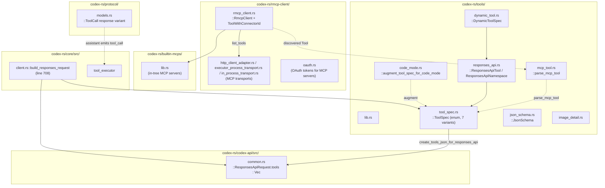

# Chapter 05: Tools & MCP

> Status: **audited (2026-05-11)** | refs/codex SHA `76845d716b` | 12 claims / 12 anchors / 0 open questions

## Scope

Covers the `tools` field of the Responses API request body — what populates it, how MCP tools become wire-shape `function` entries, and how `ResponsesApiTool` serialises to JSON. Tools are a **separate cache hash dimension** from `input[]` (Chapter 04): tools changes invalidate the tools-dimension cache independently of the input prefix.

What's **here**: `ToolSpec` enum + its 7 variants, `ResponsesApiTool` struct, namespace tools, MCP tool ingestion via `rmcp-client` + `parse_mcp_tool`, dynamic-tool conversion path, `create_tools_json_for_responses_api` serialiser, and the wire-level `Vec<serde_json::Value>` slot in `ResponsesApiRequest`.

**Deferred**:
- The full `ResponsesApiRequest` body shape (Chapter 06 — datasheet D6-1).
- Tool execution / `apply_patch` semantics — out of scope (sandboxing, listed in design.md out-of-scope crates).
- Subagent-specific tool subsetting — Chapter 10.
- Code-mode tool augmentation (`code_mode.rs`) — referenced briefly here, full treatment if needed in a future chapter.

## Module architecture



Stack view (build-time → wire):

```
┌────────────────────────────────────────────────────────────┐
│ Sources of tools                                           │
│   • Built-in: tools defined directly in codex-rs/tools/    │
│   • MCP-discovered: rmcp-client.list_tools() per connector │
│   • DynamicToolSpec: agents / skills runtime registration  │
│   • Special: web_search / image_generation / local_shell   │
├────────────────────────────────────────────────────────────┤
│ Normalisation to ToolSpec enum                             │
│   parse_mcp_tool → ToolDefinition → ResponsesApiTool       │
│   dynamic_tool_to_responses_api_tool / _to_loadable_*      │
│   augment_tool_spec_for_code_mode (when feature on)        │
├────────────────────────────────────────────────────────────┤
│ Aggregation into prompt.tools : Vec<ToolSpec>              │
│   (Session / TurnContext owns this slice for the turn)     │
├────────────────────────────────────────────────────────────┤
│ Serialisation                                              │
│   create_tools_json_for_responses_api(&prompt.tools)?      │
│   → Vec<serde_json::Value>                                 │
├────────────────────────────────────────────────────────────┤
│ Wire emission                                              │
│   ResponsesApiRequest.tools = Vec<Value>  (top-level)      │
│   alongside .input / .instructions / .client_metadata      │
└────────────────────────────────────────────────────────────┘
```

## IDEF0 decomposition

See [`idef0.05.json`](idef0.05.json). Activities:

- **A5.1** Define built-in tools as `ToolSpec` variants — concrete tools authored in `codex-rs/tools/` (Function variants for `apply_patch`, `update_plan`, etc.; special variants for `local_shell`, `web_search`, `image_generation`).
- **A5.2** Discover MCP tools via `RmcpClient.list_tools()` per connected server.
- **A5.3** Convert MCP `rmcp::model::Tool` → local `ToolDefinition` via `parse_mcp_tool`, then into `ResponsesApiTool` (Function variant of ToolSpec).
- **A5.4** Convert `DynamicToolSpec` (agents/skills) → `ResponsesApiTool` or `LoadableToolSpec::Namespace`.
- **A5.5** Aggregate into `prompt.tools: Vec<ToolSpec>` for the current turn.
- **A5.6** Serialise via `create_tools_json_for_responses_api` → `Vec<serde_json::Value>` → assigned to `ResponsesApiRequest.tools`.

## GRAFCET workflow

See [`grafcet.05.json`](grafcet.05.json). 7 steps from sources → normalisation → aggregation → serialisation → wire.

## Controls & Mechanisms

A5.2 has multiple MCP transport mechanisms (HTTP streamable, executor-process stdio, in-process); A5.6 has one serialisation mechanism (`serde_json::to_value` per element). Captured in IDEF0 ICOM cells; no separate diagram.

## Protocol datasheet

### D5-1: `tools` field of `ResponsesApiRequest` (wire-level slice)

**Transport**: HTTP POST body field `tools` AND WS first-frame body field `tools`. Always emitted as a JSON array; empty when no tools (Vec::new()).
**Triggered by**: A5.6 — every Responses API request carries the current turn's tool set.
**Source**: [`refs/codex/codex-rs/codex-api/src/common.rs:175`](refs/codex/codex-rs/codex-api/src/common.rs#L175) (`ResponsesApiRequest.tools`).

| Element | Type / Encoding | Required | Source (file:line) | Stability | Notes |
|---|---|---|---|---|---|
| Outer array | `Vec<serde_json::Value>` | required (may be `[]`) | [`common.rs:175`](refs/codex/codex-rs/codex-api/src/common.rs#L175) | semi-static — changes when MCP connectors connect/disconnect, skills reload, agent capabilities reconfigure | One element per registered tool. Separate cache hash dimension from `input[]`. |
| Each Function tool element | JSON object | per element | [`tools/src/tool_spec.rs:17`](refs/codex/codex-rs/tools/src/tool_spec.rs#L17) | stable per tool definition | `{ "type": "function", "name": ..., "description": ..., "strict": ..., "parameters": <JsonSchema>, "defer_loading"?: bool }`. `output_schema` is `#[serde(skip)]` — never on wire. |
| Each Namespace element | JSON object | per element | [`tools/src/responses_api.rs:73`](refs/codex/codex-rs/tools/src/responses_api.rs#L73) | stable per namespace | `{ "type": "namespace", "name": ..., "description": ..., "tools": [...] }` — nested array of `{ "type": "function", ... }` entries. |
| `tool_choice` (sibling field) | string | required | [`client.rs:750`](refs/codex/codex-rs/core/src/client.rs#L750) | stable per turn | Hard-coded `"auto"` in `build_responses_request`. |
| `parallel_tool_calls` (sibling field) | bool | required | [`client.rs:751`](refs/codex/codex-rs/core/src/client.rs#L751) | per-turn (from prompt.parallel_tool_calls) | Whether the model may emit multiple tool calls per turn. |

**Other ToolSpec variants** (serialised tags):
- `tool_search` → `{ "type": "tool_search", "execution": ..., "description": ..., "parameters": ... }`
- `local_shell` → `{ "type": "local_shell" }` (empty body)
- `image_generation` → `{ "type": "image_generation", "output_format": ... }`
- `web_search` → `{ "type": "web_search", "external_web_access"?, "filters"?, "user_location"?, "search_context_size"?, "search_content_types"? }`
- `custom` (Freeform) → `{ "type": "custom", ... }` via `FreeformTool` shape

**Example payload** (sanitized — a `tools` array with 2 function tools):

```json
{
  "tools": [
    {
      "type": "function",
      "name": "apply_patch",
      "description": "Apply a unified diff to the workspace.",
      "strict": true,
      "parameters": {
        "type": "object",
        "properties": { "patch": { "type": "string", "description": "Unified diff text" } },
        "required": ["patch"],
        "additionalProperties": false
      }
    },
    {
      "type": "function",
      "name": "demo",
      "description": "A demo tool",
      "strict": false,
      "parameters": {
        "type": "object",
        "properties": { "foo": { "type": "string" } }
      }
    }
  ],
  "tool_choice": "auto",
  "parallel_tool_calls": false
}
```

## Claims & anchors

| Claim | Anchor | Kind |
|---|---|---|
| **C1**: `ToolSpec` is a serde-tagged enum (`#[serde(tag = "type")]`) with 7 variants: `Function(ResponsesApiTool)`, `Namespace(ResponsesApiNamespace)`, `ToolSearch { ... }`, `LocalShell {}`, `ImageGeneration { output_format }`, `WebSearch { ... }`, `Freeform(FreeformTool)`. When serialised, the variant name becomes the `"type"` field. | [`refs/codex/codex-rs/tools/src/tool_spec.rs:17`](refs/codex/codex-rs/tools/src/tool_spec.rs#L17) | **enum (TYPE)** |
| **C2**: `ResponsesApiTool` struct (the Function variant payload) carries `name: String`, `description: String`, `strict: bool`, `defer_loading: Option<bool>` (`skip_serializing_if = "Option::is_none"`), `parameters: JsonSchema`, `output_schema: Option<Value>` (`#[serde(skip)]` — never emitted on wire). | [`refs/codex/codex-rs/tools/src/responses_api.rs:26`](refs/codex/codex-rs/tools/src/responses_api.rs#L26) | **struct (TYPE)** |
| **C3**: `ResponsesApiNamespace` struct: `name: String`, `description: String`, `tools: Vec<ResponsesApiNamespaceTool>`. Used for grouping related tools under a namespace prefix. | [`refs/codex/codex-rs/tools/src/responses_api.rs:73`](refs/codex/codex-rs/tools/src/responses_api.rs#L73) | **struct (TYPE)** |
| **C4**: `ResponsesApiNamespaceTool` is a tagged enum currently with **only one variant**: `Function(ResponsesApiTool)`. Namespaces can only contain function tools (no nested namespaces). | [`refs/codex/codex-rs/tools/src/responses_api.rs:64`](refs/codex/codex-rs/tools/src/responses_api.rs#L64) | **enum (TYPE)** |
| **C5**: `pub fn create_tools_json_for_responses_api(tools: &[ToolSpec]) -> Result<Vec<Value>, serde_json::Error>` iterates each `ToolSpec`, calls `serde_json::to_value(tool)?`, pushes into `tools_json` Vec, returns. Pre-serialises to `Value` so the request struct can embed unstructured tool JSON. | [`refs/codex/codex-rs/tools/src/tool_spec.rs:100`](refs/codex/codex-rs/tools/src/tool_spec.rs#L100) | fn |
| **C6**: `ResponsesApiRequest.tools` is `Vec<serde_json::Value>` (not `Vec<ToolSpec>`) — already-serialised JSON. This is what reaches the wire byte-for-byte. The struct also carries `tool_choice: String`, `parallel_tool_calls: bool` as sibling fields. | [`refs/codex/codex-rs/codex-api/src/common.rs:175`](refs/codex/codex-rs/codex-api/src/common.rs#L175) | **struct field (TYPE)** |
| **C7**: `build_responses_request` populates `tools` by calling `create_tools_json_for_responses_api(&prompt.tools)?` (line 719), sets `tool_choice: "auto"` (line 750) and `parallel_tool_calls: prompt.parallel_tool_calls` (line 751). Same line block assigns `instructions`, `input`, and other body fields. | [`refs/codex/codex-rs/core/src/client.rs:719`](refs/codex/codex-rs/core/src/client.rs#L719) | fn body |
| **C8**: `pub fn parse_mcp_tool(tool: &rmcp::model::Tool) -> Result<ToolDefinition, serde_json::Error>` is the conversion entry point from MCP-protocol `Tool` descriptors (from any `RmcpClient.list_tools()` call) into local `ToolDefinition`. Downstream converters then map ToolDefinition → ResponsesApiTool → ToolSpec::Function. | [`refs/codex/codex-rs/tools/src/mcp_tool.rs:6`](refs/codex/codex-rs/tools/src/mcp_tool.rs#L6) | fn |
| **C9**: `rmcp-client` crate exports `RmcpClient`, `ToolWithConnectorId`, `ListToolsWithConnectorIdResult` as the public surface for talking to MCP servers. Transports: HTTP client adapter, executor-process (stdio over child process), in-process (for built-in MCPs). | [`refs/codex/codex-rs/rmcp-client/src/lib.rs:33`](refs/codex/codex-rs/rmcp-client/src/lib.rs#L33) | **module re-exports (TYPE)** |
| **C10**: `dynamic_tool_to_responses_api_tool(tool: &DynamicToolSpec) -> Result<ResponsesApiTool, _>` converts a dynamic-tool descriptor (from agents/skills at runtime) into a ResponsesApiTool; its sibling `dynamic_tool_to_loadable_tool_spec` wraps the result in either `LoadableToolSpec::Function` or `LoadableToolSpec::Namespace` depending on whether `tool.namespace` is set. | [`refs/codex/codex-rs/tools/src/responses_api.rs:69`](refs/codex/codex-rs/tools/src/responses_api.rs#L69) | fn |
| **C11**: TEST `create_tools_json_for_responses_api_includes_top_level_name` pins JSON wire shape: for `ToolSpec::Function(ResponsesApiTool { name: "demo", description: "A demo tool", strict: false, defer_loading: None, parameters: <object {foo: string}>, output_schema: None })`, the serialised Value equals `{ "type": "function", "name": "demo", "description": "A demo tool", "strict": false, "parameters": {"type": "object", "properties": {"foo": {"type": "string"}} } }`. Confirms: tag is top-level `"type"`; `output_schema` absent (skip); `defer_loading` absent when None. | [`refs/codex/codex-rs/tools/src/tool_spec_tests.rs:146`](refs/codex/codex-rs/tools/src/tool_spec_tests.rs#L146) | **test (TEST)** |
| **C12**: The `tools` field is a **separate cache dimension** from `input[]` — they hash independently on the backend. Tools change when MCP connectors connect/disconnect, skills reload, or agent capabilities reconfigure mid-session. Confirmed structurally by C6 (Vec<Value> as a sibling field of `input: Vec<ResponseItem>` in ResponsesApiRequest) — both serialise at the same nesting depth. | [`refs/codex/codex-rs/codex-api/src/common.rs:170`](refs/codex/codex-rs/codex-api/src/common.rs#L170) | struct layout |

Anchor totals: 12 claims, 12 anchors. TEST/TYPE diversity: **5 TYPE** (C1 enum, C2 struct, C3 struct, C4 enum, C6 struct field) + **1 TEST** (C11). C9 module re-exports counted under TYPE.

## Cross-diagram traceability (per miatdiagram §4.7)

- `tools/src/tool_spec.rs::ToolSpec` → A5.1, A5.5 → D5-1 datasheet rows (verified C1, C5).
- `tools/src/responses_api.rs::ResponsesApiTool` → A5.1, A5.3, A5.4 → D5-1 Function row (verified C2, C10).
- `tools/src/mcp_tool.rs::parse_mcp_tool` → A5.3 (verified C8).
- `rmcp-client/src/lib.rs::RmcpClient` → A5.2 (verified C9).
- `codex-api/src/common.rs::ResponsesApiRequest.tools` → wire-level emission (verified C6, C12).
- `core/src/client.rs::build_responses_request` (line 719) → A5.6, calls `create_tools_json_for_responses_api` → connects A5.6 to D5-1.
- TEST `create_tools_json_for_responses_api_includes_top_level_name` (C11) → pins D5-1 Function-row JSON shape byte-exact.

Every IDEF0 Mechanism cell in `idef0.05.json` resolves to an architecture box on the chapter diagram. Forward link to Chapter 06 (`ResponsesApiRequest` full body) flagged as "deferred, not yet audited at the time Chapter 05 audited — owned by Chapter 06".

## Open questions

None. The tools-field shape is fully covered. The behavioural questions (when do MCP connectors reconfigure during a session? how does the tools-dimension cache interact with `previous_response_id` chain?) belong to Chapter 11 (Cache & Prefix Model) — flagged as deferred.

## OpenCode delta map

- **A5.1 Built-in tools** — OpenCode defines its own built-in tool set in `packages/opencode/src/tool/` (Bash, Read, Edit, Write, Grep, Glob, TodoWrite, Task, ToolSearch, etc.). The names and shapes differ from upstream codex tools — upstream has `apply_patch`/`update_plan`/`local_shell`; OpenCode has `bash`/`read`/`edit`/`write`. **Aligned**: no — fundamentally different built-in toolsets by design. **Drift**: this is by design — OpenCode is a different product surface. Cache impact: backends seeing OpenCode's tool list cannot route to codex-cli's tool-set cache and vice versa. Acceptable.
- **A5.2 MCP discovery** — OpenCode has its own MCP client in `packages/opencode/src/mcp/` (separate from `rmcp-client`). Each MCP server registers via `ManagedAppRegistry`; tools surface via `ManagedAppManifest`. **Aligned**: functionally yes (both discover MCP tools and convert to local descriptor); **Drift**: implementation entirely different (Node vs Rust ecosystems).
- **A5.3 MCP tool → ToolSpec conversion** — OpenCode does the equivalent conversion in [packages/opencode-codex-provider/src/convert.ts](packages/opencode-codex-provider/src/convert.ts) using AI SDK v2's `convertTools` adapter, then emits `{ type: "function", name, description, parameters, strict }` shape. **Aligned**: yes structurally — the JSON wire shape matches C11's TEST expectations.
- **A5.4 Dynamic tools** — OpenCode's equivalent is the `lazyTools` mechanism in `StreamInput.lazyTools` ([Ch01 C5 ref](#chapter-01-entry-points)) plus the `skill` tool that loads skill-specific tool sets on demand. **Aligned**: partial — concept matches (runtime-registered tools), implementation differs.
- **A5.5 Aggregation into prompt.tools** — OpenCode aggregates in `LLM.stream(input)` where `input.tools: Record<string, Tool>` is built from agent.capabilities ∩ user.tools ∩ MCP tools ∩ skill tools. **Aligned**: equivalent function, different shape (Record vs Vec).
- **A5.6 Serialisation** — OpenCode's codex provider serialises via AI SDK v2's tool-conversion adapter, then `convertTools` shapes into the wire `{ type: "function", name, ... }` array. Final wire output **matches** C11's TEST byte-for-byte for tool-list entries. **Aligned**: yes at wire level.

**Cross-cutting drift findings:**

1. **`tools` field is wire-level aligned but tool-set content is OpenCode-specific.** The struct shape, the `tool_choice: "auto"`, the `parallel_tool_calls` flag all match upstream. The actual tool names and JSON schemas differ because OpenCode's tool set is different — by design.
2. **Tools dimension is independent cache dimension** — both upstream and OpenCode rely on this implicit backend behaviour. If MCP connectors connect/disconnect mid-session, the tools array changes byte-for-byte but `input[]` cache should survive — confirmed by C12 (struct layout) and matches OpenCode's observed cache behaviour.
3. **No upstream analogue for OpenCode's `skill` tool** — upstream uses `AvailableSkillsInstructions` developer fragment (Chapter 04 C10) for skill discovery. OpenCode opts for a tool-based skill loader. Both approaches work; cache profiles differ: upstream pays the skills-bundle cost in `input[]` (developer message), OpenCode pays it in `tools` (the `skill` tool entry's description). Equivalent net byte cost.
