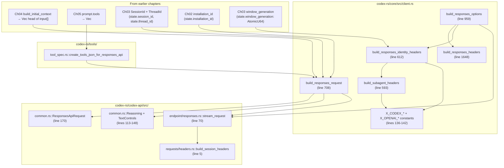

# Chapter 06: Responses API Request Build

> Status: **audited (2026-05-11)** | refs/codex SHA `76845d716b` | 12 claims / 12 anchors / 0 open questions

## Scope

The convergence chapter. Composes `instructions` (driver, Ch04 context), `input[]` (build_initial_context output from Ch04 + history + new user turn), and `tools[]` (Ch05) into a single `ResponsesApiRequest`, plus assigns the **wire-shaping fields**: `prompt_cache_key`, `client_metadata`, `service_tier`, `store`, `stream`, `include`, `reasoning`, `text`, `tool_choice`, `parallel_tool_calls`. Also covers per-turn HTTP headers (X-Codex-* family, x-client-request-id, x-openai-subagent, session/thread id pairs).

What's **here**: `build_responses_request` fn body, `ResponsesApiRequest` field-by-field meaning, `prompt_cache_key` derivation, `client_metadata` composition, per-turn header builders (`build_responses_identity_headers`, `build_subagent_headers`), header constants registry, and the canonical assembly site in `Endpoint::stream_request`.

**Deferred**:
- HTTP SSE transport mechanics (Chapter 07).
- WebSocket transport variant (Chapter 08).
- Compact sub-endpoint (Chapter 09).
- Sub-agent identity dimensions (Chapter 10).
- Cache routing semantics from the backend's perspective (Chapter 11).

## Module architecture



Stack view (per-turn → wire):

```
┌───────────────────────────────────────────────────────────────┐
│ TurnContext + ModelClientSession + Prompt + provider info     │
├───────────────────────────────────────────────────────────────┤
│ build_responses_request (core/client.rs:708)                  │
│   instructions = prompt.base_instructions.text   (driver)     │
│   input        = prompt.get_formatted_input()    (Ch04 head + history) │
│   tools        = create_tools_json_for_responses_api(...)     │
│   reasoning    = build_reasoning(model_info, effort, summary) │
│   include      = ["reasoning.encrypted_content"] if reasoning │
│   text         = create_text_param_for_request(verbosity, ...)│
│   prompt_cache_key = Some(state.thread_id.to_string())        │
│   service_tier = filter by model_info.supports_service_tier   │
│   store        = provider.is_azure_responses_endpoint()       │
│   stream       = true   (hard-coded)                          │
│   tool_choice  = "auto" (hard-coded)                          │
│   client_metadata = Some({"x-codex-installation-id": <UUID>}) │
├───────────────────────────────────────────────────────────────┤
│ build_responses_options (core/client.rs:959)                  │
│   extra_headers ← build_responses_headers (beta + turn_state) │
│                ← build_responses_identity_headers (parent + window) │
│                ← optional attestation header                  │
│   session_id, thread_id, session_source threaded through      │
├───────────────────────────────────────────────────────────────┤
│ stream_request (codex-api/endpoint/responses.rs:70)           │
│   x-client-request-id ← thread_id                             │
│   session_id / session-id / thread_id / thread-id ← build_session_headers │
│   x-openai-subagent ← if subagent_header(session_source) Some │
│   body = serde_json::to_value(request)                        │
├───────────────────────────────────────────────────────────────┤
│ HTTP POST /responses (Ch07) OR WS first-frame (Ch08)          │
└───────────────────────────────────────────────────────────────┘
```

## IDEF0 decomposition

See [`idef0.06.json`](idef0.06.json). Activities:

- **A6.1** Compose request body — `build_responses_request` fills every field of `ResponsesApiRequest`.
- **A6.2** Derive `prompt_cache_key` — `Some(state.thread_id.to_string())`. Pure thread_id, no install / account mix-in.
- **A6.3** Compose `client_metadata` — `Some(HashMap { "x-codex-installation-id" → state.installation_id })`. **One** key on streaming path.
- **A6.4** Build per-turn HTTP headers — combine identity headers (parent_thread_id + window_id + subagent) + responses headers (beta + turn_state + turn_metadata) + attestation.
- **A6.5** Per-endpoint stream invocation — `stream_request` adds x-client-request-id + session/thread pairs + subagent header before posting.

## GRAFCET workflow

See [`grafcet.06.json`](grafcet.06.json). Linear assembly path. No branches inside the assembly itself (branches sit outside — provider-side switching between SSE vs WS picks the transport in Ch07/Ch08).

## Controls & Mechanisms

A6.1 has 6+ mechanism dependencies (Prompt, ModelInfo, provider, reasoning effort, service_tier filter). Captured in IDEF0 ICOM cells; no separate diagram.

## Protocol datasheet

### D6-1: `ResponsesApiRequest` body (full)

**Transport**: HTTP POST `/responses` (Ch07) OR WS first frame body (Ch08). Same JSON shape; transport difference is framing only.
**Triggered by**: A6.1 — every Responses turn.
**Source**: [`refs/codex/codex-rs/codex-api/src/common.rs:170`](refs/codex/codex-rs/codex-api/src/common.rs#L170) (`ResponsesApiRequest`); assembled in [`refs/codex/codex-rs/core/src/client.rs:708`](refs/codex/codex-rs/core/src/client.rs#L708).

| Field | Type / Encoding | Required | Source (file:line) | Stability | Notes |
|---|---|---|---|---|---|
| `model` | string (model slug, e.g. `"gpt-5.5"`) | required | [`client.rs:746`](refs/codex/codex-rs/core/src/client.rs#L746) | stable-per-session | From `model_info.slug`. |
| `instructions` | string (driver / base_instructions text) | required (skip when empty) | [`client.rs:747`](refs/codex/codex-rs/core/src/client.rs#L747) | stable-per-session | Driver text only — context fragments live in `input[]` (Ch04). |
| `input` | array of ResponseItem | required | [`client.rs:748`](refs/codex/codex-rs/core/src/client.rs#L748) | growing per-turn | From `prompt.get_formatted_input()`. Head = Ch04 D4-1 output; tail = conversation history + current user input. |
| `tools` | array of opaque JSON Value | required (may be `[]`) | [`client.rs:749`](refs/codex/codex-rs/core/src/client.rs#L749) | semi-static (Ch05 D5-1) | From `create_tools_json_for_responses_api(prompt.tools)`. Independent cache dimension. |
| `tool_choice` | string `"auto"` | required | [`client.rs:750`](refs/codex/codex-rs/core/src/client.rs#L750) | invariant | **Hard-coded "auto"** — no per-turn override. |
| `parallel_tool_calls` | bool | required | [`client.rs:751`](refs/codex/codex-rs/core/src/client.rs#L751) | per-turn from prompt | Allows model to emit multiple tool calls per turn. |
| `reasoning` | Reasoning struct \| null | optional | [`common.rs:113`](refs/codex/codex-rs/codex-api/src/common.rs#L113) | per-turn | `{ effort?, summary? }` — both Options inside, skip_serializing_if. |
| `store` | bool | required | [`client.rs:753`](refs/codex/codex-rs/core/src/client.rs#L753) | provider-dependent | `provider.is_azure_responses_endpoint()` — true for Azure, false elsewhere. |
| `stream` | bool | required | [`client.rs:754`](refs/codex/codex-rs/core/src/client.rs#L754) | invariant | **Hard-coded `true`** — codex always streams. |
| `include` | array of string | required (may be `[]`) | [`client.rs:721`](refs/codex/codex-rs/core/src/client.rs#L721) | per-turn | `["reasoning.encrypted_content"]` when reasoning is Some, else `[]`. |
| `service_tier` | string \| null | optional | [`client.rs:743`](refs/codex/codex-rs/core/src/client.rs#L743) | per-turn | Filtered by `model_info.supports_service_tier`. |
| `prompt_cache_key` | string \| null | optional (always Some in practice) | [`client.rs:742`](refs/codex/codex-rs/core/src/client.rs#L742) | **stable-per-session** | `Some(state.thread_id.to_string())`. **Pure thread_id — no install / account mix-in.** This is the cache namespace key. |
| `text` | TextControls \| null | optional | [`client.rs:737`](refs/codex/codex-rs/core/src/client.rs#L737) | per-turn | `{ verbosity?, format? }` — format is `{ type: "json_schema", strict, schema, name }` when output_schema is set. |
| `client_metadata` | object\<string,string\> \| null | optional (always Some in practice) | [`client.rs:759-762`](refs/codex/codex-rs/core/src/client.rs#L759-L762) | **stable-per-install** | `Some(HashMap { "x-codex-installation-id" → state.installation_id })`. **One key only on streaming path.** Compact sub-request adds more (Ch09). |

**Example payload** (sanitized — minimal streaming turn):

```json
{
  "model": "gpt-5.5",
  "instructions": "<base instructions / driver text — Chapter 04 references>",
  "input": [
    { "type": "message", "role": "developer", "content": [...] },
    { "type": "message", "role": "user", "content": [...] },
    { "type": "message", "role": "user", "content": [{ "type": "input_text", "text": "<user turn text>" }] }
  ],
  "tools": [{ "type": "function", "name": "apply_patch", "description": "...", "strict": true, "parameters": {...} }],
  "tool_choice": "auto",
  "parallel_tool_calls": false,
  "store": false,
  "stream": true,
  "include": ["reasoning.encrypted_content"],
  "reasoning": { "effort": "medium", "summary": null },
  "prompt_cache_key": "01927c0a-1234-7abc-9def-0123456789ab",
  "client_metadata": { "x-codex-installation-id": "42dbf4ca-fda0-44f9-ba52-2e4618b727c5" }
}
```

### D6-2: Per-turn HTTP headers (streaming Responses path)

**Transport**: HTTP request headers, added before POST body emission.
**Triggered by**: A6.4 + A6.5 — built in `build_responses_options` (extra_headers seed) + `stream_request` (additional adds).
**Source**: Composite — `build_responses_identity_headers` ([client.rs:612](refs/codex/codex-rs/core/src/client.rs#L612)), `build_responses_headers` ([client.rs:1648](refs/codex/codex-rs/core/src/client.rs#L1648)), `stream_request` ([codex-api/endpoint/responses.rs:70](refs/codex/codex-rs/codex-api/src/endpoint/responses.rs#L70)).

| Header | Type / Encoding | Required | Source (file:line) | Stability | Notes |
|---|---|---|---|---|---|
| `Authorization` | `Bearer <access_token>` | required | Ch02 D headers + AuthProvider.add_auth_headers | per-refresh | From auth manager. (Ch02 C11, C12.) |
| `User-Agent` | `{originator}/{ver} ({os}; {arch}) <terminal>` | required | Ch02 C9 | stable-per-session | From `get_codex_user_agent()`. |
| `originator` | `"codex_cli_rs"` (or override) | required | Ch02 C8 | stable-per-session | Process-wide cell. |
| `ChatGPT-Account-Id` | string (from id_token claim) | optional | Ch02 C12 | per-account | Added by backend-client `headers()`. |
| `X-OpenAI-Fedramp` | `"true"` | optional | Ch02 C12 | per-account | Only when `chatgpt_account_is_fedramp` set. |
| `session_id` + `session-id` | UUID string (both forms emitted) | required when known | [`requests/headers.rs:5`](refs/codex/codex-rs/codex-api/src/requests/headers.rs#L5) `build_session_headers` | stable-per-session | Two-form emission for back-compat tolerance. |
| `thread_id` + `thread-id` | UUID string (both forms emitted) | required when known | [`requests/headers.rs:5`](refs/codex/codex-rs/codex-api/src/requests/headers.rs#L5) `build_session_headers` | stable-per-session | Same UUID as prompt_cache_key. |
| `x-client-request-id` | UUID string = thread_id | required | [`endpoint/responses.rs:91-92`](refs/codex/codex-rs/codex-api/src/endpoint/responses.rs#L91-L92) | stable-per-session | Equals `thread_id`. Set in stream_request before posting. |
| `x-codex-beta-features` | comma-separated string | optional | [`client.rs:1655-1660`](refs/codex/codex-rs/core/src/client.rs#L1655-L1660) `build_responses_headers` | stable-per-session | Lists enabled experimental features visible to backend. |
| `x-codex-turn-state` | opaque token | conditional | [`client.rs:1664`](refs/codex/codex-rs/core/src/client.rs#L1664) | per-turn (sticky-routing) | From server-supplied state on prior turn; replayed for sticky routing. |
| `x-codex-turn-metadata` | JSON string | conditional | [`client.rs:1667`](refs/codex/codex-rs/core/src/client.rs#L1667) | per-turn | When caller supplies turn_metadata_header. |
| `x-codex-window-id` | `"{thread_id}:{window_generation}"` | required (identity headers always added) | [`client.rs:620`](refs/codex/codex-rs/core/src/client.rs#L620) `build_responses_identity_headers` | stable-per-window | Window generation increments on each compaction (Ch03 C8). |
| `x-codex-parent-thread-id` | UUID string | conditional | [`client.rs:617`](refs/codex/codex-rs/core/src/client.rs#L617) | stable-per-subagent | Only when `SessionSource::SubAgent(ThreadSpawn { .. })`. |
| `x-openai-subagent` | subagent label string | conditional | [`endpoint/responses.rs:95-96`](refs/codex/codex-rs/codex-api/src/endpoint/responses.rs#L95-L96) + [`client.rs:597-598`](refs/codex/codex-rs/core/src/client.rs#L597-L598) | stable-per-subagent | Labels review / compact / memory_consolidation / collab_spawn / custom. |
| `x-openai-memgen-request` | `"true"` | conditional | [`client.rs:603-606`](refs/codex/codex-rs/core/src/client.rs#L603-L606) | per-source | Only when `SessionSource::Internal(MemoryConsolidation)`. |
| `x-oai-attestation` | opaque base64 | conditional | [`client.rs:909`](refs/codex/codex-rs/core/src/client.rs#L909) | per-turn | When `state.include_attestation` and provider supplies header. |
| `x-codex-installation-id` | **NOT in headers on streaming turn** — only in body's `client_metadata` (see D6-1). Header form reserved for Compact sub-request (Chapter 09). | — | — | — | Critical: do NOT add this as a header on the normal turn path. |

**Example header set** (sanitized — minimal streaming turn, no subagent):

```
Authorization: Bearer eyJhbGci...
User-Agent: codex_cli_rs/0.x.y (Linux 5.15.x; x86_64) ...
originator: codex_cli_rs
ChatGPT-Account-Id: <acct-id>
session_id: 01927c0a-1234-7abc-9def-0123456789ab
session-id: 01927c0a-1234-7abc-9def-0123456789ab
thread_id: 01927c0a-1234-7abc-9def-0123456789ab
thread-id: 01927c0a-1234-7abc-9def-0123456789ab
x-client-request-id: 01927c0a-1234-7abc-9def-0123456789ab
x-codex-window-id: 01927c0a-1234-7abc-9def-0123456789ab:0
```

## Claims & anchors

| Claim | Anchor | Kind |
|---|---|---|
| **C1**: `build_responses_request(provider, prompt, model_info, effort, summary, service_tier) -> Result<ResponsesApiRequest>` is the single composer for the request body. All 14 ResponsesApiRequest fields are assigned in one struct literal at lines 745-763. | [`refs/codex/codex-rs/core/src/client.rs:708`](refs/codex/codex-rs/core/src/client.rs#L708) | fn |
| **C2**: `prompt_cache_key = Some(self.state.thread_id.to_string())`. **Pure thread_id**, no install / account / model mix-in. This is the backend cache namespace anchor. | [`refs/codex/codex-rs/core/src/client.rs:742`](refs/codex/codex-rs/core/src/client.rs#L742) | local assignment |
| **C3**: `client_metadata = Some(HashMap::from([(X_CODEX_INSTALLATION_ID_HEADER.to_string(), state.installation_id.clone())]))`. **One key only** on the streaming path: `"x-codex-installation-id"` → UUID. Compact path adds more (Ch09). | [`refs/codex/codex-rs/core/src/client.rs:759`](refs/codex/codex-rs/core/src/client.rs#L759) | local assignment |
| **C4**: `store = provider.is_azure_responses_endpoint()`. True only for Azure-hosted Responses endpoints; false (the default) for first-party OpenAI. | [`refs/codex/codex-rs/core/src/client.rs:753`](refs/codex/codex-rs/core/src/client.rs#L753) | local assignment |
| **C5**: `stream = true` (hard-coded). codex always streams; non-streaming codex client does not exist on this path. | [`refs/codex/codex-rs/core/src/client.rs:754`](refs/codex/codex-rs/core/src/client.rs#L754) | local assignment |
| **C6**: `include = vec!["reasoning.encrypted_content".to_string()]` when `reasoning` is Some, else `Vec::new()`. Backend uses this opt-in to return encrypted reasoning content for replay. | [`refs/codex/codex-rs/core/src/client.rs:721`](refs/codex/codex-rs/core/src/client.rs#L721) | conditional assignment |
| **C7**: `Reasoning` struct: `{ effort: Option<ReasoningEffortConfig>, summary: Option<ReasoningSummaryConfig> }` — both Options with `skip_serializing_if = "Option::is_none"`. | [`refs/codex/codex-rs/codex-api/src/common.rs:113`](refs/codex/codex-rs/codex-api/src/common.rs#L113) | **struct (TYPE)** |
| **C8**: `TextControls` struct: `{ verbosity: Option<OpenAiVerbosity>, format: Option<TextFormat> }`. `TextFormat` = `{ type: TextFormatType (json_schema), strict: bool, schema: Value, name: String }`. Output JSON schema flows through `format`; verbosity from per-model + override. | [`refs/codex/codex-rs/codex-api/src/common.rs:143`](refs/codex/codex-rs/codex-api/src/common.rs#L143) | **struct (TYPE)** |
| **C9**: 7 `X_CODEX_*` / `X_OPENAI_*` header constants in client.rs lines 136-142: `X_CODEX_INSTALLATION_ID_HEADER`, `X_CODEX_TURN_STATE_HEADER`, `X_CODEX_TURN_METADATA_HEADER`, `X_CODEX_PARENT_THREAD_ID_HEADER`, `X_CODEX_WINDOW_ID_HEADER`, `X_OPENAI_MEMGEN_REQUEST_HEADER`, `X_OPENAI_SUBAGENT_HEADER`. Plus `X_OAI_ATTESTATION_HEADER` from a separate module. | [`refs/codex/codex-rs/core/src/client.rs:136`](refs/codex/codex-rs/core/src/client.rs#L136) | constants block |
| **C10**: `build_responses_identity_headers` emits `x-codex-parent-thread-id` (conditional on subagent ThreadSpawn) and `x-codex-window-id` (always, format `"{thread_id}:{window_generation}"`). Calls `build_subagent_headers` for `x-openai-subagent` + `x-openai-memgen-request`. | [`refs/codex/codex-rs/core/src/client.rs:612`](refs/codex/codex-rs/core/src/client.rs#L612) | fn |
| **C11**: `stream_request` adds 3 wire-level headers right before posting: `x-client-request-id` = thread_id (line 91-92), `session_id`/`session-id`/`thread_id`/`thread-id` via `build_session_headers` (line 94), and `x-openai-subagent` via `subagent_header(session_source)` (line 95-96). The body is `serde_json::to_value(&request)` (line 84). | [`refs/codex/codex-rs/codex-api/src/endpoint/responses.rs:70`](refs/codex/codex-rs/codex-api/src/endpoint/responses.rs#L70) | fn |
| **C12**: TEST `build_subagent_headers_sets_other_subagent_label` constructs a ModelClient with `SessionSource::SubAgent(SubAgentSource::Other("memory_consolidation"))`, calls `build_subagent_headers`, asserts `X_OPENAI_SUBAGENT_HEADER` value equals `"memory_consolidation"`. Pins the subagent-label header contract. | [`refs/codex/codex-rs/core/src/client_tests.rs:248`](refs/codex/codex-rs/core/src/client_tests.rs#L248) | **test (TEST)** |

Anchor totals: 12 claims, 12 anchors. TEST/TYPE diversity: **2 TYPE** (C7 Reasoning, C8 TextControls) + **1 TEST** (C12). Sufficient.

## Cross-diagram traceability (per miatdiagram §4.7)

- `core/src/client.rs::build_responses_request` → A6.1, A6.2, A6.3 → D6-1 ✓
- `core/src/client.rs::build_responses_identity_headers` → A6.4 → D6-2 (x-codex-window-id, x-codex-parent-thread-id) ✓
- `core/src/client.rs::build_subagent_headers` → A6.4 → D6-2 (x-openai-subagent, x-openai-memgen-request) ✓
- `codex-api/src/endpoint/responses.rs::stream_request` → A6.5 → D6-2 (x-client-request-id, session_id pairs, x-openai-subagent re-add) ✓
- `codex-api/src/common.rs::ResponsesApiRequest` (Ch05 C12) → D6-1 outer shape ✓
- `core/src/client.rs::X_CODEX_*` constants → D6-2 header name registry ✓
- TEST C12 → D6-2 x-openai-subagent semantics for non-spawn subagent label ✓

All cross-links verified. Chapter 06 closes the input/tools/headers/body composition triangle.

## Open questions

None for Chapter 06. Cache-routing semantics (how backend uses prompt_cache_key + client_metadata to identify lineage) are observable from the wire side but not source-derivable from upstream codex-cli — that's Chapter 11 territory.

## OpenCode delta map

- **A6.1 Compose body** — OpenCode codex-provider's `buildResponsesApiRequest` in [packages/opencode-codex-provider/src/provider.ts:62](packages/opencode-codex-provider/src/provider.ts#L62) is the analogue. **Aligned**: field-by-field matches D6-1 schema where OpenCode emits the field. **Drift**: OpenCode emits a `context_management` field for codex-server compaction inline ([provider.ts:80](packages/opencode-codex-provider/src/provider.ts#L80)) — this field is not in upstream's `ResponsesApiRequest` struct (codex-cli relies on Compact sub-endpoint, Ch09, not on inline compaction).
- **A6.2 prompt_cache_key derivation** — OpenCode emits `prompt_cache_key = sessionId` per [packages/opencode-codex-provider/src/provider.ts:81](packages/opencode-codex-provider/src/provider.ts#L81), matching upstream C2's "pure thread_id" semantics. **Aligned**: yes (post commit f5cffae25 which dropped accountId mix-in).
- **A6.3 client_metadata composition** — OpenCode emits `client_metadata = { "x-codex-installation-id": <UUID>, "x-codex-window-id": "<conv>:<gen>" }` via `buildClientMetadata` ([packages/opencode-codex-provider/src/headers.ts:108](packages/opencode-codex-provider/src/headers.ts#L108)). **Drift**: OpenCode includes `x-codex-window-id` in client_metadata; upstream **does not** (window-id is HTTP header only — D6-2). This is a real wire-shape divergence and may be a future ticket. Cache impact: backend may key on client_metadata content; extra key could mis-route or could be a no-op. Source: `specs/provider/codex-installation-id/` confirms current OpenCode behaviour.
- **A6.4 Per-turn HTTP headers** — OpenCode emits `x-codex-window-id`, `x-codex-parent-thread-id`, `x-openai-subagent`, `x-codex-turn-state`, `session_id`, `thread_id`, `x-client-request-id` via [packages/opencode-codex-provider/src/headers.ts:38](packages/opencode-codex-provider/src/headers.ts#L38). **Aligned**: yes for most. **Drift**: OpenCode emits only `session_id` + `thread_id` (underscore form); upstream emits **both** underscore AND hyphen forms (`session-id`, `thread-id`) per `build_session_headers` (D6-2 row). Backend tolerance unknown. Plus `x-codex-beta-features` not currently emitted by OpenCode (not a relevant feature surface).
- **A6.5 Stream invocation** — OpenCode's HTTP path in `provider.ts` (lines 364-385) and WS path in `transport-ws.ts` are the analogues. **Aligned**: yes structurally.

**Critical wire-shape divergence findings:**

1. **OpenCode `x-codex-window-id` in client_metadata** — extra key compared to upstream's "one key only" rule (D6-1 C3). May or may not affect backend routing. **Worth a future ticket** to remove if cache investigation surfaces backend keying on client_metadata content.
2. **OpenCode does not emit dash-form session/thread headers** — upstream emits both `session_id` AND `session-id` (Ch02 + D6-2). If backend prefers dash-form, OpenCode misses; if backend prefers underscore-form, no impact. Backend tolerance unknown.
3. **`context_management` field is OpenCode-only** — upstream uses Compact sub-endpoint instead (Ch09). Both arrive at similar outcomes via different paths. This is a documented architectural choice in OpenCode (server-side inline compaction). Don't try to remove it without first auditing Ch09.
