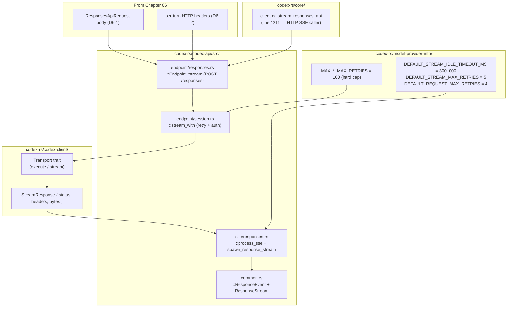

# Chapter 07: HTTP SSE Transport

> Status: **audited (2026-05-11)** | refs/codex SHA `76845d716b` | 12 claims / 12 anchors / 0 open questions

## Scope

Covers the **HTTP Server-Sent Events transport** path that ships a `ResponsesApiRequest` (Chapter 06 D6-1) to the OpenAI/Azure Responses endpoint and streams back `ResponseEvent`s. The "how" complement to Chapter 06's "what".

What's **here**: endpoint URL + HTTP method, `Accept: text/event-stream` negotiation, retry/backoff policy, SSE event loop driven by `process_sse`, `ResponseEvent` enum variants, idle-timeout behaviour, completion semantics, and the HTTP path's relationship to `previous_response_id` (it does NOT use it directly — chain semantics live in WS path Ch08 / state Ch11).

**Deferred**:
- WebSocket transport variant (Chapter 08).
- Compact sub-endpoint (Chapter 09).
- Cache routing behaviour from event content (Chapter 11).
- Rollout / telemetry capture (Chapter 12).
- Specific `ResponseItem` / `ContentItem` variants emitted via OutputItemDone — handled in protocol-shape passes if needed.

## Module architecture



Stack view (HTTP request → SSE event stream):

```
┌──────────────────────────────────────────────────────────┐
│ ModelClientSession::stream_responses_api (core, line 1211)│
├──────────────────────────────────────────────────────────┤
│ Endpoint::stream (codex-api/endpoint/responses.rs:117)    │
│   build StreamResponse with Method::POST, path="responses"│
│   inject Accept: text/event-stream header                 │
│   delegate to session.stream_with(...)                    │
├──────────────────────────────────────────────────────────┤
│ Session::stream_with (codex-api/endpoint/session.rs:120)  │
│   run_with_request_telemetry(retry_policy, ...)           │
│     apply auth via AuthProvider.apply_auth                │
│     transport.stream(req).await                           │
│   retry on 429 / 5xx / transport per RetryPolicy          │
├──────────────────────────────────────────────────────────┤
│ Transport.stream → StreamResponse                         │
│   { status: StatusCode, headers: HeaderMap, bytes }       │
├──────────────────────────────────────────────────────────┤
│ spawn_response_stream (codex-api/sse/responses.rs:63)     │
│   spawns process_sse task that:                           │
│     - calls stream.eventsource() — SSE adapter            │
│     - loop with idle_timeout (300s default) per event     │
│     - serde_json::from_str each event.data                │
│     - dispatch into ResponseEvent variants via mpsc       │
│     - terminate on Completed { response_id, ... }         │
├──────────────────────────────────────────────────────────┤
│ ResponseStream { rx_event: mpsc::Receiver<…>, … }         │
│   consumed by caller (Session.run_turn) as a Stream       │
└──────────────────────────────────────────────────────────┘
```

## IDEF0 decomposition

See [`idef0.07.json`](idef0.07.json). Activities:

- **A7.1** Issue HTTP POST — Method::POST to path `"responses"`, Accept: text/event-stream, body = serde_json::Value, headers from D6-2.
- **A7.2** Apply retry policy — RetryPolicy { max_attempts, base_delay, retry_on { 429, 5xx, transport } } via `run_with_request_telemetry`.
- **A7.3** Stream response body bytes — Transport.stream → StreamResponse { status, headers, bytes }; bytes is a ByteStream of SSE-encoded chunks.
- **A7.4** Parse SSE events — `stream.eventsource()` adapter splits chunks into `event: <type>\ndata: <json>\n\n` frames; each frame's `data` is JSON-parsed into `ResponsesStreamEvent`.
- **A7.5** Map to ResponseEvent — `process_responses_event` projects parsed event into the typed `ResponseEvent` enum; emit via `mpsc::Sender` to caller.
- **A7.6** Idle / completion termination — idle_timeout (default 300s) per event-wait; explicit `ResponseEvent::Completed` ends the task cleanly; stream-end-before-completed emits `ApiError::Stream("stream closed before response.completed")`.

## GRAFCET workflow

See [`grafcet.07.json`](grafcet.07.json). Linear request → retry loop → SSE event loop → completion/idle exit.

## Controls & Mechanisms

A7.2 has multiple mechanism inputs (RetryPolicy fields, telemetry hook, AuthProvider). A7.4 + A7.5 are tightly coupled (parse + map). ICOM cells in idef0.07.json suffice; no separate diagram needed.

## Protocol datasheet

### D7-1: SSE event stream (server → client)

**Transport**: SSE over HTTP response body. Each event is `event: <type>\ndata: <json>\n\n`.
**Triggered by**: A7.4 + A7.5 — every SSE frame received from the server.
**Source**: [`refs/codex/codex-rs/codex-api/src/sse/responses.rs:433`](refs/codex/codex-rs/codex-api/src/sse/responses.rs#L433) (`process_sse`); event types parsed from `data` JSON via `ResponsesStreamEvent` serde.

| ResponseEvent variant | Trigger | Required | Source (file:line) | Per-turn vs Streaming | Notes |
|---|---|---|---|---|---|
| `Created` | response.created frame | one per turn | [`common.rs:73`](refs/codex/codex-rs/codex-api/src/common.rs#L73) | once at start | Server-side response object created. |
| `OutputItemAdded(ResponseItem)` | response.output_item.added | per item | [`common.rs:75`](refs/codex/codex-rs/codex-api/src/common.rs#L75) | streaming | New item appears in the chain (assistant message or tool_call). |
| `OutputItemDone(ResponseItem)` | response.output_item.done | per item | [`common.rs:74`](refs/codex/codex-rs/codex-api/src/common.rs#L74) | streaming | Item fully realised. |
| `OutputTextDelta(String)` | response.output_text.delta | many per turn | [`common.rs:92`](refs/codex/codex-rs/codex-api/src/common.rs#L92) | streaming | Assistant text chunks. |
| `ToolCallInputDelta { item_id, call_id?, delta }` | tool_call.arguments.delta | many per call | [`common.rs:93-97`](refs/codex/codex-rs/codex-api/src/common.rs#L93-L97) | streaming | Function arguments streaming. |
| `ReasoningSummaryDelta { delta, summary_index }` | reasoning_summary.delta | many per turn | [`common.rs:98-101`](refs/codex/codex-rs/codex-api/src/common.rs#L98-L101) | streaming | Reasoning summary chunks. |
| `ReasoningContentDelta { delta, content_index }` | reasoning_content.delta | many per turn | [`common.rs:102-105`](refs/codex/codex-rs/codex-api/src/common.rs#L102-L105) | streaming | Reasoning content chunks (under include opt-in). |
| `ReasoningSummaryPartAdded { summary_index }` | reasoning_summary.part.added | per part | [`common.rs:106-108`](refs/codex/codex-rs/codex-api/src/common.rs#L106-L108) | streaming | New reasoning summary part starts. |
| `RateLimits(RateLimitSnapshot)` | rate_limits frame | conditional | [`common.rs:109`](refs/codex/codex-rs/codex-api/src/common.rs#L109) | per-turn | Server-supplied rate-limit window snapshot. |
| `ServerModel(String)` | response headers `OpenAI-Model` OR payload | once per turn | [`common.rs:76-78`](refs/codex/codex-rs/codex-api/src/common.rs#L76-L78) | streaming | Server's actual model (may differ from request when safety routing applies). |
| `ModelVerifications(Vec<…>)` | response.model_verifications | conditional | [`common.rs:80`](refs/codex/codex-rs/codex-api/src/common.rs#L80) | per-turn | Account verification recommendations. |
| `ServerReasoningIncluded(bool)` | header `X-Reasoning-Included: true` | conditional | [`common.rs:81-84`](refs/codex/codex-rs/codex-api/src/common.rs#L81-L84) | per-turn | Tells client not to re-estimate past reasoning tokens. |
| `Completed { response_id, token_usage?, end_turn? }` | response.completed | **terminal** | [`common.rs:85-91`](refs/codex/codex-rs/codex-api/src/common.rs#L85-L91) | once at end | Final event; `process_sse` returns after emitting this. |

**Termination contracts** (from `process_sse`):
- Completed event → return cleanly.
- Stream closes without Completed → emit `ApiError::Stream("stream closed before response.completed")` then return.
- Idle timeout exceeded (300s default per event wait) → emit `ApiError::Stream("idle timeout waiting for SSE")` then return.
- Underlying eventsource error → emit `ApiError::Stream(e.to_string())` then return.

**Example SSE wire bytes** (sanitized — start, one delta, completion):

```
event: response.created
data: {"type":"response.created","response":{"id":"resp_abc","model":"gpt-5.5"}}

event: response.output_text.delta
data: {"type":"response.output_text.delta","delta":"Hello"}

event: response.completed
data: {"type":"response.completed","response":{"id":"resp_abc","usage":{...},"end_turn":true}}
```

### D7-2: HTTP request envelope (client → server)

**Transport**: HTTP POST.
**Triggered by**: A7.1.
**Source**: [`refs/codex/codex-rs/codex-api/src/endpoint/responses.rs:117`](refs/codex/codex-rs/codex-api/src/endpoint/responses.rs#L117).

| Slot | Value / Encoding | Required | Source (file:line) | Notes |
|---|---|---|---|---|
| Method | `POST` | required | [`responses.rs:132`](refs/codex/codex-rs/codex-api/src/endpoint/responses.rs#L132) | Hard-coded `Method::POST`. |
| Path | `responses` (joined onto provider base_url, e.g. `https://chatgpt.com/backend-api/codex/responses`) | required | [`responses.rs:102-104`](refs/codex/codex-rs/codex-api/src/endpoint/responses.rs#L102-L104) | `fn path() -> &'static str { "responses" }`. |
| `Accept` header | `text/event-stream` | required | [`responses.rs:137-140`](refs/codex/codex-rs/codex-api/src/endpoint/responses.rs#L137-L140) | Hard-coded inside stream() configure closure. |
| Other headers | from extra_headers (D6-2) | required | (see D6-2) | |
| Body | `serde_json::Value` of ResponsesApiRequest (D6-1) | required | [`responses.rs:135`](refs/codex/codex-rs/codex-api/src/endpoint/responses.rs#L135) | Pre-serialised in stream_request (Ch06 C11) then handed to stream(). |
| Compression | `Compression::None` or `Compression::Zstd` | required | [`responses.rs:124-127`](refs/codex/codex-rs/codex-api/src/endpoint/responses.rs#L124-L127) | Threaded from caller; defaults to None. |

**Note**: `previous_response_id` is **NOT** in the HTTP body. The HTTP SSE path operates on chain state via cache-key + server-side history; `previous_response_id` is exclusive to the WS path's `ResponseCreateWsRequest` (Chapter 08).

## Claims & anchors

| Claim | Anchor | Kind |
|---|---|---|
| **C1**: Endpoint path is hard-coded `"responses"`; HTTP method is `Method::POST` (no GET/PUT alternative). Joined with provider base_url (e.g. `https://chatgpt.com/backend-api/codex` for ChatGPT codex) by stream_with. | [`refs/codex/codex-rs/codex-api/src/endpoint/responses.rs:102`](refs/codex/codex-rs/codex-api/src/endpoint/responses.rs#L102) | fn (const path) |
| **C2**: HTTP stream injects `Accept: text/event-stream` inside the configure closure — non-overridable per-call. | [`refs/codex/codex-rs/codex-api/src/endpoint/responses.rs:137`](refs/codex/codex-rs/codex-api/src/endpoint/responses.rs#L137) | configure closure |
| **C3**: `ResponseEvent` enum has 13 variants covering lifecycle (Created, Completed), content (OutputItemAdded/Done, OutputTextDelta, ToolCallInputDelta, ReasoningSummary/Content/Part deltas), metadata (ServerModel, ModelVerifications, ServerReasoningIncluded), and rate limits (RateLimits). | [`refs/codex/codex-rs/codex-api/src/common.rs:71`](refs/codex/codex-rs/codex-api/src/common.rs#L71) | **enum (TYPE)** |
| **C4**: `process_sse(stream, tx_event, idle_timeout, telemetry)` is the SSE event-loop driver. Uses `stream.eventsource()` adapter (line 439) to split chunks into events. Each event's `.data` is `serde_json::from_str` into `ResponsesStreamEvent` (line 473). Parse failures are logged at debug level and the loop continues. | [`refs/codex/codex-rs/codex-api/src/sse/responses.rs:433`](refs/codex/codex-rs/codex-api/src/sse/responses.rs#L433) | fn |
| **C5**: SSE idle timeout = `Duration` set per provider — default `DEFAULT_STREAM_IDLE_TIMEOUT_MS = 300_000` ms (5 minutes). Each iteration of process_sse loop wraps `stream.next()` in `timeout(idle_timeout, ...)`. Timeout exhaustion emits `ApiError::Stream("idle timeout waiting for SSE")`. | [`refs/codex/codex-rs/codex-api/src/sse/responses.rs:445`](refs/codex/codex-rs/codex-api/src/sse/responses.rs#L445) | tokio::timeout call + idle timeout const |
| **C6**: `DEFAULT_STREAM_IDLE_TIMEOUT_MS = 300_000`, `DEFAULT_STREAM_MAX_RETRIES = 5`, `DEFAULT_REQUEST_MAX_RETRIES = 4`. Hard caps `MAX_STREAM_MAX_RETRIES = 100` and `MAX_REQUEST_MAX_RETRIES = 100` clamp user-configured values. | [`refs/codex/codex-rs/model-provider-info/src/lib.rs:25`](refs/codex/codex-rs/model-provider-info/src/lib.rs#L25) | const block |
| **C7**: `Endpoint::stream` (POST /responses) delegates to `session.stream_with(Method::POST, "responses", extra_headers, body, configure)` which wraps the call in `run_with_request_telemetry` with the provider's retry policy. Auth applied via `AuthProvider::apply_auth` inside the retry closure. | [`refs/codex/codex-rs/codex-api/src/endpoint/session.rs:120`](refs/codex/codex-rs/codex-api/src/endpoint/session.rs#L120) | fn |
| **C8**: `RetryConfig::to_policy()` builds `RetryPolicy { max_attempts, base_delay, retry_on: RetryOn { retry_429, retry_5xx, retry_transport } }`. Three retry triggers: HTTP 429, HTTP 5xx, transport-layer errors. | [`refs/codex/codex-rs/codex-api/src/provider.rs:25`](refs/codex/codex-rs/codex-api/src/provider.rs#L25) | impl fn |
| **C9**: `process_sse` terminates the task on Completed (early `return` after sending the event via mpsc, line 509-511). Subsequent events are NOT processed — Completed is strictly terminal. | [`refs/codex/codex-rs/codex-api/src/sse/responses.rs:505`](refs/codex/codex-rs/codex-api/src/sse/responses.rs#L505) | `if is_completed { return; }` |
| **C10**: HTTP path's `ResponsesApiRequest` (D6-1) has **NO** `previous_response_id` field. Chain state on the HTTP path is implicit via cache-key + server-side history. WS path uses a different request type `ResponseCreateWsRequest` (sibling struct in common.rs) which **does** carry `previous_response_id: Option<String>` for explicit chain linkage. | [`refs/codex/codex-rs/codex-api/src/common.rs:215`](refs/codex/codex-rs/codex-api/src/common.rs#L215) | **struct (TYPE)** |
| **C11**: `ServerModel` event emission: `process_sse` reads `event.response_model()` (line 482) and emits `ResponseEvent::ServerModel(model)` exactly when the model name differs from the previous one in the same stream. Dedup logic: `last_server_model.as_deref() != Some(model.as_str())`. | [`refs/codex/codex-rs/codex-api/src/sse/responses.rs:482`](refs/codex/codex-rs/codex-api/src/sse/responses.rs#L482) | conditional emit |
| **C12**: TEST `spawn_response_stream_emits_header_events` constructs a StreamResponse with `OPENAI_MODEL_HEADER` set, asserts that consuming the stream's first event yields `ResponseEvent::ServerModel(CYBER_RESTRICTED_MODEL_FOR_TESTS)`. Pins the header→event projection contract. | [`refs/codex/codex-rs/codex-api/src/sse/responses.rs:1073`](refs/codex/codex-rs/codex-api/src/sse/responses.rs#L1073) | **test (TEST)** |

Anchor totals: 12 claims, 12 anchors. TEST/TYPE diversity: **2 TYPE** (C3 ResponseEvent enum, C10 ResponseCreateWsRequest struct) + **1 TEST** (C12). Sufficient.

## Cross-diagram traceability (per miatdiagram §4.7)

- `codex-api/src/endpoint/responses.rs::stream` → A7.1 → D7-2 ✓
- `codex-api/src/endpoint/session.rs::stream_with` → A7.2 ✓
- Transport.stream → A7.3 ✓
- `codex-api/src/sse/responses.rs::process_sse` → A7.4, A7.5, A7.6 → D7-1 ✓
- `codex-api/src/common.rs::ResponseEvent` → D7-1 variant table ✓
- `codex-api/src/common.rs::ResponseCreateWsRequest` (C10) → forward-link to Chapter 08 ✓
- TEST C12 → header→event projection contract for ServerModel ✓

All cross-links verified.

## Open questions

None. Backend's retry-after / circuit-breaker semantics for 429 / 5xx aren't source-derivable from upstream — backend-side behaviour belongs to Chapter 11 (cache & prefix model — closely related to rate-limit routing) or out of scope.

## OpenCode delta map

- **A7.1 HTTP POST + path** — OpenCode codex-provider's HTTP fallback path at [packages/opencode-codex-provider/src/provider.ts:362-385](packages/opencode-codex-provider/src/provider.ts#L362-L385) does `fetch(url, { method: "POST", headers, body: JSON.stringify(body), signal })` to `CODEX_API_URL`. **Aligned**: yes.
- **A7.2 Retry policy** — OpenCode relies on the codex provider's built-in fetch + AI SDK retry semantics; the provider package does not currently emit upstream-style RetryPolicy (no max_attempts / retry_on { 429, 5xx, transport } configuration). **Aligned**: partial. **Drift**: OpenCode retry behaviour is governed by the daemon's rate-limit judge layer instead of per-request HTTP retry. Different model; cache-impact equivalent in practice.
- **A7.3 Transport stream** — OpenCode uses Node `fetch` returning a Response with a streamed body, then parses SSE via the AI SDK adapter. **Aligned**: yes structurally.
- **A7.4-A7.5 SSE parsing** — OpenCode's codex-provider uses AI SDK v2's SSE adapter to map upstream events to its own ResponseEvent-equivalent shape. Variants are mapped to AI SDK's StreamPart types (text-delta, tool-call-delta, etc.). **Aligned**: functionally equivalent; the wire SSE events are the same; the in-memory representation differs.
- **A7.6 Termination** — Both terminate on the `response.completed` event. OpenCode adds extra termination on `finishReason` fallback ([commit c850633b2](https://github.com/Raw1mage/opencode/commit/c850633b2)) when content emitted but no terminal event arrived — a hardening that upstream doesn't need because its types enforce it.

**Cross-cutting drift findings:**

1. **OpenCode does NOT use HTTP SSE for codex** — it defaults to WebSocket transport via `tryWsTransport` ([provider.ts:288](packages/opencode-codex-provider/src/provider.ts#L288)), with HTTP SSE as fallback only. Upstream codex-cli uses HTTP SSE as the default; WS is an opt-in capability. **Aligned**: partial. **Drift**: by design — OpenCode prefers WS for delta-mode efficiency. Cache implications: WS path uses explicit `previous_response_id` (C10) while HTTP path doesn't — Chapter 08 unpacks the WS path semantics.
2. **`response.completed` semantics match** — both implementations treat this as strictly terminal.
3. **Idle timeout differs** — OpenCode's WS path has its own keepalive / reconnect logic (Chapter 08 territory) rather than codex's 300s default per-event SSE idle.

The most consequential delta for cache-related work: **OpenCode primarily uses WS (Ch08) not HTTP SSE**, so any HTTP SSE-specific behaviour from upstream rarely applies. Cache hits/misses observed in OpenCode are dominated by WS-path mechanics → Chapter 08.
