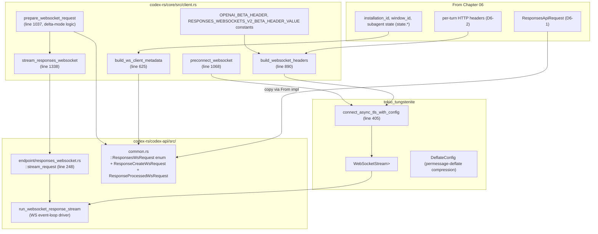

# Chapter 08: WebSocket Transport

> Status: **audited (2026-05-11)** | refs/codex SHA `76845d716b` | 12 claims / 12 anchors / 0 open questions

## Scope

Covers **Responses-over-WebSocket** — the higher-performance transport that codex prefers when supported. Same wire body content (Chapter 06 D6-1) but framed differently: WS handshake → first frame carries `ResponseCreateWsRequest` → server streams `ResponseEvent`-equivalent frames → optional `response.processed` ACK back. Adds **delta-mode** (incremental input via `previous_response_id`) and **sticky-routing** via `x-codex-turn-state`.

What's **here**: WS endpoint URL semantics (same path + Beta header), `OpenAI-Beta: responses_websockets=2026-02-06` negotiation, handshake header set (overlaps with HTTP), first-frame body shape (`ResponsesWsRequest` discriminated union), `ResponseProcessedWsRequest` ACK shape, delta-mode logic via `prepare_websocket_request`, `build_ws_client_metadata` composition (CRITICAL: this is richer than HTTP's `client_metadata`), turn-state sticky routing, reconnect / cached session reuse.

**Deferred**:
- Compact sub-endpoint (Chapter 09) — uses its own variant.
- Subagent-specific behaviour (Chapter 10).
- Cache routing observations from WS event stream (Chapter 11).
- Telemetry capture (Chapter 12).

## Module architecture



Stack view (turn dispatch → WS frames):

```
┌─────────────────────────────────────────────────────────────────┐
│ stream_responses_websocket (core/client.rs:1338)                 │
│   - build ResponsesApiRequest via build_responses_request (Ch06) │
│   - ResponseCreateWsRequest::from(&request)  (copies all fields) │
│   - overwrite client_metadata via build_ws_client_metadata (richer) │
│   - prepare_websocket_request: maybe insert previous_response_id  │
│     + incremental_items for delta-mode                            │
├─────────────────────────────────────────────────────────────────┤
│ Handshake (one-time per WS connection)                           │
│   build_websocket_headers (core/client.rs:890):                  │
│     + build_responses_headers (beta+turn_state+turn_metadata)    │
│     + x-client-request-id := thread_id                           │
│     + build_session_headers (session_id, session-id, thread_id, thread-id) │
│     + build_responses_identity_headers (window_id + parent_thread + subagent) │
│     + attestation (if any)                                       │
│     + OpenAI-Beta: responses_websockets=2026-02-06               │
│     + x-responsesapi-include-timing-metrics (if requested)       │
│   connect_async_tls_with_config (WS upgrade over HTTPS)          │
├─────────────────────────────────────────────────────────────────┤
│ First frame: ResponsesWsRequest::ResponseCreate(payload)         │
│   { type: "response.create",                                     │
│     model, instructions, input, tools, …  (D6-1 fields),         │
│     previous_response_id?: Some(<prev>) on delta-mode,           │
│     generate?: false for warmup,                                 │
│     client_metadata: {                                           │
│       x-codex-installation-id,                                   │
│       x-codex-window-id,                                         │
│       x-openai-subagent?,                                        │
│       x-codex-parent-thread-id?,                                 │
│       x-codex-turn-metadata?,                                    │
│       w3c traceparent / tracestate (if trace context present)    │
│     }                                                             │
│   }                                                               │
├─────────────────────────────────────────────────────────────────┤
│ Server frames → run_websocket_response_stream                    │
│   reads response headers (x-codex-turn-state stored per turn)    │
│   parses each frame → ResponseEvent (same enum as HTTP, Ch07 D7-1)│
│   emits via mpsc::Sender<Result<ResponseEvent, ApiError>> (1600 cap)│
├─────────────────────────────────────────────────────────────────┤
│ Optional ACK back: ResponsesWsRequest::ResponseProcessed         │
│   { type: "response.processed", response_id }                    │
│   sent by send_response_processed when caller confirms consume   │
└─────────────────────────────────────────────────────────────────┘
```

## IDEF0 decomposition

See [`idef0.08.json`](idef0.08.json). Activities:

- **A8.1** Build WS handshake headers — `build_websocket_headers` composes a header map for the WS upgrade request.
- **A8.2** Establish WS connection — `connect_async_tls_with_config` performs the TLS+WS upgrade; cached connection reused when possible.
- **A8.3** Build WS client_metadata — `build_ws_client_metadata` produces the richer per-frame metadata map (2-5 keys).
- **A8.4** Prepare delta-mode request — `prepare_websocket_request` decides full-mode vs delta-mode based on last_response presence + incremental_items computability.
- **A8.5** Send first frame — `ResponsesWsRequest::ResponseCreate(payload)` serialised + sent as a Text WS message.
- **A8.6** Drive response stream — `run_websocket_response_stream` reads server frames, maps to `ResponseEvent`, emits via mpsc.
- **A8.7** Optional ACK — `send_response_processed` posts `ResponsesWsRequest::ResponseProcessed { response_id }` after caller consumes the response.

## GRAFCET workflow

See [`grafcet.08.json`](grafcet.08.json). Connection establish → handshake → first frame send → event-loop streaming → optional ACK. Reconnect branch on transport error.

## Controls & Mechanisms

A8.3 (build_ws_client_metadata) has 5 independent conditional sources contributing keys; reflected in ICOM cells. No separate diagram needed.

## Protocol datasheet

### D8-1: WS handshake headers (HTTP upgrade request)

**Transport**: HTTPS GET with `Upgrade: websocket`; encoded by tungstenite.
**Triggered by**: A8.2 — every WS connection establish.
**Source**: [`refs/codex/codex-rs/core/src/client.rs:890`](refs/codex/codex-rs/core/src/client.rs#L890) (`build_websocket_headers`).

| Header | Type / Encoding | Required | Source (file:line) | Stability | Notes |
|---|---|---|---|---|---|
| `OpenAI-Beta` | `"responses_websockets=2026-02-06"` (date-versioned) | required for WS | [`client.rs:911-914`](refs/codex/codex-rs/core/src/client.rs#L911-L914) | stable per codex-cli build | Activates the Responses-WS beta surface. Without this header backend serves only HTTP SSE. |
| `Authorization`, `User-Agent`, `originator` | (Ch02 D headers) | required | Ch02 C11, C12 | per-refresh / stable | Same as HTTP path. |
| `session_id` + `session-id` + `thread_id` + `thread-id` | UUID strings (both forms) | required | [`client.rs:906`](refs/codex/codex-rs/core/src/client.rs#L906) | stable-per-session | Via `build_session_headers`. |
| `x-client-request-id` | UUID = thread_id | required | [`client.rs:903-904`](refs/codex/codex-rs/core/src/client.rs#L903-L904) | stable-per-session | |
| `x-codex-beta-features` | comma-separated feature keys | optional | Ch06 D6-2 (same source) | stable-per-session | |
| `x-codex-window-id` | `"{thread_id}:{window_generation}"` | always emitted | Ch06 C10 (via build_responses_identity_headers) | stable-per-window | |
| `x-codex-parent-thread-id` | UUID | conditional (ThreadSpawn subagent) | Ch06 C10 | stable-per-subagent | |
| `x-openai-subagent` | label string | conditional | Ch06 C10 | stable-per-subagent | |
| `x-openai-memgen-request` | `"true"` | conditional (Internal MemoryConsolidation) | Ch06 D6-2 | per-source | |
| `x-codex-turn-state` | opaque token | conditional (replayed from prior turn) | [`client.rs:1664`](refs/codex/codex-rs/core/src/client.rs#L1664) | per-turn sticky | Read from response.headers on prior turn, sent on next WS frame in same turn for sticky routing. |
| `x-codex-turn-metadata` | JSON string | conditional | [`client.rs:1667`](refs/codex/codex-rs/core/src/client.rs#L1667) | per-turn | When caller supplies turn_metadata_header. |
| `x-oai-attestation` | opaque base64 | conditional | [`client.rs:908-910`](refs/codex/codex-rs/core/src/client.rs#L908-L910) | per-turn | When state.include_attestation. |
| `x-responsesapi-include-timing-metrics` | `"true"` | conditional | [`client.rs:915-919`](refs/codex/codex-rs/core/src/client.rs#L915-L919) | stable-per-session | Opt-in for server-supplied timing metrics. |

### D8-2: First WS frame — `ResponsesWsRequest::ResponseCreate(payload)`

**Transport**: WebSocket Text message, JSON body.
**Triggered by**: A8.5 — every new turn (or every WS-message in incremental mode).
**Source**: [`refs/codex/codex-rs/codex-api/src/common.rs:272`](refs/codex/codex-rs/codex-api/src/common.rs#L272) (`ResponsesWsRequest` enum); body composed from [`client.rs:1377-1383`](refs/codex/codex-rs/core/src/client.rs#L1377-L1383).

| Field | Type / Encoding | Required | Source (file:line) | Stability | Notes |
|---|---|---|---|---|---|
| `type` | string literal `"response.create"` | required (serde tag) | [`common.rs:273`](refs/codex/codex-rs/codex-api/src/common.rs#L273) | invariant | Discriminator for ResponsesWsRequest variant. |
| `model` | same as D6-1 | required | [`common.rs:215+`](refs/codex/codex-rs/codex-api/src/common.rs#L215) | stable-per-session | |
| `instructions` | same as D6-1 | optional (skip when empty) | same | stable-per-session | |
| `input` | array of ResponseItem | required | same | full or incremental (delta-mode) | In delta-mode this contains only NEW items since last_response. |
| `tools` | array of Value | required | same | semi-static (Ch05) | |
| `tool_choice`, `parallel_tool_calls`, `reasoning`, `store`, `stream`, `include`, `service_tier?`, `prompt_cache_key?`, `text?` | same as D6-1 | per D6-1 | same | per D6-1 | |
| `previous_response_id` | string \| null | **WS-only**; required when delta-mode | [`common.rs:221`](refs/codex/codex-rs/codex-api/src/common.rs#L221) | per-turn chain pointer | Some(<prev response_id>) when prepare_websocket_request decides delta-mode. None on initial frame of a new turn. |
| `generate` | bool \| null | optional | [`common.rs:237`](refs/codex/codex-rs/codex-api/src/common.rs#L237) | per-warmup | Set to false during preconnect to suppress generation. |
| `client_metadata` | object | required (richer than HTTP) | [`client.rs:625-656`](refs/codex/codex-rs/core/src/client.rs#L625-L656) build_ws_client_metadata + [`common.rs:247-267`](refs/codex/codex-rs/codex-api/src/common.rs#L247-L267) `response_create_client_metadata` (W3C trace) | mixed | 2-5 keys (vs HTTP's 1 key): see D8-3 below. |

### D8-3: WS `client_metadata` shape (richer than HTTP)

**Important correction to Chapter 06**: HTTP path emits exactly ONE key (`x-codex-installation-id`). WS path **always emits at least 2 keys** and up to 5+:

| Key | Required | Source (file:line) | Stability | Notes |
|---|---|---|---|---|
| `x-codex-installation-id` | always | [`client.rs:630-633`](refs/codex/codex-rs/core/src/client.rs#L630-L633) | stable-per-install | Same UUID as HTTP path. |
| `x-codex-window-id` | **always** | [`client.rs:634-637`](refs/codex/codex-rs/core/src/client.rs#L634-L637) | stable-per-window | Format `"{thread_id}:{window_generation}"`. NOT in HTTP body (HTTP emits as header only). |
| `x-openai-subagent` | conditional (subagent source) | [`client.rs:638-640`](refs/codex/codex-rs/core/src/client.rs#L638-L640) | stable-per-subagent | |
| `x-codex-parent-thread-id` | conditional (ThreadSpawn subagent) | [`client.rs:641-646`](refs/codex/codex-rs/core/src/client.rs#L641-L646) | stable-per-subagent | |
| `x-codex-turn-metadata` | conditional (caller-supplied) | [`client.rs:647-654`](refs/codex/codex-rs/core/src/client.rs#L647-L654) | per-turn | |
| `traceparent` / `tracestate` (W3C) | conditional (trace context present) | [`common.rs:247-267`](refs/codex/codex-rs/codex-api/src/common.rs#L247-L267) `response_create_client_metadata` | per-request | Inserted **after** build_ws_client_metadata. |

### D8-4: `ResponseProcessedWsRequest` (optional ACK back, client → server)

**Transport**: WebSocket Text message, JSON body.
**Triggered by**: A8.7 — `send_response_processed(response_id)`.
**Source**: [`refs/codex/codex-rs/codex-api/src/common.rs:243`](refs/codex/codex-rs/codex-api/src/common.rs#L243).

| Field | Type / Encoding | Required | Source (file:line) | Notes |
|---|---|---|---|---|
| `type` | string `"response.processed"` | required | [`common.rs:275`](refs/codex/codex-rs/codex-api/src/common.rs#L275) | Discriminator. |
| `response_id` | string | required | [`common.rs:244`](refs/codex/codex-rs/codex-api/src/common.rs#L244) | The response_id from a prior `ResponseEvent::Completed` frame. |

## Claims & anchors

| Claim | Anchor | Kind |
|---|---|---|
| **C1**: WS endpoint URL reuses the same path `/responses` (RESPONSES_ENDPOINT const). Backend distinguishes WS from HTTP via the `OpenAI-Beta: responses_websockets=2026-02-06` header. Constants: `pub const OPENAI_BETA_HEADER: &str = "OpenAI-Beta"; const RESPONSES_WEBSOCKETS_V2_BETA_HEADER_VALUE: &str = "responses_websockets=2026-02-06";`. | [`refs/codex/codex-rs/core/src/client.rs:135`](refs/codex/codex-rs/core/src/client.rs#L135) | const block |
| **C2**: `build_websocket_headers` is the handshake header composer. Calls: `build_responses_headers` (beta + turn_state + turn_metadata), inserts `x-client-request-id` = thread_id, `build_session_headers` (session/thread underscore + dash forms), `build_responses_identity_headers` (window_id + parent_thread + subagent), optional attestation, OPENAI_BETA_HEADER, optional include-timing-metrics. | [`refs/codex/codex-rs/core/src/client.rs:890`](refs/codex/codex-rs/core/src/client.rs#L890) | fn |
| **C3**: `ResponsesWsRequest` is a discriminated union with 2 variants: `ResponseCreate(ResponseCreateWsRequest)` → serde tag `"response.create"`; `ResponseProcessed(ResponseProcessedWsRequest)` → serde tag `"response.processed"`. | [`refs/codex/codex-rs/codex-api/src/common.rs:272`](refs/codex/codex-rs/codex-api/src/common.rs#L272) | **enum (TYPE)** |
| **C4**: `ResponseProcessedWsRequest` is a single-field struct: `pub struct ResponseProcessedWsRequest { pub response_id: String }`. Used to ACK back to server after caller consumes the response. | [`refs/codex/codex-rs/codex-api/src/common.rs:243`](refs/codex/codex-rs/codex-api/src/common.rs#L243) | **struct (TYPE)** |
| **C5**: `build_ws_client_metadata(turn_metadata_header) -> HashMap<String,String>` always inserts `x-codex-installation-id` and `x-codex-window-id`; conditionally inserts `x-openai-subagent` (subagent source), `x-codex-parent-thread-id` (ThreadSpawn), `x-codex-turn-metadata` (caller-supplied). 2-5 keys total. | [`refs/codex/codex-rs/core/src/client.rs:625`](refs/codex/codex-rs/core/src/client.rs#L625) | fn |
| **C6**: `response_create_client_metadata(client_metadata, trace) -> Option<HashMap>` post-processes the build_ws_client_metadata output to add W3C `traceparent` / `tracestate` keys when a trace context is present. Returns None if the resulting map would be empty. | [`refs/codex/codex-rs/codex-api/src/common.rs:247`](refs/codex/codex-rs/codex-api/src/common.rs#L247) | fn |
| **C7**: `prepare_websocket_request` is the delta-mode decider. If `last_response` is None OR `get_incremental_items` returns None OR `last_response.response_id.is_empty()` → emit full-mode `ResponsesWsRequest::ResponseCreate(payload)`. Otherwise → emit `ResponseCreate { previous_response_id: Some(last_response.response_id), input: incremental_items, ..payload }`. | [`refs/codex/codex-rs/core/src/client.rs:1037`](refs/codex/codex-rs/core/src/client.rs#L1037) | fn |
| **C8**: WS payload composition site in `stream_responses_websocket` (line 1377-1383): `ResponseCreateWsRequest { client_metadata: response_create_client_metadata(Some(self.client.build_ws_client_metadata(turn_metadata_header)), request_trace.as_ref()), ..ResponseCreateWsRequest::from(&request) }`. The struct-update syntax copies all other fields from the HTTP-path ResponsesApiRequest then overwrites client_metadata. | [`refs/codex/codex-rs/core/src/client.rs:1377`](refs/codex/codex-rs/core/src/client.rs#L1377) | fn body |
| **C9**: WS connection handshake uses `tokio_tungstenite::connect_async_tls_with_config` (line 405 of responses_websocket.rs). Supports permessage-deflate compression via `DeflateConfig` ExtensionsConfig. | [`refs/codex/codex-rs/codex-api/src/endpoint/responses_websocket.rs:405`](refs/codex/codex-rs/codex-api/src/endpoint/responses_websocket.rs#L405) | fn call |
| **C10**: `Endpoint::stream_request(request: ResponsesWsRequest, connection_reused: bool) -> Result<ResponseStream, ApiError>`. The `connection_reused` flag is the sticky-routing signal — true when reusing a cached WS connection within the same session. Emits seed events (ServerModel, ModelsEtag, ServerReasoningIncluded) from cached state before forwarding to `run_websocket_response_stream`. | [`refs/codex/codex-rs/codex-api/src/endpoint/responses_websocket.rs:248`](refs/codex/codex-rs/codex-api/src/endpoint/responses_websocket.rs#L248) | fn |
| **C11**: `X_CODEX_TURN_STATE_HEADER = "x-codex-turn-state"` is the sticky-routing token. Server stores its value via reading response headers; client replays it on subsequent requests in the same turn so the backend routes the continuation to the same machine. The .get() call at line 441 reads it from the response. | [`refs/codex/codex-rs/codex-api/src/endpoint/responses_websocket.rs:155`](refs/codex/codex-rs/codex-api/src/endpoint/responses_websocket.rs#L155) | const + read site |
| **C12**: TEST `build_ws_client_metadata_includes_window_lineage_and_turn_metadata` (line 272 of client_tests.rs). Constructs a ModelClient with `SubAgentSource::ThreadSpawn { parent_thread_id, depth: 2, ... }`, advances window_generation, calls `build_ws_client_metadata(Some(r#"{"turn_id":"turn-123"}"#))`. Asserts the resulting map equals all 5 keys: x-codex-installation-id, x-codex-window-id (`{thread_id}:1` — confirming advance_window_generation incremented), x-openai-subagent ("collab_spawn"), x-codex-parent-thread-id, x-codex-turn-metadata (verbatim JSON). Pins the WS client_metadata shape byte-exact under subagent + turn_metadata conditions. | [`refs/codex/codex-rs/core/src/client_tests.rs:272`](refs/codex/codex-rs/core/src/client_tests.rs#L272) | **test (TEST)** |

Anchor totals: 12 claims, 12 anchors. TEST/TYPE diversity: **2 TYPE** (C3 enum, C4 struct) + **1 TEST** (C12). 9 fn-body anchors. Sufficient.

## Cross-diagram traceability (per miatdiagram §4.7)

- `core/src/client.rs::build_websocket_headers` → A8.1 → D8-1 ✓
- `tokio_tungstenite::connect_async_tls_with_config` → A8.2 ✓
- `core/src/client.rs::build_ws_client_metadata` → A8.3 → D8-3 (verified via C5 + TEST C12) ✓
- `core/src/client.rs::prepare_websocket_request` → A8.4 → D8-2 previous_response_id + input columns ✓
- `core/src/client.rs::stream_responses_websocket` (line 1377-1383) → A8.5 → D8-2 ✓
- `codex-api/src/endpoint/responses_websocket.rs::stream_request` → A8.6 → forward link to Ch07's D7-1 (same ResponseEvent enum) ✓
- `codex-api/src/common.rs::ResponseProcessedWsRequest` → A8.7 → D8-4 ✓
- TEST C12 → D8-3 byte-exact composition under subagent + turn_metadata ✓

## Open questions

None for Chapter 08. The reconnect-on-error path (lines 1402-1410 around `StatusCode::UPGRADE_REQUIRED`) is mechanically clear; full state machine for cached-session reuse is implementation detail that belongs to Chapter 11 if cache observability needs it.

## Correction to Chapter 06 OpenCode delta map

**Chapter 06 flagged**: OpenCode's `x-codex-window-id` in `client_metadata` is divergent vs upstream's "one-key" rule.

**Chapter 08 reveals**: This characterisation was **HTTP-path-specific**. On the WS path — which is OpenCode's **primary** codex transport — upstream **always** emits `x-codex-window-id` inside `client_metadata` (C5, TEST C12). OpenCode is therefore **aligned** with upstream's WS path, not divergent.

The actual divergence sits at the **transport-choice** layer: OpenCode emits `x-codex-window-id` in body's client_metadata on the HTTP fallback path as well, which is upstream-divergent ONLY when HTTP is used. Since HTTP is fallback-only for OpenCode, the live impact is small. Recommend updating `provider_codex-installation-id/` and bundle-slow-first specs to reflect this nuance if either resumes.

## OpenCode delta map

- **A8.1 Handshake headers** — OpenCode emits via [packages/opencode-codex-provider/src/transport-ws.ts](packages/opencode-codex-provider/src/transport-ws.ts) + [`headers.ts:38`](packages/opencode-codex-provider/src/headers.ts#L38) `buildHeaders` (with `isWebSocket: true`). Emits `OpenAI-Beta: <WS_BETA_HEADER>` constant + standard identity headers. **Aligned**: yes structurally. **Drift**: OpenCode's WS_BETA_HEADER value may not exactly match upstream's `responses_websockets=2026-02-06` date; worth a check during the bundle-slow-first resume work.
- **A8.2 WS connection** — OpenCode uses Bun's native WebSocket client. **Aligned**: yes (both negotiate ws:// → wss:// over TLS). **Drift**: permessage-deflate handling differs (upstream explicit DeflateConfig; OpenCode relies on Bun defaults).
- **A8.3 client_metadata composition** — OpenCode's `buildClientMetadata` ([packages/opencode-codex-provider/src/headers.ts:108](packages/opencode-codex-provider/src/headers.ts#L108)) emits `x-codex-installation-id` + `x-codex-window-id`. **Aligned**: yes with upstream WS path C5. Missing conditional keys: `x-openai-subagent`, `x-codex-parent-thread-id`, `x-codex-turn-metadata`, `traceparent` / `tracestate`. **Drift**: those keys would be needed for subagent semantics (Chapter 10 territory) and W3C tracing (not currently implemented). Cache impact unclear; subagent feature gap is documented separately.
- **A8.4 Delta-mode prepare** — OpenCode tracks `previous_response_id` per session in [`continuation.ts`](packages/opencode-codex-provider/src/continuation.ts) and emits it on subsequent WS frames. **Aligned**: yes. **Drift**: incremental-items computation logic differs — upstream's `get_incremental_items` does strict-extension check; OpenCode tracks via `prevLen` instead. Both produce delta-mode but the gate condition for "can we delta?" is computed differently.
- **A8.5 First frame** — OpenCode emits `{ type: "response.create", ...body }` via `wsRequest` ([transport-ws.ts:273](packages/opencode-codex-provider/src/transport-ws.ts#L273)) with `stream`/`background` stripped (line 294). **Aligned**: yes. **Drift**: OpenCode strips fields upstream keeps; double-check at next bundle-slow-first audit.
- **A8.6 Drive stream** — OpenCode processes server frames via its own event mapping. **Aligned**: ResponseEvent variants match Ch07 D7-1 byte-equivalently.
- **A8.7 ACK back** — OpenCode does not currently send `{ type: "response.processed", response_id }` ACKs. **Drift**: server may not rely on this signal (it's optional confirmation), but worth verifying. Not a cache concern; backend telemetry / state-tracking concern.

**Cumulative key OpenCode finding for WS path**: structurally aligned to upstream where it matters. The flagged drift items (subagent client_metadata keys, ACK back, traceparent injection) are feature gaps rather than wire-shape regressions.
