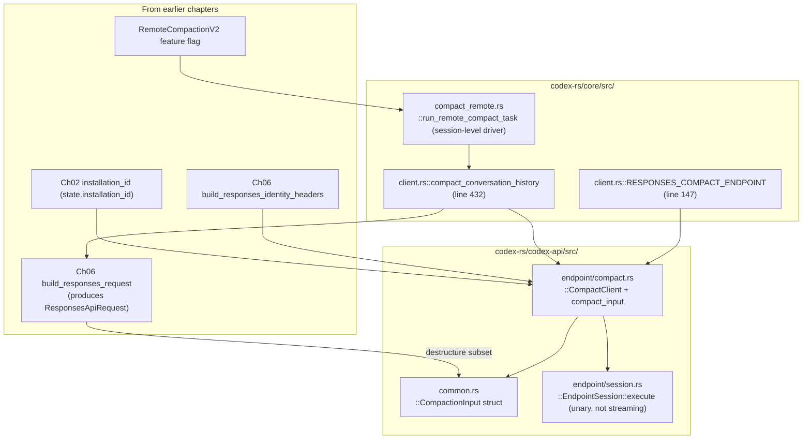

# Chapter 09: Compact Sub-Endpoint

> Status: **audited (2026-05-11)** | refs/codex SHA `76845d716b` | 12 claims / 12 anchors / 0 open questions

## Scope

Covers `/responses/compact` — the **unary** sub-endpoint codex uses to compact conversation history into a smaller representative summary. Different path, different request type (`CompactionInput`), different response shape (`Vec<ResponseItem>` returned directly, not streamed), and — uniquely — the **one place upstream codex-cli emits `x-codex-installation-id` as an HTTP header** rather than as a `client_metadata` body field.

What's **here**: `/responses/compact` path constant, `CompactionInput<'a>` request type, `ApiCompactClient` + `compact_input` fn, `CompactHistoryResponse { output: Vec<ResponseItem> }` response, the unique header-form `x-codex-installation-id` emission, header composition (overlap with Ch06/Ch08 but different mix), `compact_conversation_history` caller in core::client, RemoteCompactionV2 feature gate, Azure-provider gate via `should_use_remote_compact_task`.

**Deferred**:
- The full state machine that triggers compaction (when does codex decide to call this endpoint? — Chapter 11 cache & prefix model).
- Memory summarize endpoint (`MemorySummarizeInput` — adjacent but separate, not in the original 12-chapter scope).
- Sub-agent-driven compaction variants (Chapter 10).

## Module architecture



Stack view (compaction trigger → response):

```
┌──────────────────────────────────────────────────────────┐
│ Session-level driver (compact_remote.rs)                 │
│   gate: TurnContext.features.enabled(RemoteCompactionV2) │
│   gate: should_use_remote_compact_task(provider) (Azure) │
├──────────────────────────────────────────────────────────┤
│ ModelClient::compact_conversation_history (client.rs:432)│
│   - early return Ok([]) if prompt.input is empty         │
│   - build_responses_request → get standard ResponsesApiRequest │
│   - destructure subset into CompactionInput              │
│     (drops: store, stream, include, tool_choice, client_metadata) │
│   - assemble extra_headers (different mix vs Ch06/Ch08)  │
│     • x-codex-installation-id  ← UNIQUE to compact path  │
│     • build_responses_headers (beta only; NO turn_state) │
│     • build_responses_identity_headers (window/parent/subagent)│
│     • build_session_headers (session/thread pairs)       │
│     • optional X-OAI-Attestation                         │
│   - ApiCompactClient::compact_input → POST              │
├──────────────────────────────────────────────────────────┤
│ ApiCompactClient::compact_input (codex-api/endpoint/compact.rs:50) │
│   serde_json::to_value(input) → body                     │
│   self.session.execute(POST, "responses/compact", ...)   │
│   parse CompactHistoryResponse { output }                │
├──────────────────────────────────────────────────────────┤
│ Server response (unary, JSON body — NOT SSE)             │
│   { "output": [ResponseItem, ...] }                      │
└──────────────────────────────────────────────────────────┘
```

## IDEF0 decomposition

See [`idef0.09.json`](idef0.09.json). Activities:

- **A9.1** Gate compaction — feature `RemoteCompactionV2` + provider check.
- **A9.2** Build CompactionInput — destructure subset of `ResponsesApiRequest`.
- **A9.3** Assemble compact headers — different mix than streaming path; **adds `x-codex-installation-id` as HTTP header**.
- **A9.4** Issue HTTP POST to `/responses/compact` (unary, not streaming).
- **A9.5** Parse unary response — `CompactHistoryResponse { output: Vec<ResponseItem> }`.

## GRAFCET workflow

See [`grafcet.09.json`](grafcet.09.json). Linear flow with early-return on empty input.

## Controls & Mechanisms

A9.3 has 5+ header sources (overlapping with Ch06/Ch08 but with a different mix). ICOM cells in idef0.09.json suffice.

## Protocol datasheet

### D9-1: `CompactionInput<'a>` body (client → server, POST /responses/compact)

**Transport**: HTTP POST `/responses/compact`.
**Triggered by**: A9.4 — compaction event.
**Source**: [`refs/codex/codex-rs/codex-api/src/common.rs:25`](refs/codex/codex-rs/codex-api/src/common.rs#L25) (`CompactionInput`).

| Field | Type / Encoding | Required | Source (file:line) | Stability | Notes |
|---|---|---|---|---|---|
| `model` | `&'a str` (model slug) | required | [`common.rs:26`](refs/codex/codex-rs/codex-api/src/common.rs#L26) | stable-per-session | Borrowed slice. |
| `input` | `&'a [ResponseItem]` | required | [`common.rs:27`](refs/codex/codex-rs/codex-api/src/common.rs#L27) | per-compaction-call | The conversation history slice being compacted. |
| `instructions` | `&'a str` (driver) | optional (skip when empty) | [`common.rs:29`](refs/codex/codex-rs/codex-api/src/common.rs#L29) | stable-per-session | Same driver as streaming path. |
| `tools` | `Vec<Value>` | required | [`common.rs:30`](refs/codex/codex-rs/codex-api/src/common.rs#L30) | semi-static | Same shape as Ch05 D5-1. |
| `parallel_tool_calls` | bool | required | [`common.rs:31`](refs/codex/codex-rs/codex-api/src/common.rs#L31) | per-call | |
| `reasoning` | `Option<Reasoning>` | optional | [`common.rs:33`](refs/codex/codex-rs/codex-api/src/common.rs#L33) | per-call | |
| `service_tier` | `Option<&'a str>` | optional | [`common.rs:35`](refs/codex/codex-rs/codex-api/src/common.rs#L35) | per-call | |
| `prompt_cache_key` | `Option<&'a str>` | optional | [`common.rs:37`](refs/codex/codex-rs/codex-api/src/common.rs#L37) | stable-per-session | Same value as streaming path (`thread_id` string). |
| `text` | `Option<TextControls>` | optional | [`common.rs:39`](refs/codex/codex-rs/codex-api/src/common.rs#L39) | per-call | |

**Fields ABSENT compared to ResponsesApiRequest** (D6-1):
- `tool_choice` — implicit (compact endpoint doesn't accept tool_choice).
- `store`, `stream`, `include` — irrelevant for unary compact.
- `client_metadata` — moved to **HTTP header** form (see D9-2 below).

### D9-2: HTTP headers (compact-specific)

**Transport**: HTTP POST headers.
**Triggered by**: A9.3.
**Source**: [`refs/codex/codex-rs/core/src/client.rs:487-503`](refs/codex/codex-rs/core/src/client.rs#L487-L503).

| Header | Type / Encoding | Required | Source (file:line) | Notes |
|---|---|---|---|---|
| `x-codex-installation-id` | UUID string | **always** on this endpoint | [`client.rs:488-490`](refs/codex/codex-rs/core/src/client.rs#L488-L490) | **UNIQUE to compact path.** Streaming HTTP path has this in `body.client_metadata` (Ch06 D6-1); WS path has it in `client_metadata` of first frame (Ch08 D8-3). Compact endpoint is the ONE place upstream emits it as an HTTP header. |
| `x-codex-beta-features` | comma-separated | optional | via `build_responses_headers` (line 491-495) | Same value as streaming. |
| `x-codex-window-id` | `"{thread_id}:{window_gen}"` | required | via `build_responses_identity_headers` (line 496) | Same as Ch06. |
| `x-codex-parent-thread-id` | UUID | conditional | via `build_responses_identity_headers` (line 496) | When ThreadSpawn subagent. |
| `x-openai-subagent` | label | conditional | via `build_responses_identity_headers` (line 496) | When subagent. |
| `x-openai-memgen-request` | "true" | conditional | via `build_responses_identity_headers` (line 496) | When MemoryConsolidation. |
| `session_id` + `session-id` + `thread_id` + `thread-id` | UUID strings | required | via `build_session_headers` (line 497-500) | Both forms emitted. |
| `x-oai-attestation` | opaque | conditional | line 501-503 | When state.include_attestation. |
| Standard auth headers | (Ch02) | required | implicit via session.execute | Authorization, User-Agent, originator, etc. |

**Headers ABSENT compared to streaming path:**
- `x-codex-turn-state` — NOT applicable (compact is unary, no sticky routing within a single call).
- `x-codex-turn-metadata` — NOT applicable.
- `x-client-request-id` — not present in this header set (no explicit insert).
- `OpenAI-Beta` (WS-only header) — NOT applicable, this is HTTP not WS.

### D9-3: `CompactHistoryResponse` (server → client)

**Transport**: HTTP response body (JSON, NOT SSE).
**Triggered by**: A9.5.
**Source**: [`refs/codex/codex-rs/codex-api/src/endpoint/compact.rs:61-64`](refs/codex/codex-rs/codex-api/src/endpoint/compact.rs#L61-L64).

| Field | Type / Encoding | Required | Notes |
|---|---|---|---|
| `output` | `Vec<ResponseItem>` | required | The compacted history items. Caller uses these to replace its in-memory conversation. |

```rust
#[derive(Debug, Deserialize)]
struct CompactHistoryResponse {
    output: Vec<ResponseItem>,
}
```

**Example payload** (sanitized):

```json
{
  "output": [
    { "type": "message", "role": "assistant", "content": [{ "type": "output_text", "text": "<compacted summary>" }] }
  ]
}
```

## Claims & anchors

| Claim | Anchor | Kind |
|---|---|---|
| **C1**: `RESPONSES_COMPACT_ENDPOINT = "/responses/compact"` — const defined alongside `RESPONSES_ENDPOINT` (Ch08 C1). | [`refs/codex/codex-rs/core/src/client.rs:147`](refs/codex/codex-rs/core/src/client.rs#L147) | const |
| **C2**: `CompactionInput<'a>` is a 9-field borrowing struct: `model: &'a str, input: &'a [ResponseItem], instructions: &'a str (skip if empty), tools: Vec<Value>, parallel_tool_calls: bool, reasoning: Option<Reasoning>, service_tier: Option<&'a str>, prompt_cache_key: Option<&'a str>, text: Option<TextControls>`. Subset of `ResponsesApiRequest` (D6-1) — DROPS tool_choice, store, stream, include, client_metadata. | [`refs/codex/codex-rs/codex-api/src/common.rs:25`](refs/codex/codex-rs/codex-api/src/common.rs#L25) | **struct (TYPE)** |
| **C3**: `ApiCompactClient::compact_input(input: &CompactionInput<'_>, extra_headers: HeaderMap) -> Result<Vec<ResponseItem>, ApiError>` is the typed entry point. Internally calls `to_value(input)` then `compact()` which posts to `responses/compact` via `session.execute(Method::POST, ...)`. | [`refs/codex/codex-rs/codex-api/src/endpoint/compact.rs:50`](refs/codex/codex-rs/codex-api/src/endpoint/compact.rs#L50) | fn |
| **C4**: `CompactClient::path()` returns `"responses/compact"` (note: NO leading slash here, since session.execute joins with the base URL). The const `RESPONSES_COMPACT_ENDPOINT` (`/responses/compact`) is used for telemetry routing only. | [`refs/codex/codex-rs/codex-api/src/endpoint/compact.rs:32`](refs/codex/codex-rs/codex-api/src/endpoint/compact.rs#L32) | fn |
| **C5**: `ModelClient::compact_conversation_history(prompt, model_info, settings, session_telemetry, compaction_trace) -> Result<Vec<ResponseItem>>` is the upstream caller. Reuses `build_responses_request` then destructures into `ApiCompactionInput`. Early returns `Ok(Vec::new())` when `prompt.input.is_empty()`. | [`refs/codex/codex-rs/core/src/client.rs:432`](refs/codex/codex-rs/core/src/client.rs#L432) | fn |
| **C6**: **`x-codex-installation-id` is emitted as HTTP header on this endpoint, NOT as `client_metadata`.** Lines 487-490: `let mut extra_headers = ApiHeaderMap::new(); if let Ok(header_value) = HeaderValue::from_str(&self.state.installation_id) { extra_headers.insert(X_CODEX_INSTALLATION_ID_HEADER, header_value); }`. This is the ONE place upstream codex uses the header form of installation_id. Streaming HTTP (Ch06 C3) and WS (Ch08 C5) both use `client_metadata`. | [`refs/codex/codex-rs/core/src/client.rs:487`](refs/codex/codex-rs/core/src/client.rs#L487) | fn body |
| **C7**: Compact header build composition (post-installation_id at line 491-503): `build_responses_headers(beta_features_header, /*turn_state*/ None, /*turn_metadata_header*/ None)` extends; `build_responses_identity_headers` extends; `build_session_headers(Some(session_id), Some(thread_id))` extends; optional `X_OAI_ATTESTATION_HEADER`. Note: turn_state and turn_metadata are explicitly None — unary compact has no sticky routing. | [`refs/codex/codex-rs/core/src/client.rs:491`](refs/codex/codex-rs/core/src/client.rs#L491) | fn body |
| **C8**: Compact response shape: `struct CompactHistoryResponse { output: Vec<ResponseItem> }` — deserialised via serde from response body. The output Vec replaces the caller's compacted history. | [`refs/codex/codex-rs/codex-api/src/endpoint/compact.rs:61`](refs/codex/codex-rs/codex-api/src/endpoint/compact.rs#L61) | **struct (TYPE)** |
| **C9**: Empty-input short-circuit: `if prompt.input.is_empty() { return Ok(Vec::new()); }` at the top of `compact_conversation_history`. Prevents wasteful endpoint round-trip when there's nothing to compact. | [`refs/codex/codex-rs/core/src/client.rs:440`](refs/codex/codex-rs/core/src/client.rs#L440) | guard clause |
| **C10**: Use of this endpoint is gated by `Feature::RemoteCompactionV2` enabled in the session features. Also reflected in `x-codex-beta-features` header value (Ch06 C9 advertise list). | [`refs/codex/codex-rs/core/src/session/turn.rs:816`](refs/codex/codex-rs/core/src/session/turn.rs#L816) | feature flag check |
| **C11**: Additional gate `should_use_remote_compact_task(provider)` evaluates provider-specific eligibility (e.g. Azure provider check). Tested at `should_use_remote_compact_task_for_azure_provider`. | [`refs/codex/codex-rs/core/src/compact_tests.rs:188`](refs/codex/codex-rs/core/src/compact_tests.rs#L188) | **test (TEST)** |
| **C12**: TEST `path_is_responses_compact` pins the literal path string: `assert_eq!(CompactClient::<DummyTransport>::path(), "responses/compact");`. Locks the endpoint path against accidental rename. | [`refs/codex/codex-rs/codex-api/src/endpoint/compact.rs:90`](refs/codex/codex-rs/codex-api/src/endpoint/compact.rs#L90) | **test (TEST)** |

Anchor totals: 12 claims, 12 anchors. TEST/TYPE diversity: **2 TYPE** (C2 CompactionInput struct, C8 CompactHistoryResponse struct) + **2 TEST** (C11, C12). Plus 1 const (C1) and 7 fn/fn-body anchors.

## Cross-diagram traceability (per miatdiagram §4.7)

- `core/src/client.rs::RESPONSES_COMPACT_ENDPOINT` (C1) + `compact_conversation_history` (C5) → A9.1, A9.4 → D9-1 / D9-2 ✓
- `codex-api/src/common.rs::CompactionInput` (C2) → A9.2 → D9-1 ✓
- `codex-api/src/endpoint/compact.rs::CompactClient::compact_input` (C3) + `path` (C4) → A9.4 ✓
- `codex-api/src/endpoint/compact.rs::CompactHistoryResponse` (C8) → A9.5 → D9-3 ✓
- `core/src/client.rs::compact_conversation_history` lines 487-503 (C6, C7) → A9.3 → D9-2 ✓
- `core/src/session/turn.rs::Feature::RemoteCompactionV2 check` (C10) → A9.1 ✓
- `core/src/compact_tests.rs::should_use_remote_compact_task_for_azure_provider` (C11) → A9.1 Azure gate ✓
- TEST C12 → D9-1 path pinning ✓

All cross-links verified.

## Open questions

None. Trigger semantics (when does the session-level driver decide to invoke `compact_conversation_history`?) belong to Chapter 11 (cache & prefix model) since compaction is part of the cache-budget management dance. The `MemorySummarizeInput` adjacent surface (lines 43-50 of common.rs) is intentionally out-of-scope for this 12-chapter reference.

## OpenCode delta map

- **A9.1 Compaction gate** — OpenCode has its own compaction stack in `packages/opencode/src/session/compaction.ts` driven by daemon-side heuristics (`needsCompaction` from context_budget telemetry, `recompress` triggered by size). **Aligned**: no — different architecture. OpenCode runs **server-side inline compaction** via the `context_management` field on every Responses request (see [packages/opencode-codex-provider/src/provider.ts:80](packages/opencode-codex-provider/src/provider.ts#L80)) rather than calling a separate `/responses/compact` endpoint. **Drift**: by design.
- **A9.2 CompactionInput** — OpenCode does not construct anything equivalent. The `context_management` field passes inline alongside the regular `input[]` on a normal Responses request. **Aligned**: no.
- **A9.3 Compact headers** — Since OpenCode doesn't call `/responses/compact`, **none of D9-2's headers apply**. The `x-codex-installation-id` header form is therefore unused by OpenCode entirely; OpenCode's installation_id always travels in `client_metadata` body (Ch06 D6-1 / Ch08 D8-3). **Aligned**: trivially — OpenCode never enters this code path.
- **A9.4 POST /responses/compact** — Not used by OpenCode.
- **A9.5 CompactHistoryResponse parsing** — Not used by OpenCode.

**Key cross-cutting finding:**

**Upstream codex-cli's `/responses/compact` endpoint and OpenCode's inline `context_management` field are functionally equivalent but architecturally divergent.** Both produce a compacted conversation history that fits in the model's context window:

- Upstream: client-driven, explicit sub-request with its own header set (including header-form installation_id), unary response.
- OpenCode: server-driven, declared via `context_management: [{ type: "compaction", compact_threshold }]` field on every Responses request body. The server decides whether/when to compact based on the threshold.

**Implication for the bundle-slow-first work and future cache RCAs:**

When the new agent's content-parts-shape RCA fix lands, the cache behaviour on **inline server-side compaction** (OpenCode's path) is governed by the server's interpretation of `context_management`, not by a separate compact endpoint. So:

- Subagent caching working / main caching stuck (the RCA's central observation) is on the **streaming Responses path** (Ch06/Ch08), not on the compact path.
- Compact-endpoint behaviour is irrelevant to that RCA — flag in the fix-plan if anyone tries to attribute issues here.
- The Chapter 06 OpenCode delta map noted: "`context_management` field is OpenCode-only" — Chapter 09 confirms the equivalence direction: upstream does the same work via a different endpoint. Neither is "wrong"; they're alternate architectures.

Operational consequence: OpenCode's installation_id is **never** sent as an HTTP header (it always rides in client_metadata body). That's structurally fine because OpenCode never enters the compact-endpoint code path. If a future OpenCode change introduced an explicit compact-endpoint call, **C6 would become the canonical reference** for what header to emit.
