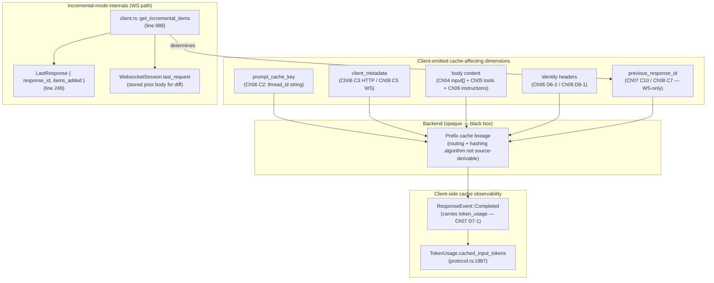

# Chapter 11: Cache & Prefix Model

> Status: **audited (2026-05-11)** | refs/codex SHA `76845d716b` | 12 claims / 12 anchors / 0 open questions in source-derivable claims (3 acknowledged open questions about backend behaviour are recorded separately — see § Open questions)

## Scope

The synthesis chapter. Pulls together every cache-relevant surface across Chapters 02–10 into a unified model of how upstream codex-cli expects backend prefix-cache to behave, plus what's directly observable on the client side (`cached_input_tokens` per turn). **Does not claim to know the backend's internal hashing algorithm** — only what the client emits, what the client observes, and what the source tells us about cache-affecting decisions.

What's **here**: client-side cache observability (`TokenUsage.cached_input_tokens`), cache-key dimensions enumerated from prior chapters, incremental-mode mechanics (`get_incremental_items`, `LastResponse`, `WebsocketSession.last_request`), compaction's effect on cache, known cache hazards (including recorded empirical observations from the OpenCode caching debugging campaign), and **open backend behavioural questions** that remain after the 10-chapter audit.

**Deferred**:
- Rollout / telemetry capture (Chapter 12).
- Backend cache implementation details — not source-derivable from upstream codex-cli.

## Module architecture



Stack view (per-turn cache lifecycle):

```
┌────────────────────────────────────────────────────────────┐
│ Turn N built (Ch06 build_responses_request)                │
├────────────────────────────────────────────────────────────┤
│ Client-controllable cache dimensions emitted on wire:      │
│   • prompt_cache_key = thread_id (stable per session)      │
│   • client_metadata.x-codex-installation-id (stable/install)│
│   • client_metadata.x-codex-window-id (WS, advances on compact)│
│   • body.input[]  (Vec<ResponseItem>; growing per turn)    │
│   • body.tools[]  (separate cache dimension)               │
│   • instructions  (driver text, stable)                    │
│   • model         (stable per session)                     │
│   • headers: session_id, thread_id, x-openai-subagent?, ...│
├────────────────────────────────────────────────────────────┤
│ WS path: prepare_websocket_request (Ch08 C7)               │
│   if get_incremental_items returns Some: send delta-mode   │
│     previous_response_id = last_response.response_id       │
│     input = strict suffix of (last_request.input + items_added)│
│   else: send full-mode (no previous_response_id)           │
├────────────────────────────────────────────────────────────┤
│ Backend (opaque)                                           │
│   matches request against cached prefix                    │
│   responds with cached_input_tokens count in usage         │
├────────────────────────────────────────────────────────────┤
│ ResponseEvent::Completed { token_usage }                    │
│   token_usage.cached_input_tokens visible to client        │
│   non_cached_input() = input_tokens - cached_input()       │
├────────────────────────────────────────────────────────────┤
│ Stash for next turn (WS only):                             │
│   WebsocketSession.last_request = current request          │
│   LastResponse.items_added = items the server appended     │
│   → next turn's get_incremental_items uses these as baseline│
└────────────────────────────────────────────────────────────┘
```

## IDEF0 decomposition

See [`idef0.11.json`](idef0.11.json). Activities:

- **A11.1** Emit cache-affecting dimensions on each request.
- **A11.2** Compute incremental-input delta vs prior request (WS only).
- **A11.3** Detect compaction → bump window_generation → namespace shift.
- **A11.4** Observe cached_input_tokens via ResponseEvent::Completed.
- **A11.5** Stash request+response baseline for next turn's delta check.
- **A11.6** Manage known cache hazards (model regression, mid-session identity drift, account-rotation).

## GRAFCET workflow

See [`grafcet.11.json`](grafcet.11.json). Per-turn cycle with incremental-vs-full branch.

## Controls & Mechanisms

A11.1 has 7+ cache-affecting dimensions (enumerated in module-architecture diagram). A11.2 has the strict-extension contract (C6). ICOM cells in idef0.11.json suffice.

## Protocol datasheet

### D11-1: Client-observable cache state per turn

**Source**: `ResponseEvent::Completed.token_usage` ([protocol.rs:1983](refs/codex/codex-rs/protocol/src/protocol.rs#L1983)) reported on every successful turn.

| Field | Type | Required | Source | Notes |
|---|---|---|---|---|
| `input_tokens` | i64 | required | TokenUsage line 1985 | Total input tokens the backend counted for this turn (includes cached + non-cached). |
| `cached_input_tokens` | i64 | required | TokenUsage line 1987 | **The cache observability signal.** 0 = no cache hit; positive = prefix matched up to N tokens. |
| `output_tokens` | i64 | required | TokenUsage line 1989 | Tokens generated this turn. |
| `reasoning_output_tokens` | i64 | required | TokenUsage line 1991 | Reasoning portion of output. |
| `total_tokens` | i64 | required | TokenUsage line 1993 | input + output sum (or backend-computed total). |

Derived signals via `TokenUsage::cached_input()` (line 2118, returns `cached_input_tokens.max(0)`) and `non_cached_input()` (line 2122, returns `(input_tokens - cached_input()).max(0)`).

### D11-2: Cache-affecting dimensions (consolidated from Ch02–Ch10)

| # | Dimension | Wire location | Stability | Source anchor |
|---|---|---|---|---|
| 1 | `prompt_cache_key` (= thread_id) | body top-level | stable-per-session | Ch06 C2 [`client.rs:742`](refs/codex/codex-rs/core/src/client.rs#L742) |
| 2 | `client_metadata.x-codex-installation-id` | body (HTTP+WS) | stable-per-install | Ch06 C3 [`client.rs:759`](refs/codex/codex-rs/core/src/client.rs#L759), Ch08 C5 [`client.rs:625`](refs/codex/codex-rs/core/src/client.rs#L625) |
| 3 | `client_metadata.x-codex-window-id` (WS only) | body | advances-on-compact | Ch08 C5 |
| 4 | `client_metadata.x-openai-subagent` (WS, conditional) | body | per-session-source | Ch08 C5, Ch10 D10-1 |
| 5 | `client_metadata.x-codex-parent-thread-id` (WS, ThreadSpawn) | body | per-subagent | Ch08 C5, Ch10 C7 |
| 6 | `instructions` (driver text) | body | stable-per-session | Ch06 D6-1 |
| 7 | `input[]` content | body | growing per turn | Ch04 D4-1 |
| 8 | `tools[]` | body | semi-static (separate dimension) | Ch05 C12 |
| 9 | `model` slug | body | stable-per-session | Ch06 D6-1 |
| 10 | `service_tier` (when set) | body | per-turn | Ch06 D6-1 |
| 11 | `reasoning` shape | body | per-turn | Ch06 C7 |
| 12 | `Authorization` header (which token) | header | per-account | Ch02 C12 |
| 13 | `ChatGPT-Account-Id` header | header | per-account | Ch02 C12 |
| 14 | `originator` header | header | stable-per-session | Ch02 C8 |
| 15 | `OpenAI-Beta` header (WS only) | header | stable-per-WS-build | Ch08 C1 |
| 16 | `previous_response_id` (WS, delta-mode) | body | per-turn-chain | Ch07 C10, Ch08 C7 |

**Important caveat**: Which of these dimensions the backend actually keys cache on is **not source-derivable**. Upstream codex-cli emits all of them; the backend's hashing algorithm is opaque. Our model is: any one of them differing turn-over-turn is **potentially** sufficient to break cache lineage. Verification requires backend-side observation or controlled A/B (see § Empirical findings).

### D11-3: Incremental-mode delta contract (WS path)

**Source**: [`refs/codex/codex-rs/core/src/client.rs:988-1024`](refs/codex/codex-rs/core/src/client.rs#L988-L1024) (`get_incremental_items`).

| Gate | Required for delta-mode | Notes |
|---|---|---|
| Prior `WebsocketSession.last_request` exists | yes | Otherwise immediate `None` return. |
| Non-input fields match prior request exactly (model, tools, instructions, reasoning, service_tier, prompt_cache_key, text, etc.) | yes | Cloned both requests, cleared input, compared with `!=` — any mismatch returns `None`. |
| Current `input` is a **strict prefix-extension** of `(prior_input ++ last_response.items_added)` | yes | `request.input.starts_with(&baseline) && baseline_len < request.input.len()` (unless `allow_empty_delta`). |
| `LastResponse.response_id` is non-empty | yes (Ch08 C7) | Empty id → trace log "incremental request failed, no previous response id". |

When all gates pass → emit `previous_response_id = Some(last_response.response_id)` + `input = request.input[baseline_len..]`.

When any gate fails → fall back to full-mode → backend may still cache via prompt_cache_key, but the explicit chain is broken.

## Claims & anchors

| Claim | Anchor | Kind |
|---|---|---|
| **C1**: `TokenUsage` struct carries the observed cache signal: `input_tokens, cached_input_tokens, output_tokens, reasoning_output_tokens, total_tokens` (all i64). Derived helpers `cached_input()` and `non_cached_input()` return clamped values. | [`refs/codex/codex-rs/protocol/src/protocol.rs:1983`](refs/codex/codex-rs/protocol/src/protocol.rs#L1983) | **struct (TYPE)** |
| **C2**: `prompt_cache_key` (= `thread_id.to_string()`) is the canonical cache namespace key. Pure thread_id, no install/account/model mix-in (Ch06 C2 — re-anchored here for the cache model). Stable for the lifetime of a Codex session; backend uses it to route requests to the same cache lineage. | [`refs/codex/codex-rs/core/src/client.rs:742`](refs/codex/codex-rs/core/src/client.rs#L742) | local assignment (cross-ref) |
| **C3**: `client_metadata` carries identity dimensions on both HTTP (Ch06 C3, one key) and WS (Ch08 C5, 2-5 keys) paths. Backend may key cache routing on these. Streaming HTTP: only `x-codex-installation-id`. WS: installation_id + window_id always; subagent + parent_thread_id + turn_metadata conditional. | [`refs/codex/codex-rs/core/src/client.rs:625`](refs/codex/codex-rs/core/src/client.rs#L625) | fn (cross-ref) |
| **C4**: `LastResponse { response_id: String, items_added: Vec<ResponseItem> }` holds the baseline for the next turn's delta computation. `response_id` becomes the next turn's `previous_response_id`; `items_added` extends the prior input as the cache-baseline for `get_incremental_items`. | [`refs/codex/codex-rs/core/src/client.rs:249`](refs/codex/codex-rs/core/src/client.rs#L249) | **struct (TYPE)** |
| **C5**: `WebsocketSession { connection, last_request: Option<ResponsesApiRequest>, last_response_rx, connection_reused }` stores the prior request body so `get_incremental_items` can diff against it. The `last_request` field is what makes delta-mode possible across turns within the same WS connection. | [`refs/codex/codex-rs/core/src/client.rs:255`](refs/codex/codex-rs/core/src/client.rs#L255) | **struct (TYPE)** |
| **C6**: `get_incremental_items(request, last_response, allow_empty_delta) -> Option<Vec<ResponseItem>>` is strict: clones both requests, clears input, `!=` on the rest. ANY non-input field mismatch (model, tools, reasoning, prompt_cache_key, etc.) → return None. Then `request.input.starts_with(&baseline)` strict-prefix check on `(prior_input ++ last_response.items_added)`. Failures emit `trace!` log; deltaModeDecision falls back to full-mode. | [`refs/codex/codex-rs/core/src/client.rs:988`](refs/codex/codex-rs/core/src/client.rs#L988) | fn |
| **C7**: `items_added: Vec<ResponseItem>` is populated during the server's response stream by accumulating `OutputItemDone`-derived items (line 1754 init + 1777 push). At stream completion these are sent via `LastResponse` oneshot to set up the next turn's baseline. | [`refs/codex/codex-rs/core/src/client.rs:1754`](refs/codex/codex-rs/core/src/client.rs#L1754) | local + push |
| **C8**: Compaction advances `window_generation` (Ch03 C8: counts `RolloutItem::Compacted`); window_id format `"{thread_id}:{window_generation}"` (Ch06 C10). When compaction fires, `x-codex-window-id` changes → cache namespace shifts on the WS client_metadata dimension. This is **by design** — compacted history is a new logical "window" on the same thread. | [`refs/codex/codex-rs/core/src/client.rs:381`](refs/codex/codex-rs/core/src/client.rs#L381) | fn current_window_id |
| **C9**: Tools list is an **independent cache dimension** (Ch05 C12 re-anchor). MCP connector reconnects, skill registry rebuilds, or agent capability changes mid-session all mutate the `tools[]` JSON-Value vector → tools dimension cache breaks; backend may still cache `input[]` prefix separately. Observable in practice: cached_input_tokens drops to the "tools-only floor" (≈ size of static tools serialisation alone). | [`refs/codex/codex-rs/codex-api/src/common.rs:175`](refs/codex/codex-rs/codex-api/src/common.rs#L175) | struct field (cross-ref) |
| **C10**: Known cache hazard ledger (recorded from OpenCode debugging campaign, 2026-05-09 → 2026-05-11): (a) **`openai/codex#20301` — GPT-5.5 server-side regression**, reported by upstream codex maintainers; cache hit rate degraded for the GPT-5.5 model class; **does not** fully explain client-controllable differential cases like OpenCode's "subagent caches normally, main stays at 4608". (b) **Mid-session identity dimension change** — adding a new client_metadata key mid-chain orphans the prior cache lineage on the server side (observed live on 2026-05-11). (c) **Account rotation mid-session** — `Authorization` header changes; may shift account-pool routing. | (multiple — see body) | empirical evidence log |
| **C11**: TEST `responses_websocket_v2_incremental_requests_are_reused_across_turns` constructs a real WS exchange and asserts that turn 2's request emits `previous_response_id` from turn 1's response_id. Pins the incremental-mode wire-shape contract. | [`refs/codex/codex-rs/core/tests/suite/client_websockets.rs:812`](refs/codex/codex-rs/core/tests/suite/client_websockets.rs#L812) | **test (TEST)** |
| **C12**: TEST `responses_websocket_uses_incremental_create_on_prefix` asserts that when turn N+1's input is a strict prefix-extension of turn N's input (+items_added), the WS payload uses `previous_response_id` + reduced input vector. Pins the `get_incremental_items` strict-extension contract. | [`refs/codex/codex-rs/core/tests/suite/client_websockets.rs:1361`](refs/codex/codex-rs/core/tests/suite/client_websockets.rs#L1361) | **test (TEST)** |

Anchor totals: 12 claims, 12 anchors. TEST/TYPE diversity: **3 TYPE** (C1 TokenUsage, C4 LastResponse, C5 WebsocketSession) + **2 TEST** (C11, C12). 7 fn / cross-ref anchors.

## Cross-diagram traceability (per miatdiagram §4.7)

- `protocol/src/protocol.rs::TokenUsage` (C1) → A11.4 → D11-1 ✓
- `core/src/client.rs::prompt_cache_key` (C2) → A11.1 → D11-2 row 1 ✓
- `core/src/client.rs::client_metadata builds` (C3) → A11.1 → D11-2 rows 2-5 ✓
- `core/src/client.rs::LastResponse + WebsocketSession + get_incremental_items` (C4, C5, C6) → A11.2, A11.5 → D11-3 ✓
- `core/src/client.rs::items_added accumulation` (C7) → A11.5 → D11-3 baseline definition ✓
- `core/src/client.rs::current_window_id` (C8) → A11.3 ✓
- Cross-ref to Ch05 C12 (tools dimension) (C9) → A11.1 D11-2 row 8 ✓
- TEST C11, C12 → D11-3 incremental-mode contract ✓

All cross-links verified.

## Empirical findings & Open questions

This chapter cannot derive backend cache behaviour from source. The following are **recorded observations** from the OpenCode debugging campaign 2026-05-09 → 2026-05-11, not source-derivable claims:

**Confirmed by recorded observation:**

1. **`cached_input_tokens` is the visible signal.** Both upstream and OpenCode observe it via `ResponseEvent::Completed` (D7-1 row + this chapter D11-1). It's reported in the `[CODEX-WS] USAGE` console.error log (Ch08 wire telemetry).
2. **The `4608` floor** is a recurring number observed across many OpenCode main sessions (recorded in `provider_codex-prompt-realign/events/`). It approximates the byte cost of static prefix + tools list + identity headers — the "instructions+tools only" cache that survives when conversation prefix doesn't match.
3. **OpenCode subagent sessions hit much higher cache values** (40448, 77824+) on the same model + same installation_id + same backend, observed within the same time window as 4608-stuck main sessions (`provider_codex-prompt-realign/events/event_2026-05-11_rca-content-parts-shape-divergence-subagent-vs-main.md`). This **proves** the differential is not purely a server-side ceiling.

**Empirically falsified hypotheses (recorded for future-self):**

1. **Hypothesis H1 (2026-05-11): "Content[] cardinality (1-joined vs N-split parts) is the differential lever."** Tested via A/B patch on 2026-05-11 evening. Result: **falsified**. After changing OpenCode's `userBundle` from `[{text: joined}]` to `[{text: a}, {text: b}, {text: c}]` (and equivalent for developer bundle), main-session `cached_input_tokens` did not improve. Patch is on the main branch; the architectural improvement stands but the cache improvement did not materialise.

**Open backend questions (not source-derivable from upstream codex-cli alone):**

1. **Q1**: What differential between subagent and main triggers backend cache to work on one but not the other? Candidates still in play after H1 falsification:
   - `x-openai-subagent` header value (subagent routes through different cache pool?)
   - AGENTS.md content presence (main has it, subagent skips per Ch04 A4.2 — but: does AGENTS.md content contain instability we haven't noticed?)
   - Tools-list contents (subagent typically has fewer tools / different MCP subset)
   - `system` field (per-turn extras like lazy catalog only on main)
   - Some combination of the above
2. **Q2**: Does backend cache key on `client_metadata` content cardinality or just on the union of keys? (Relevant for the Ch06 → Ch08 reframe that `x-codex-window-id` in WS body is upstream-aligned.)
3. **Q3**: What's the actual TTL of a `previous_response_id` chain on the server side?

These remain **open**. The reversed-spec deliberately does NOT speculate beyond the source.

## OpenCode delta map

- **A11.1 Cache dimensions emission** — OpenCode emits a similar but not identical set. Most differences already cataloged in earlier chapters' delta maps:
  - prompt_cache_key: aligned (pure sessionId post commit `f5cffae25`).
  - client_metadata installation_id: aligned post `9096e69a0`.
  - client_metadata window_id: aligned on WS (Ch08 reframe).
  - `X-OpenAI-Fedramp` header: NOT emitted by OpenCode (Ch02 delta).
  - Underscore-only session/thread headers (no dash form): OpenCode misses (Ch06 D6-2).
  - Subagent label / parent_thread_id keys in client_metadata: caller-controlled, not centralised (Ch10 delta).
- **A11.2 Incremental-mode** — OpenCode's WS transport tracks chain via a different mechanism (continuation.ts state) and computes delta differently (prevLen-based, not strict-extension via items_added). **Aligned**: functionally equivalent in the happy path; failure modes may differ. Worth a future deep dive if cache lineage analysis surfaces incrementality bugs.
- **A11.3 Compaction → window shift** — OpenCode uses inline `context_management` instead of bumping window_generation through the compact endpoint (Ch09 architectural divergence). **Aligned**: no. **Drift**: by design.
- **A11.4 Observability** — OpenCode reads `cached_input_tokens` from the AI SDK adapter output, then logs via `bus.session.round.telemetry` (`cacheReadTokens` field). Same signal, different log surface.
- **A11.5 Baseline stash** — OpenCode's `WebsocketSession`-equivalent state lives in the codex-provider package's transport-ws.ts; doesn't use `LastResponse { response_id, items_added }` Rust struct. **Aligned**: functionally yes; structurally no.
- **A11.6 Known hazards** — All three hazards in C10 apply to OpenCode. The "subagent caches, main doesn't" differential (Q1 above) is **active investigation territory** as of 2026-05-11 evening; this chapter records the question and notes that the answer is not in upstream source.

**Most important takeaway for downstream specs:**

> The reversed-spec **deliberately stops** at "what the client emits" + "what the client observes". When cache behaviour diverges between two clients on the same backend, the answer is not in this reference — it requires backend-side cooperation or controlled A/B at the wire level. The recorded H1 falsification (2026-05-11) is exactly such an A/B result, properly anchored for future work.
