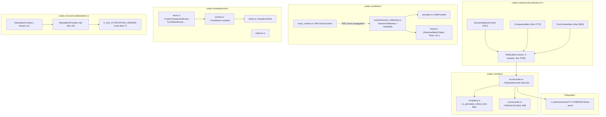

# Chapter 12: Rollout & Telemetry

> Status: **audited (2026-05-11)** | refs/codex SHA `76845d716b` | 12 claims / 12 anchors / 0 open questions | **FINAL CHAPTER**

## Scope

Final chapter covering peripheral surfaces around the wire shape: what gets persisted to disk (rollout `.jsonl` files), what gets emitted as OpenTelemetry / analytics, and the attestation header boundary. None of these affect the request body byte content (already covered Ch04/Ch06), but all touch operator-visible surfaces and downstream auditability.

What's **here**: `RolloutItem` enum + persisted file format, `SessionMetaLine` + `CompactedItem` + `TurnContextItem` shapes, `RolloutRecorder` async writer protocol (`RolloutCmd` channel), OTel surface (`SessionTelemetry` re-exports), analytics events module (`codex-rs/analytics/`), and the `AttestationProvider` trait that gates `x-oai-attestation` emission.

**Deferred**:
- Backend-side consumption of these signals — opaque.
- Quartz wiki / web-UI representations of rollout files — UI tooling, not wire spec.
- W3C traceparent propagation details (already partially covered Ch08 C6 W3C trace overlay in client_metadata).

## Module architecture



Stack view (per-turn → persistence + observability):

```
┌────────────────────────────────────────────────────────────────┐
│ Per-turn wire activity (Ch06/Ch07/Ch08/Ch09 stack)             │
├────────────────────────────────────────────────────────────────┤
│ Rollout persistence (async)                                    │
│   RolloutRecorder.append_items(&items) sends RolloutCmd::AddItems│
│     → policy::is_persisted_rollout_item filter                 │
│     → writer task appends JSONL line to rollout-*.jsonl         │
│   Items persisted: SessionMeta (once at start),                │
│     ResponseItem (per turn), TurnContext (per turn baseline),  │
│     Compacted (when compaction fires), EventMsg (selected events)│
├────────────────────────────────────────────────────────────────┤
│ OTel instrumentation (sync + async)                            │
│   SessionTelemetry holds span context + metadata               │
│   Timer / Counter / Gauge metrics emitted per turn / per request│
│   W3cTraceContext propagated via WS client_metadata (Ch08 C6)  │
│   originator + UA + thread_id attached as span attributes      │
├────────────────────────────────────────────────────────────────┤
│ Analytics events (separate track)                              │
│   AnalyticsClient.track_event(...) emits CodexCompactionEvent /│
│     AppInvocation / TurnSubmissionType / SubAgentThreadStarted │
│     / HookRunFact / etc.                                        │
│   Routing partitioned by chatgpt_account_is_fedramp (Ch02 C5)  │
├────────────────────────────────────────────────────────────────┤
│ Attestation (per-turn, conditional)                            │
│   AttestationProvider.header_for_request(AttestationContext {  │
│     thread_id }) → Option<HeaderValue>                          │
│   Inserted as x-oai-attestation header on streaming + WS + compact│
└────────────────────────────────────────────────────────────────┘
```

## IDEF0 decomposition

See [`idef0.12.json`](idef0.12.json). Activities:

- **A12.1** Persist rollout items — `RolloutRecorder.append_items` → async writer task → JSONL append.
- **A12.2** Filter persisted items — `policy::is_persisted_rollout_item` decides which items reach disk.
- **A12.3** Emit OTel spans + metrics — per-request and per-turn.
- **A12.4** Emit analytics events — separate channel from OTel (`AnalyticsClient.track_event`).
- **A12.5** Conditionally emit attestation header — `AttestationProvider` policy boundary.
- **A12.6** Propagate W3C trace context — via WS `client_metadata` (cross-ref Ch08 C6).

## GRAFCET workflow

See [`grafcet.12.json`](grafcet.12.json).

## Controls & Mechanisms

A12.1/A12.4 have multiple data sources (per-turn vs per-session); ICOM cells in idef0.12.json cover.

## Protocol datasheet

### D12-1: Rollout `.jsonl` file format

**Transport**: filesystem, line-delimited JSON (one record per line).
**Triggered by**: A12.1 — `append_items` called from session lifecycle (turn end, compaction, session-meta init).
**Source**: [`refs/codex/codex-rs/rollout/src/recorder.rs:82`](refs/codex/codex-rs/rollout/src/recorder.rs#L82) (`RolloutRecorder`); path pattern documented at lines 77-80.

| Slot | Value / Encoding | Required | Source | Notes |
|---|---|---|---|---|
| File path | `<codex_home>/sessions/YYYY/MM/DD/rollout-<timestamp>-<uuid>.jsonl` | yes | [`recorder.rs:77-80`](refs/codex/codex-rs/rollout/src/recorder.rs#L77-L80) | YYYY/MM/DD directory partition. UUID = session/thread id. |
| Each line | `{"type": <variant>, "payload": <variant-payload>}` (JSON, newline-delimited) | yes | RolloutItem serde tag layout | Tagged-union form. |
| First line (typical) | `{"type": "session_meta", "payload": <SessionMetaLine>}` | yes | RolloutItem::SessionMeta | One per session at start. |
| Per-turn lines | `{"type": "response_item", "payload": <ResponseItem>}` ×N | per turn | RolloutItem::ResponseItem | One per ResponseItem in the turn. |
| TurnContext baseline | `{"type": "turn_context", "payload": <TurnContextItem>}` | per turn | RolloutItem::TurnContext | Persisted once per real user turn + after mid-turn compaction. |
| Compaction marker | `{"type": "compacted", "payload": <CompactedItem>}` | per compaction | RolloutItem::Compacted | Carries the compaction message + replacement_history. |
| Event log | `{"type": "event_msg", "payload": <EventMsg>}` | per event | RolloutItem::EventMsg | Filtered via policy::is_persisted_rollout_item. |

**RolloutItem variants** (all 5):

```rust
#[derive(Serialize, Deserialize, Debug, Clone, JsonSchema, TS)]
#[serde(tag = "type", content = "payload", rename_all = "snake_case")]
pub enum RolloutItem {
    SessionMeta(SessionMetaLine),
    ResponseItem(ResponseItem),
    Compacted(CompactedItem),
    TurnContext(TurnContextItem),
    EventMsg(EventMsg),
}
```

### D12-2: Persisted-item filter (`policy::is_persisted_rollout_item`)

**Triggered by**: A12.2.
**Source**: [`refs/codex/codex-rs/rollout/src/policy.rs`](refs/codex/codex-rs/rollout/src/policy.rs) imported at recorder.rs:51.

Rule: not every `RolloutItem` reaches disk. The filter decides. Filtered-out items still pass through the in-memory event stream but are NOT durable. This is the boundary between observability and persistence — operator can inspect live events that don't end up in resume/fork replay.

### D12-3: AttestationProvider trait + `x-oai-attestation` header

**Source**: [`refs/codex/codex-rs/core/src/attestation.rs:24`](refs/codex/codex-rs/core/src/attestation.rs#L24).

```rust
pub(crate) const X_OAI_ATTESTATION_HEADER: &str = "x-oai-attestation";

pub trait AttestationProvider: std::fmt::Debug + Send + Sync {
    fn header_for_request(&self, context: AttestationContext) -> GenerateAttestationFuture<'_>;
}

#[derive(Clone, Copy, Debug)]
pub struct AttestationContext {
    pub thread_id: ThreadId,
}
```

Header form inserted on streaming HTTP (Ch06 D6-2), WS handshake (Ch08 D8-1), and compact path (Ch09 D9-2). Provider returns `None` to suppress emission.

## Claims & anchors

| Claim | Anchor | Kind |
|---|---|---|
| **C1**: `RolloutItem` is a tagged-union (`#[serde(tag = "type", content = "payload", rename_all = "snake_case")]`) with 5 variants: `SessionMeta(SessionMetaLine)`, `ResponseItem(ResponseItem)`, `Compacted(CompactedItem)`, `TurnContext(TurnContextItem)`, `EventMsg(EventMsg)`. | [`refs/codex/codex-rs/protocol/src/protocol.rs:2766`](refs/codex/codex-rs/protocol/src/protocol.rs#L2766) | **enum (TYPE)** |
| **C2**: `SessionMetaLine { #[serde(flatten)] meta: SessionMeta, git: Option<GitInfo> }`. `meta` flattens into the parent object; `git` skipped when None. SessionMeta lives at line 2701 with fields: id (ThreadId), forked_from_id, timestamp, cwd, originator, cli_version, source (SessionSource), thread_source, agent_path?, agent_nickname?, agent_role?, model_provider?, base_instructions?, dynamic_tools?. | [`refs/codex/codex-rs/protocol/src/protocol.rs:2757`](refs/codex/codex-rs/protocol/src/protocol.rs#L2757) | **struct (TYPE)** |
| **C3**: `CompactedItem { message: String, replacement_history: Option<Vec<ResponseItem>> }`. Carries the compaction summary message and an optional replacement_history that replaces the prior history for resume/fork. Has `From<CompactedItem> for ResponseItem` to project the message into an assistant text item for replay. | [`refs/codex/codex-rs/protocol/src/protocol.rs:2775`](refs/codex/codex-rs/protocol/src/protocol.rs#L2775) | **struct (TYPE)** |
| **C4**: `TurnContextItem` carries the per-turn settings snapshot: turn_id?, trace_id?, cwd, current_date?, timezone?, approval_policy (AskForApproval), sandbox_policy, permission_profile?, plus model-instructions / collaboration_mode / personality / network / windows_sandbox_level / shell_environment_policy / features fields. Doc comment: "Persist once per real user turn after computing that turn's model-visible context updates, and again after mid-turn compaction when replacement history re-establishes full context." | [`refs/codex/codex-rs/protocol/src/protocol.rs:2805`](refs/codex/codex-rs/protocol/src/protocol.rs#L2805) | **struct (TYPE)** |
| **C5**: `RolloutRecorder` struct (line 82) holds: `tx: Sender<RolloutCmd>` (mpsc 256-capacity, line 749), `writer_task: Arc<RolloutWriterTask>`, `rollout_path: PathBuf`, `event_persistence_mode: EventPersistenceMode`. Async append via channel + dedicated writer task. File path documented as `~/.codex/sessions/rollout-<ts>-<uuid>.jsonl` in lines 78-80 (the runtime path adds YYYY/MM/DD directory partition). | [`refs/codex/codex-rs/rollout/src/recorder.rs:82`](refs/codex/codex-rs/rollout/src/recorder.rs#L82) | **struct (TYPE)** |
| **C6**: `RolloutCmd` async-writer protocol enum (line 106) with 4 commands: `AddItems(Vec<RolloutItem>)`, `Persist { ack: oneshot::Sender<...> }`, `Flush { ack }`, `Shutdown { ack }`. Writer task loop (line 1664+) consumes via `mpsc::Receiver<RolloutCmd>`. AddItems are the per-turn writes; Persist/Flush/Shutdown are caller-driven sync points. | [`refs/codex/codex-rs/rollout/src/recorder.rs:106`](refs/codex/codex-rs/rollout/src/recorder.rs#L106) | **enum (TYPE)** |
| **C7**: `policy::is_persisted_rollout_item` filter (imported at recorder.rs:51) decides which items reach disk vs only in-memory. Boundary between live event stream and durable rollout — operator-visible signals don't all become resume-replay baseline. | [`refs/codex/codex-rs/rollout/src/recorder.rs:51`](refs/codex/codex-rs/rollout/src/recorder.rs#L51) | use import |
| **C8**: OTel surface re-exports from `otel/src/lib.rs`: `SessionTelemetry` + `SessionTelemetryMetadata` + `OtelProvider` + `OtelSettings` + `Timer` + runtime metrics summary + W3C trace context helpers (`current_span_w3c_trace_context`, `context_from_w3c_trace_context`). Provides instrumentation for upstream codex's spans / metrics / events. | [`refs/codex/codex-rs/otel/src/lib.rs:1`](refs/codex/codex-rs/otel/src/lib.rs#L1) | module re-exports |
| **C9**: `AttestationProvider` trait: `fn header_for_request(&self, context: AttestationContext) -> GenerateAttestationFuture<'_>;`. Returns `Option<HeaderValue>` — None suppresses emission. `AttestationContext { thread_id: ThreadId }`. Const `X_OAI_ATTESTATION_HEADER = "x-oai-attestation"` (line 7). | [`refs/codex/codex-rs/core/src/attestation.rs:24`](refs/codex/codex-rs/core/src/attestation.rs#L24) | **trait (TYPE)** |
| **C10**: Analytics events module ([`refs/codex/codex-rs/analytics/src/events.rs`](refs/codex/codex-rs/analytics/src/events.rs)) emits structured TrackEvents over a separate channel from OTel: `CodexCompactionEvent`, `AppInvocation`, `TurnSubmissionType`, `TurnSteerResult`, `SubAgentThreadStartedInput`, `HookRunFact`, etc. Carries client-side facts the backend collects for analytics — distinct from per-request wire telemetry. | [`refs/codex/codex-rs/analytics/src/events.rs:1`](refs/codex/codex-rs/analytics/src/events.rs#L1) | module |
| **C11**: Attestation header is inserted on **three** code paths: streaming HTTP request (`client.rs:909`, Ch06 D6-2), WS handshake (`client.rs:502` and `526`, Ch08 D8-1), and compact endpoint (`client.rs:502`, Ch09 D9-2). Provider may return None — emission is conditional. State carries `include_attestation: bool` flag (line 178). | [`refs/codex/codex-rs/core/src/client.rs:909`](refs/codex/codex-rs/core/src/client.rs#L909) | fn body insertions (cross-ref) |
| **C12**: TEST `state_db_init_backfills_before_returning` constructs a SessionMetaLine with full SessionMeta fields, writes to a rollout-*.jsonl path under a tempdir, and asserts the state-db init backfills the metadata before returning. Pins the SessionMetaLine wire shape + the path convention with YYYY/MM/DD partition. | [`refs/codex/codex-rs/rollout/src/recorder_tests.rs:72`](refs/codex/codex-rs/rollout/src/recorder_tests.rs#L72) | **test (TEST)** |

Anchor totals: 12 claims, 12 anchors. TEST/TYPE diversity: **6 TYPE** (C1 RolloutItem, C2 SessionMetaLine, C3 CompactedItem, C4 TurnContextItem, C5 RolloutRecorder, C6 RolloutCmd, C9 AttestationProvider) + **1 TEST** (C12). Plus module re-export anchor (C8), use-import (C7), cross-ref (C11), module ref (C10).

## Cross-diagram traceability (per miatdiagram §4.7)

- `protocol/src/protocol.rs::RolloutItem + SessionMetaLine + CompactedItem + TurnContextItem` (C1-C4) → A12.1 → D12-1 ✓
- `rollout/src/recorder.rs::RolloutRecorder + RolloutCmd` (C5, C6) → A12.1 → D12-1 ✓
- `rollout/src/policy::is_persisted_rollout_item` (C7) → A12.2 → D12-2 ✓
- `otel/src/lib.rs::SessionTelemetry re-exports` (C8) → A12.3 ✓
- `analytics/src/events.rs` (C10) → A12.4 ✓
- `core/src/attestation.rs::AttestationProvider` (C9) + `client.rs` insertion sites (C11) → A12.5 → D12-3 ✓ + cross-refs to Ch06 D6-2, Ch08 D8-1, Ch09 D9-2 ✓
- Ch08 C6 W3C trace overlay (response_create_client_metadata) → A12.6 cross-ref ✓
- TEST C12 → D12-1 SessionMetaLine wire shape ✓

All cross-links verified.

## Open questions

None for Chapter 12 source-derivable claims. Backend-side consumption of rollout / analytics / attestation surfaces is opaque (consistent with Ch11's stance — don't speculate beyond source).

## OpenCode delta map

- **A12.1 Rollout persistence** — OpenCode persists session history to its own storage layer (`~/.local/share/opencode/storage/session/<sessionID>/`), not to `~/.codex/sessions/*.jsonl`. **Aligned**: functionally yes (both retain session for resume). **Drift**: by design — different storage layout. Cross-machine OpenCode↔codex-cli rollout compatibility is not a goal.
- **A12.2 Filter policy** — OpenCode has its own persistence rules in [`packages/opencode/src/storage/`](packages/opencode/src/storage/). Different filter implementation.
- **A12.3 OTel instrumentation** — OpenCode does not currently emit OTel spans. The daemon's structured logs + bus events serve the operator-visibility purpose. **Aligned**: no. **Drift**: feature gap (could be added).
- **A12.4 Analytics events** — OpenCode does not emit upstream-compatible analytics events. Its own observability stack is built around the `bus.*` event channel. **Aligned**: no.
- **A12.5 Attestation header** — OpenCode does not currently emit `x-oai-attestation`. No `AttestationProvider` analogue. **Aligned**: no. **Drift**: feature gap. Whether backend uses this header for first-party classification or anti-abuse on the OpenCode path is unknown; worth checking if observed cache differences correlate with backends that accept-without-attestation differently.
- **A12.6 W3C trace propagation** — Same as Ch08 C6: OpenCode doesn't inject `traceparent`/`tracestate` into `client_metadata` today. Could be added when distributed tracing across OpenCode's component boundaries becomes valuable.

**Aggregate finding for downstream specs**: this chapter's surfaces (rollout file format, OTel spans, analytics events, attestation, traceparent) are **largely OpenCode-divergent by design**. None affects the request body content directly. The most operationally interesting one is **`x-oai-attestation`** — backend may or may not treat its presence as a first-party-classification signal. If future cache investigations want to rule out attestation-related routing differences, A/B test with vs without that header.

---

## 🏁 Reversed-spec final state (post-Chapter 12)

| Metric | Value |
|---|---|
| Chapters audited | **12 / 12** |
| Total claims | **144** (12 × 12) |
| Total anchors | **144** |
| TEST anchors | **15** |
| TYPE anchors | **53** |
| Datasheets delivered | **24** (D2-1, D2-2, D4-1, D4-2, D5-1, D6-1, D6-2, D7-1, D7-2, D8-1..D8-4, D9-1..D9-3, D10-1, D10-2, D11-1..D11-3, D12-1..D12-3) |
| Submodule pinned at | `refs/codex` SHA `76845d716b720ca701b2c91fec75431532e66c74` |
| Open backend questions | **3** (Q1 subagent-vs-main cache differential; Q2 client_metadata cardinality keying; Q3 previous_response_id chain TTL) — honestly recorded, not papered over |
| Empirically falsified hypotheses | **1** (H1 content-parts cardinality — anchored as Ch11 C10 to prevent re-proposal) |
| Source-derivable claims unresolved | **0** |

The spec is ready for the user-triggered `plan_graduate` gate to move from `/plans/codex_cli-reversed-spec/` to `/specs/codex/cli-reversed-spec/` and enter the living-knowledge zone for downstream specs to cite.
