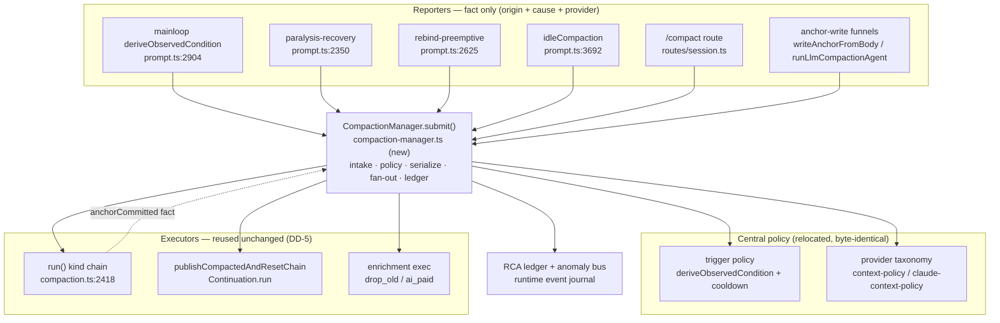

# Proposal: compaction_central-manager

_語言：[zh-hant](./) · **en**_

> Auto-generated index for the `central-manager` topic. Edit the source files; this README mirrors them. Do not edit this file directly.

## Status

**Living** · 6 history entries · last advance 2026-06-10 (mode `promote` from verified)

## Source artifacts

- [`proposal.md`](./proposal.md) — why this exists · modified 2026-06-10
- [`design.md`](./design.md) — architecture & decisions · modified 2026-06-10
- [`tasks.md`](./tasks.md) — checklist · 31/31 done (100%) · modified 2026-06-10
- [`idef0.json`](./idef0.json) + _no SVGs yet_ — formal functional decomposition
- [`grafcet.json`](./grafcet.json) + _no SVGs yet_ — formal runtime behavior
- `.state.json` — lifecycle state machine

## Why (excerpt)

Compaction's **post-anchor side-effects** — chain-reset publish and background
enrichment scheduling — are dispatched from multiple call sites, each carrying
its own eligibility judgment, with no single management seam. The subsystem is
in a *"wanted to unify, only did half"* state: the **trigger decision** got
centralized (`deriveObservedCondition` + 30s cooldown) and **chain-reset** got
a seam (`publishCompactedAndResetChain` → `Continuation.run`), but **enrichment
scheduling never got pulled into a seam**. The fingerprints of half-done
unification are in the code itself:

- `scheduleHybridEnrichment` is invoked from **two** layers of the same `run()`
  call stack — `writeAnchorFromBody:795` and `run():2678` — under **three**
  different eligibility checks. The L795 comment (*"Previously only run() called
  this; create() (used by /compact) skipped it"*) shows a coverage gap was
  closed by **adding a second call site** rather than by centralizing.
- The `hybridEnrichInFlight` guard exists **because** there is no single call
  point — a cross-call dedup band-aid, and a weak one (set after the async IIFE,
  cleared in `finally`).

**Verified failure (RCA `event_2026-06-10_rca-re-verified-with-hard-data-…`):**
on a claude-cli 1M session, one `cache-aware` narrative compaction scheduled
enrichment twice; the in-flight guard could not dedup the ~2ms
`drop_old_history` path; the anchor was double-trimmed **23,706 → 6,102 → 2,441
tokens (~10% retained)** in ~50ms. Combined with the `amnesia_supersedes`
SS-break (prior chain discarded), the sole-memory anchor of a 233-round session
collapsed to ~2.4K tokens → user-visible amnesia.

[Full →](./proposal.md)

## Architecture overview

[Full design →](./design.md)

## Recent activity

- 2026-06-10: `promote` verified → living — User-directed graduation: S0–S5 shipped to main (95a3f44d9/ba12bb16c), deployed, live-verified; manager is the single monitored compaction track. Spec at verified with all 13 artifacts valid.
- 2026-06-10: `promote` implementing → verified — S0–S5 done + merged to main (ba12bb16c); in-scope compaction suite 109/0; live fetch-back verified (one compaction → one enrichment → one recompress; provider-switch execution now in the manager ledger; manager is the single live track). Defect C resolved by S1; Defect B deferred per DD-11.
- 2026-06-10: `promote` planned → implementing — S0–S5 implemented and merged to main (ba12bb16c); final live-verification item open.
- 2026-06-10: `promote` designed → planned — tasks.md (S0→S4 strangler, unchecked), handoff.md (4 contract sections), test-vectors.json (TV-1..7 incl. RCA reproduction), errors.md (Error Catalogue / anomaly taxonomy), observability.md (Events + Metrics + RCA-ledger query path) all authored.
- 2026-06-10: `promote` proposed → designed — All designed-state artifacts present: proposal.md, spec.md (Purpose/Requirements/Acceptance Checks + Requirement/Scenario blocks), design.md (Context/Goals·Non-Goals/Decisions DD-1..9/Risks/Critical Files + classified §5 inventory), idef0.json, grafcet.json, sequence.json, data-schema.json — all drawmiat/JSON-validated.

<!-- AUTO-GENERATED by plan-builder MCP plan_sync · 2026-06-10T16:33:42Z · do not edit this file. -->
