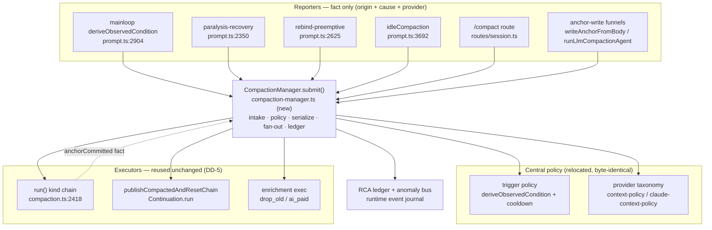

# Proposal: compaction_central-manager

_語言：**zh-hant** · [en](./README.en.md)_

> 自動產生的 `central-manager` 主題索引。請編輯來源檔案;本 README 只是它們的鏡像,請勿直接編輯。

## 狀態

**Living** · 6 筆歷史紀錄 · 最近一次推進 2026-06-10(mode `promote`,自 verified)

## 來源 artifacts

- [`proposal.md`](./proposal.md) — 為何存在 · 修改於 2026-06-10
- [`design.md`](./design.md) — 架構與決策 · 修改於 2026-06-10
- [`tasks.md`](./tasks.md) — 檢查清單 · 31/31 完成(100%) · 修改於 2026-06-10
- [`idef0.json`](./idef0.json) + _尚無 SVG_ — 形式化功能分解
- [`grafcet.json`](./grafcet.json) + _尚無 SVG_ — 形式化執行期行為
- `.state.json` — 生命週期狀態機

## 為何(摘錄)

Compaction 的**錨點後置 side-effect** —— chain-reset publish 與背景 enrichment 排程 —— 從多個呼叫點各自派發,每一處都夾帶自己的資格判斷,沒有單一的管理接縫。這個子系統處於一種*「想統一卻只做一半」*的狀態:**觸發決策**已集中(`deriveObservedCondition` + 30 秒 cooldown)、**chain-reset** 已有接縫(`publishCompactedAndResetChain` → `Continuation.run`),但 **enrichment 排程從未被收進接縫**。半成品統一的指紋就留在程式碼裡:

- `scheduleHybridEnrichment` 從同一條 `run()` 呼叫堆疊的**兩**個層級被呼叫 —— `writeAnchorFromBody:795` 與 `run():2678` —— 而且套在**三**種不同的資格檢查下。L795 的註解(*「Previously only run() called this; create() (used by /compact) skipped it」*)顯示一個覆蓋缺口是靠**再加一個呼叫點**補上的,而不是靠集中化。
- `hybridEnrichInFlight` 這道 guard 之所以存在,**正是因為**沒有單一呼叫點 —— 它是一塊跨呼叫去重的 OK 繃,而且還很弱(在 async IIFE 之後才設,於 `finally` 清掉)。

**已驗證的故障(RCA `event_2026-06-10_rca-re-verified-with-hard-data-…`):**在一個 claude-cli 1M session 上,一次 `cache-aware` narrative compaction 排了兩次 enrichment;in-flight guard 擋不住約 2ms 的 `drop_old_history` 快路徑;anchor 在約 50ms 內被連裁 **23,706 → 6,102 → 2,441 token(僅保留約 10%)**。再疊上 `amnesia_supersedes` 的 SS-break(舊 chain 被丟棄),一個 233 輪 session 的唯一記憶錨點塌縮到約 2.4K token → 使用者可見的失憶。

[完整 →](./proposal.md)

## 架構總覽

[完整設計 →](./design.md)

## 近期活動

- 2026-06-10:`promote` verified → living —— 使用者指示畢業:S0–S5 已上 main(95a3f44d9/ba12bb16c)、已部署、已實地驗證;中控是單一受監控的 compaction 軌。spec 處於 verified、13 個 artifact 全部有效。
- 2026-06-10:`promote` implementing → verified —— S0–S5 完成並 merge 進 main(ba12bb16c);in-scope compaction 套件 109/0;live fetch-back 已驗證(一次 compaction → 一次 enrichment → 一次 recompress;provider-switch 執行現在進中控 ledger;中控是單一 live 軌)。Defect C 由 S1 解決;Defect B 依 DD-11 deferred。
- 2026-06-10:`promote` planned → implementing —— S0–S5 已實作並 merge 進 main(ba12bb16c);最後的 live 驗證項待結。
- 2026-06-10:`promote` designed → planned —— tasks.md(S0→S4 strangler,未勾)、handoff.md(4 個契約小節)、test-vectors.json(TV-1..7,含 RCA 重現)、errors.md(Error Catalogue / anomaly taxonomy)、observability.md(Events + Metrics + RCA-ledger 查詢路徑)全數撰寫完成。
- 2026-06-10:`promote` proposed → designed —— designed 狀態所需 artifact 齊備:proposal.md、spec.md(Purpose/Requirements/Acceptance Checks + Requirement/Scenario 區塊)、design.md(Context/Goals·Non-Goals/Decisions DD-1..9/Risks/Critical Files + 分類後的 §5 inventory)、idef0.json、grafcet.json、sequence.json、data-schema.json —— 全部通過 drawmiat/JSON 驗證。

<!-- AUTO-GENERATED by plan-builder MCP plan_sync · 2026-06-10T16:33:42Z · do not edit this file. -->
