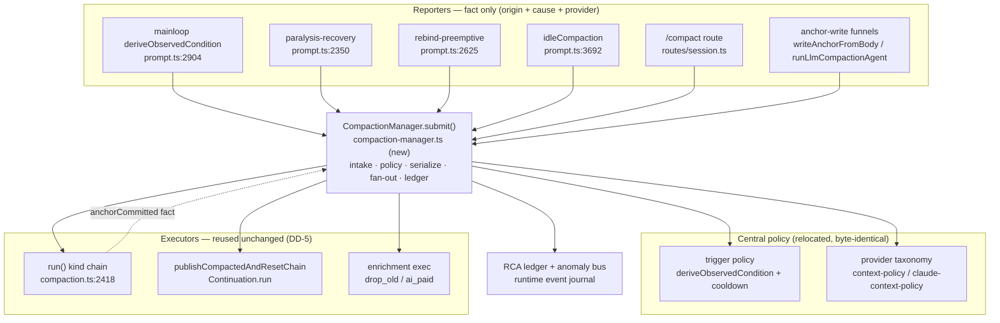

# Design: compaction_central-manager

> Draft (state: proposed). IDEF0 / GRAFCET artifacts and the `designed`-state
> advance are pending — see Open Questions. This document captures the target
> architecture and the load-bearing decisions while context is fresh.

## 1. Overview

Introduce a single in-process **`CompactionManager`** per daemon that owns all
compaction- and enrichment-related decisions for a session. Every current
direct call to `run()` / `scheduleHybridEnrichment` /
`publishCompactedAndResetChain` becomes a `manager.submit(request)` call where
the request only **describes a fact** (`origin` + `cause` + payload). The
manager evaluates policy, serializes per session, fans out exactly-once
side-effects, logs every request, and raises anomaly events on policy
violations.

## Module Architecture

Block view — reporters (no judgment) funnel into one manager that owns policy and
calls the existing executors. Mirrors the `Continuation.run` precedent (DD-9).



## 2. Current architecture — the "half-done unification"

```
                       ┌─ trigger layer (≈centralized) ──────────────┐
 prompt.ts mainloop ──►│ deriveObservedCondition ─► observed         │
 paralysis-recovery ──►│   (+ 30s cooldown choke-point)              │──► run()
 rebind-preemptive  ──►│   BUT paralysis/rebind/idle compute their   │
 idleCompaction     ──►│   own local conditions, parallel paths      │
 /compact route     ──►└─────────────────────────────────────────────┘
                                         │
                                         ▼ run() walks kind chain, writes anchor
                       ┌─ post-anchor side-effects (NOT centralized) ─┐
                       │ publish:  writeAnchorFromBody:788 (kind=NARRATIVE hardcoded)
                       │           runLlmCompactionAgent:1639 (ai_paid inline)
                       │           run():2692 (ai_free)  ← ai_free double-publishes
                       │ enrich:   writeAnchorFromBody:795 (unconditional)
                       │           run():2678 (gated on 7-set)
                       │           + internal 3-set gate in scheduleHybridEnrichment
                       │ guard:    hybridEnrichInFlight (weak, set-late/clear-in-finally)
                       └──────────────────────────────────────────────┘
```

- **Trigger** has a partial choke-point: `deriveObservedCondition` returns one
  observed and the 30s anchor-recency cooldown blocks back-to-back compactions.
  But paralysis-recovery / rebind-preemptive / idle each compute their own
  condition and call `run()` directly.
- **Side-effects** have no seam. Enrichment = 2 call sites × 3 eligibility
  checks; publish = 3 sites with inconsistent kind labels. The
  `hybridEnrichInFlight` guard is the symptom of missing centralization, and it
  fails against the ~2ms `drop_old_history` path → the verified double-trim.

## 3. Target architecture — single intake

```
 reporters (no judgment)                CompactionManager (all judgment)
 ──────────────────────                 ───────────────────────────────
 mainloop      ─┐                        ┌──────────────────────────────┐
 paralysis     ─┤                        │ intake: submit(request)       │
 rebind-preempt─┤   request{origin,      │   → structured log (origin,   │
 idle          ─┼─►  cause, kind, ...} ──►│      cause, decision)         │
 /compact      ─┤                        │ per-session serial queue      │
 anchor-written─┘                        │ policy eval (one place)        │
                                         │ side-effect fan-out (1× each)  │
                                         │ anomaly events on violation    │
                                         └───────────────┬───────────────┘
                                                         │ calls (unchanged)
                                       run() / Continuation.run / enrichment exec
```

### 3.1 Intake contract (request schema)

Every request is a tagged union carrying **`origin`** (stable call-site id) and
**`cause`** (the signal/reason, human-readable):

| kind | meaning | replaces |
|---|---|---|
| `evaluate` | "session state changed, decide if compaction is warranted" + signals | the scattered `deriveObservedCondition` callers, paralysis, rebind-preempt, idle |
| `compact` | explicit compaction (manual / `/compact`) | `/compact` route, `run({observed:manual})` |
| `anchorCommitted` | "an anchor with id A was just written (kind, observed)" | the implicit trigger for publish + enrichment |
| `enrich` | "anchor A is a candidate for background distillation" | `scheduleHybridEnrichment` call sites (795, 2678) |

`anchorCommitted` is the key inversion: instead of `writeAnchorFromBody` and
`run()` each *deciding* to publish/enrich, they each emit one `anchorCommitted`
fact, and the manager fans out publish + enrichment exactly once.

**`cause` is structured, not a string (DD-7).** Each reporter fires for a
different reason, and that reason is RCA material — so `cause` is a
discriminated value carrying the measured signals that justified the trigger:

| trigger | structured cause (illustrative) |
|---|---|
| overflow | `{observedTokens, usableTokens, contextLimit}` |
| cache-aware | `{cacheReadTokens, hitRate, observedTokens}` |
| predicted-cache-miss | `{predictedMiss, uncachedTokens}` |
| item-count | `{itemCount, threshold}` |
| stall-recovery | `{consecutiveEmpty, ctxRatio}` |
| rebind / provider-switched | `{prevProvider, newProvider}` |
| continuation-invalidated | `{invalidatedAt, lastAnchorAt}` |
| idle | `{utilization, threshold}` |
| manual | `{source: "/compact" \| "rich"}` |
| enrich | `{anchorId, anchorTokens, realPromptTokens, gateResult}` |

The manager records every cause, becoming the single ledger for "why did this
session compact/enrich" (see §3.5) and the place where cross-trigger patterns
(e.g. repeated cache-aware = cache thrash) become visible.

### 3.2 Policy surface (consolidated at the manager)

All judgment currently spread across the codebase moves into one evaluable
policy object:

- **Trigger policy**: threshold table (overflow / emergency / cache-aware /
  predicted-cache-miss / item-count / stall-recovery / provider-switched /
  continuation-invalidated), priority ordering, 30s cooldown, freerun bypass,
  subagent rules. (from `deriveObservedCondition`, `Cooldown`, `resolvePolicy`)
- **Execution policy**: per-observed kind chain + escalation. (from
  `resolveKindChain` / `KIND_CHAIN`)
- **Side-effect policy**: exactly-once publish (correct kind) + exactly-once
  enrichment per anchor; enrichment eligibility (one predicate, not three).
  (from `hybridEnrichmentEligible`, `scheduleHybridEnrichment` internal gates)
- **Provider-split**: claude (absolute aFloor) vs codex/copilot (ratio).
  (from `claude-context-policy` / `context-policy`)

Policy is **relocated, not re-tuned** in this migration. Threshold values stay
byte-identical; only their *home* changes. Re-tuning (Defect B) is a separate
follow-up.

### 3.3 Serialization model

Per-session serial execution (matches the existing single-runloop-per-session
invariant): the manager holds at most one in-flight compaction per session and
at most one enrichment per anchor. Dedup is then a **structural property** of
the intake (a second `enrich` for the same anchorId is a no-op/reject at the
door), replacing both the 30s cooldown black-box *and* the
`hybridEnrichInFlight` guard with one coherent mechanism. No new guard is
introduced; `hybridEnrichInFlight` is retired.

### 3.4 Side-effect fan-out (exactly-once)

On `anchorCommitted(anchorId, kind, observed)` the manager does, exactly once:

1. `publishCompactedAndResetChain` with the **actual** kind (fixes `ai_free`
   double-publish + the `writeAnchorFromBody:788` hardcoded `kind:"narrative"`
   that wrongly SS-breaks server-side compactions).
2. evaluate enrichment eligibility once; if eligible, schedule the background
   distillation for `anchorId` (at most once).

### 3.5 Accountability — the manager is the RCA ledger

- Every `submit` emits a structured log: `{origin, structuredCause, kind,
  decision, sessionID, anchorId?}`. Because `cause` carries the measured signals
  (§3.1), the accumulated record IS the RCA material: "why did this session
  compact/enrich, how often, on what numbers" is a query against the manager,
  not the forensic reconstruction (journal + two debug.logs) this incident
  required. One log line at the door replaces the archaeology.
- Having all causes in one place also enables **cross-trigger** diagnosis no
  single blind call site can do: e.g. N cache-aware causes in T seconds ⇒ cache
  thrash whose real fault is upstream; alternating overflow/cache-aware ⇒
  threshold fighting.
- Policy violations raise first-class anomaly events (sibling to the existing
  `session.rebind_storm`): `duplicate-enrich`, `compact-during-cooldown`,
  `enrich-below-floor`, `publish-kind-mismatch`. These become regression
  tripwires that point at the **source** call site, so the fix lands at the
  origin instead of as a downstream guard.

## 4. Migration plan — strangler, behaviour-preserving

| Slice | Change | Effect |
|---|---|---|
| **S1 (止血)** | Route `compaction.ts:795` + `:2678` enrichment calls through `manager.enrich(anchorId, origin, cause)`; manager dedups per anchorId. Retire `hybridEnrichInFlight`. | Double-trim structurally eliminated. No throwaway guard. |
| **S2** | Introduce `anchorCommitted` fact; move publish fan-out into the manager; fix `ai_free` double-publish + kind mismatch. | One anchor → one publish, correct kind. |
| **S3** | Route trigger entry points (mainloop / paralysis / rebind-preempt / idle / `/compact`) through `manager.evaluate|compact`; move `deriveObservedCondition` + cooldown policy into the manager. | Trigger judgment centralized; reporters carry origin+cause. |
| **S4** | Consolidate provider-split + execution (kind chain) policy into the manager policy object. Add anomaly taxonomy. | Single policy surface; tripwires live. |

Each slice ships behaviour-equivalent (except the bug it fixes), gated by the
existing compaction suite + new exactly-once / accountability regression tests.

## 5. Migration surface — classified call-site inventory (codex / claude / general)

Full sweep of every site that triggers compaction, schedules enrichment, or
fires a post-anchor side-effect (compaction.ts ≈5137 lines, pre-migration).
This is the change-budget for the migration.

### 5.0 Provider taxonomy (as it exists in code)

`resolvePolicy(providerId)` is a **2-way** split — `claude-cli` → `ClaudePolicy`,
everything else → `GeneralPolicy` (`context-policy.ts`). **codex** is a de-facto
3rd class: GeneralPolicy **plus** a stateful server-chain overlay. The three
classes the manager must distinguish:

- **claude** (`claude-cli`): SL chain → chain-reset is an **SL-noop**; skips
  `rebind`/`provider-switched`/`continuation-invalidated` compaction
  (`CLAUDE_NOOP_OBSERVED`, context-policy.ts:28); **absolute aFloor** enrichment
  gate; `coldCacheBGate` active; by-token, 1M.
- **codex**: GeneralPolicy + **stateful SS chain** (`invalidateContinuationFamily`
  does real work; `SS-break`); server-side `/responses/compact` `ai_free`
  (`runCodexServerSideRecompress`) — **currently dormant / test-only**;
  item-count overflow (`codexItemOverflowThreshold`); often subscription.
- **general** (copilot / other): GeneralPolicy + SL chain (chain-reset no-op);
  by-request billing → `forceRich` straight-to-`ai_paid` on tiny windows.

**Requirement (user):** each reported request must carry its provider class so
the manager applies the right policy branch; and we know which sites are
provider-specific vs universal (tagged below).

### 5.1 Trigger entry points → run()/create()/idle (8 production sites)

| Site | What | Provider |
|---|---|---|
| prompt.ts:2855→2904 | mainloop `deriveObservedCondition` → `run()` | ALL |
| prompt.ts:2323→2350 | paralysis-recovery (item-count) → `run()` | **codex** (WS transport item limit) |
| prompt.ts:2598→2625 | rebind-preemptive → `run()` | codex+general (claude no-ops in run) |
| prompt.ts:3613 | `create()` compaction-request | ALL |
| prompt.ts:3692 | `idleCompaction` → `run(idle)` | ALL (by-token 0.6 / by-request off) |
| prompt.ts:1795 | `compactWithSharedContext` (provider-switch pre-loop) | codex+general |
| routes/session.ts:1927 | manual `/compact` → `run(manual)` | ALL |
| routes/session.ts:1944 | `create()` compaction-request | ALL |

### 5.2 Trigger predicates inside `deriveObservedCondition` (the "why" sources)

Each is a distinct `cause` the manager must receive (prompt.ts:741):

| predicate | observed | Provider |
|---|---|---|
| `isOverflow` / emergency | overflow | ALL (freerun bypass) |
| `isCacheAware` / `shouldCacheAwareCompact` | cache-aware | by-token; + claude `coldCacheBGate` (prompt.ts:560) |
| predicted-cache-miss | cache-aware | **codex** (continuation chain) |
| `itemOverflowTrigger` (prompt.ts:865) | overflow | codex/general |
| stall-recovery | stall-recovery | ALL |
| provider-switched / rebind | … | codex+general (claude no-op) |
| continuation-invalidated | … | **codex** (`continuationInvalidatedAt` from codex Bus) |
| manual | manual | ALL |

### 5.3 Enrichment scheduling (2 live + 1 dormant)

| Site | What | Provider |
|---|---|---|
| compaction.ts:795 (`writeAnchorFromBody`) | unconditional schedule | ALL (internal split: claude abs-floor / general ratio) |
| compaction.ts:2678 (`run()`) | 7-set gated schedule | ALL |
| `runCodexServerSideRecompress` (compaction.ts:2168) | `/responses/compact` enrich | **codex — DORMANT** (test-only; `ai_free` disabled in hybrid path) |

`hybridEnrichInFlight` guard — compaction.ts:1730 / set ~2150 / clear ~2152 (to retire).

### 5.4 Post-anchor side-effects: publish + chain-reset

`publishCompactedAndResetChain` (def compaction.ts:197) — **6 production call sites**:

| Site | What | Provider |
|---|---|---|
| 788 (`writeAnchorFromBody`) | publish, **hardcoded `kind:"narrative"`** | ALL (SS-break bites **codex**) |
| 1639 (`runLlmCompactionAgent`, ai_paid) | publish | ALL |
| 2692 (`run()`, ai_free) | publish — **the double w/ 788** | **codex** |
| 2702 (`run()`, chain-exhausted) | publish `success:false` | ALL |
| 3320 (`rebuildStreamFromText`, reload) | publish `kind:"text-only rebuild"` | ALL |
| 4545 (`runLlmCompact`, ai_paid) | publish | ALL |

Direct `invalidateContinuationFamily` (codex chain scrub, bypasses Continuation.run):

| Site | What | Provider |
|---|---|---|
| compaction.ts:4583 | pre-flight scrub before LLM compaction | **codex** |
| prompt.ts:727 | provider-switch pre-loop | **codex** |

`Continuation.run` (chain-reset dispatcher — already centralized; SS for codex, SL-noop else):
compaction.ts:236 (inside publish), prompt.ts:907 / 1844 / 2060 / 2083.

### 5.5 Anchor-write funnels / kind executors

- `writeAnchorFromBody` (691, alias `compactWithSharedContext` 833) — narrative/ai_free funnel — ALL
- `defaultWriteAnchor` (3373) → `writeAnchorFromBody` (3508); `_writeAnchor` indirection (3704), called 2646 — ALL
- `tryLowCostServer` (1270, ai_free) — **codex**
- `tryLlmAgent` (1396) → `runLlmCompactionAgent` (1442) — ALL
- `runCodexServerSideRecompress` (2168) — **codex (dormant)**

### 5.6 Precedent — this exact centralization was already done once

`session/continuation/run.ts` header: *"Continuation.run — single procedure
executor. Replaces the five scattered `invalidateContinuationFamily` call
sites."* The chain-reset side-effect was already collapsed from 5 scattered
sites into one dispatcher with a decision table + dedup
(`continuation/dispatch-dedup.ts`). **`CompactionManager` is the same move
applied to the compaction/enrichment side** — follow its shape (single executor,
decision table, dispatch dedup, structured events).

### 5.7 Change-budget summary

~8 trigger entry points + ~8 trigger predicates + 2 (live) enrichment sites + 6
publish sites + 2 direct-invalidate + ~6 executor funnels ≈ **~25–30 call sites
to route**, across `prompt.ts` (heavy), `compaction.ts` (heavy),
`routes/session.ts`, `processor.ts`, plus new `compaction-manager.ts`. Most are
mechanical (wrap → `manager.submit({origin, cause, provider, …})`); the
judgment-bearing work is consolidating §5.2 + §5.0 policy into the manager.

## Context

Compaction's post-anchor side-effects (chain-reset publish + background
enrichment) are dispatched from scattered call sites, each with its own
eligibility judgment, with no single management seam — see §2 and the §5
inventory. A verified incident (RCA
`event_2026-06-10_rca-re-verified-with-hard-data-…`) showed a single
cache-aware compaction double-scheduling enrichment (compaction.ts:795 +
:2678), defeating the weak in-flight guard and double-trimming the anchor
23,706 → 6,102 → 2,441 tokens (~10%), which combined with the SS-break amnesia
reset collapsed a 233-round session's sole-memory anchor → user-visible
amnesia. The trigger layer is already ~centralized (`deriveObservedCondition` +
30s cooldown); the side-effect layer is not. There is an in-repo precedent for
the fix shape: `Continuation.run` already collapsed "five scattered
invalidateContinuationFamily call sites" into one executor (§5.6).

## Goals / Non-Goals

**Goals**

- One `CompactionManager` service intake for every compaction/enrichment
  request; call sites become fact-reporters, the manager owns all policy.
- Structural dedup (per-session serial + anchor-id) — retire the in-flight
  guard with no replacement guard.
- Structured, accountable requests (`origin` + structured `cause` + provider
  class) → the manager is the RCA ledger and raises anomaly events.
- Fix the verified double-trim as a consequence of the structure (slice S1),
  plus the latent `ai_free` double-publish / kind-mismatch.
- Behaviour-preserving strangler migration (policy relocated, not re-tuned).

**Non-Goals**

- Changing what compaction does (kind-chain algorithms, narrative body, drop_old
  / ai_paid mechanics) beyond exactly-once wiring.
- New compaction capabilities (voluntary summarize / pin / drop / recall — owned
  by `tool-output-chunking`).
- Threshold re-tuning; reviving the dormant codex server-side recompress.
- A cross-process queue — the manager is in-process, per-session-serial.

## Risks / Trade-offs

- **Behaviour drift during migration.** Mitigation: per-slice equivalence,
  policy relocated byte-identical, gated by the 75-test compaction suite + new
  exactly-once tests.
- **Provider-branch regressions.** The 3-class taxonomy (claude/codex/general,
  DD-8) is subtle (codex SS-chain vs claude SL-noop; CLAUDE_NOOP_OBSERVED). A
  mis-routed provider class could resurrect the ses_18d7f02e stale-anchor class
  of bug. Mitigation: provider class is an explicit request field, asserted at
  intake; provider-specific sites tagged in §5.
- **Serialization deadlock / starvation.** A per-session lock that is never
  released hangs the session's compaction. Mitigation: lock release in a
  `finally`-equivalent at the manager boundary; anomaly event on lock-held-too-
  long (mirrors the existing rebind-storm tripwire).
- **Daemon hot-swap.** The manager is new shared state; it must survive the
  `restart_self` rebuild path without losing in-flight serialization. Mitigation:
  per-session state is reconstructable from the message stream (anchors), not
  durable manager memory.
- **Scope creep.** Pulling all 25–30 sites at once risks a big-bang. Mitigation:
  strangler order S1→S4; S1 alone resolves the user-facing bug.

## Critical Files

- `packages/opencode/src/session/compaction.ts` — `run()`, `writeAnchorFromBody`,
  `scheduleHybridEnrichment` (795/2678), `publishCompactedAndResetChain` (6 call
  sites), kind executors. (≈5137 lines)
- `packages/opencode/src/session/prompt.ts` — `deriveObservedCondition` + trigger
  entry points (2350 / 2625 / 2904 / 3613 / 3692 / 1795) + Continuation.run sites.
- `packages/opencode/src/session/context-policy.ts` /
  `claude-context-policy.ts` — provider taxonomy (resolvePolicy, ClaudePolicy /
  GeneralPolicy, CLAUDE_NOOP_OBSERVED).
- `packages/opencode/src/session/continuation/run.ts` + `dispatch-dedup.ts` —
  the precedent executor to mirror (DD-9).
- `packages/opencode/src/server/routes/session.ts` — manual `/compact` entry.
- **New:** `packages/opencode/src/session/compaction-manager.ts` — the manager.

## Open Questions

- IDEF0 decomposition + GRAFCET runtime model (via miatdiagram skill) — required
  before `designed`-state advance.
- Exact request schema types + where `CompactionManager` lives (new
  `compaction-manager.ts` vs a namespace inside `compaction.ts`).
- Whether `evaluate` should be synchronous (compaction is "must finish before
  next LLM call") while `enrich` is deferred/background — the manager must model
  both a synchronous must-do path and a background queue.
- Anomaly-event severity + dashboard wiring.
- Sequencing of Defect B (claude gate keys on prompt-size vs anchor-size) and
  Defect C (drop_old idempotency) — likely separate amends after S1–S4.

## Decisions

- **DD-1**: Single intake + inversion of judgment — all compaction/enrichment work funnels through one `CompactionManager.submit(request)`; call sites become fact-reporters (describe a signal/event) and the manager is the sole owner of every eligibility/dedup/ordering/cooldown decision. Chosen over per-site guards because scattered self-judgment is the root cause: no single authority can dedup, sequence, or be accountable when the decision lives at N call sites.
- **DD-2**: Per-session serialization is the dedup mechanism, not a guard. The manager keeps at most one in-flight compaction per session and at most one enrichment per anchorId, so a duplicate request is a no-op/reject at the door — dedup becomes a structural property of the single intake. The existing `hybridEnrichInFlight` guard is retired and NOT replaced by another guard; the migration must not introduce any throwaway dedup band-aid.
- **DD-3**: Strangler migration, behaviour-preserving, with slice S1 first = the structural stop-the-bleeding. S1 routes the two enrichment call sites (compaction.ts:795, :2678) through the manager so the double-trim is eliminated by construction, with no throwaway guard. S2 moves publish fan-out into the manager (via an `anchorCommitted` fact), S3 routes trigger entry points, S4 consolidates provider-split + execution policy and adds the anomaly taxonomy. Each slice ships observably equivalent except for the bug it fixes, gated by the existing compaction suite plus new exactly-once/accountability tests.
- **DD-4**: Every request carries `origin` (stable call-site id) + `cause` (human-readable signal/reason); the manager emits a structured log per request and raises first-class anomaly events on policy violations (duplicate-enrich, compact-during-cooldown, enrich-below-floor, publish-kind-mismatch), as siblings of the existing session.rebind_storm anomaly. Rationale: the forensic reconstruction this RCA required (journal + two debug.logs) must collapse to one log line at the door, and a wrong request must point at its source so the fix lands at the origin, not as a downstream guard.
- **DD-5**: The manager orchestrates but does not reimplement the executors. It calls the existing run() / Continuation.run / enrichment-execution code unchanged; the inversion is only in who decides and when, not in the compaction algorithms. The `anchorCommitted` fact is the single driver of post-anchor fan-out, producing exactly-once publish (with the ACTUAL kind) + exactly-once enrichment — which also fixes the latent ai_free double-publish and the writeAnchorFromBody:788 hardcoded kind:"narrative" that wrongly SS-breaks server-side compactions.
- **DD-6**: Policy is relocated, not re-tuned, in this migration: threshold values, kind chains, cooldown window, and provider-split gates move to the manager byte-identical so each slice is behaviour-equivalent. The two secondary defects surfaced by the RCA — Defect B (claude A-tier enrichment gate keys on total prompt-size via max(estimate, realPromptTokens−reserve) rather than the anchor's own contribution) and Defect C (drop_old_history is non-idempotent and the round-boundary cut overshoots KEEP_RATIO) — are tracked as separate follow-up amends AFTER S1–S4, not bundled into the structural migration.
- **DD-7**: `cause` is structured RCA evidence, not a freeform log string. Each scattered trigger fires for a DIFFERENT reason; the reporter must hand the manager the measured signal values that justified the trigger (e.g. cache-aware → {cacheReadTokens, hitRate, observedTokens}; overflow → {observedTokens, usableTokens}; item-count → {itemCount, threshold}; enrich → {anchorId, anchorTokens, realPromptTokens, gateResult}). The manager therefore becomes the single RCA ledger for "why did this session compact / enrich", so future diagnosis is a query against the manager — not forensic reconstruction across journal + debug.logs. Seeing all causes in one place is also what lets the manager detect cross-trigger patterns (e.g. repeated cache-aware = cache thrash whose real cause is upstream) that individual blind call sites cannot.
- **DD-8**: Every request carries a provider class so the manager applies the correct policy branch, and the manager distinguishes three classes (not the code's current 2-way resolvePolicy split): claude (claude-cli — SL chain, chain-reset is SL-noop, CLAUDE_NOOP_OBSERVED skips rebind/provider-switched/continuation-invalidated, absolute aFloor enrichment gate, coldCacheBGate), codex (GeneralPolicy + stateful SS chain where invalidateContinuationFamily/SS-break do real work + dormant /responses/compact ai_free + item-count overflow), and general (copilot/other — GeneralPolicy + SL chain + by-request forceRich). Provider-specific call sites are tagged in the §5 inventory (e.g. paralysis item-count = codex; CLAUDE_NOOP skip = claude; the 2692 ai_free double-publish = codex) so the migration knows which routes are universal vs branch-specific.
- **DD-9**: Follow the existing in-repo precedent: `session/continuation/run.ts` already performed this exact centralization for the chain-reset side-effect — its header reads "Continuation.run — single procedure executor. Replaces the five scattered invalidateContinuationFamily call sites", with a decision table (continuation-event.ts) and dispatch dedup (continuation/dispatch-dedup.ts). CompactionManager is the same move applied to the compaction/enrichment side, and should mirror its shape: one executor, a decision/policy table, dispatch dedup keyed on a stable id, and structured events. This de-risks the design — the pattern is proven in this codebase — and the manager should ultimately sit alongside (or absorb) Continuation.run as the unified post-event side-effect layer.
- **DD-10**: Responsibility layering is three-tier, not two: (1) trigger points are pure reporters — they emit a request and decide nothing; (2) the CompactionManager is the central layer that owns provider-AGNOSTIC concerns (intake validation, per-anchor/per-session dedup, serialization, structured logging, anomaly events) and then ROUTES the request by provider class to (3) a per-provider strategy (claude / codex / general), each of which is a separately-designed module owning that provider's detailed execution logic. The manager must not embed scattered if-provider branches in its own body; it classifies provider (claude-cli→claude, codex→codex, else→general) and dispatches to the strategy. This is where the real per-provider differences live — codex SS-break chain-reset + item-count + dormant server-side compact; claude SL-noop + CLAUDE_NOOP_OBSERVED + absolute aFloor gate; general by-request forceRich — so each provider's compaction/enrichment/publish behaviour evolves in its own strategy without cross-contamination. Supersedes the implicit S1 shape where the manager called one monolithic enrichment executor that branched internally via resolvePolicy.
- **DD-11**: OPEN DECISION (deferred deliberately, NOT forgotten) — Defect B: the claude A-tier enrichment gate keys on total prompt occupancy via gateAnchorTokens = max(estimateTokens, realPromptTokens − systemReserve) vs the aCompactTokens floor, so a small anchor inside a large prompt passes the gate and drop_old trims it (the RCA's 23.7K anchor in a 213K prompt). The naive fix — gate on the anchor's own size — is in DIRECT TENSION with DD-9, which deliberately added the realPromptTokens floor to combat the chars-estimate's ~1.3x CJK/markdown undercount that was making the gate UNDER-fire (anchor pinned high, weak B-only churn). So B is not a clean one-line change; resolving it correctly means distinguishing "anchor is small relative to itself" from "estimate under-counts a genuinely large anchor", which needs its own analysis and validation. Priority is LOW now that S1's structural dedup removed the catastrophic double-trim (B's remaining harm is a single suboptimal trim of a small anchor, not amnesia). Defect C (drop_old idempotency) is already RESOLVED by S1's per-anchor dedup and needs no separate change.
- **DD-12**: Provider switch is no longer a global compaction trigger — it is a reported fact, and each provider's strategy decides on takeover whether a narrative compaction is warranted (shouldCompactOnTakeover). Surfaced by live fetch-back validation (session ses_14eeefee1, codex→claude-cli at 75K/1M): the provider-switch pre-loop (prompt.ts:1795) unconditionally wrote a narrative anchor on EVERY switch, bypassing both CLAUDE_NOOP_OBSERVED and the requestCompact monitoring — forcing SS-break amnesia + a recall round-trip on claude for zero benefit (1M window, no server chain). The old shape ('switch → compact' with a claude exception bolted on) is the scattered-judgment + exception-patch anti-pattern the whole plan removes. New shape: (1) chain-reset stays in Continuation.run (already provider-aware, untouched); (2) the narrative-compaction decision moves into the per-provider strategy — claude returns false (full-retransmit, huge window), codex/general return true (smaller windows + context representation changes on takeover; note 75K is ~28% of codex 272K / ~59% of copilot 128K — 'no pressure' was a claude-centric misread). The manager exposes shouldCompactOnTakeover(providerId) routing to the strategy and logs the decision, so this previously-unmonitored path joins the single monitored track (closing the last dual-track remnant). Behaviour for codex/general is preserved; only claude's pointless takeover-compaction is removed.
- **DD-13**: S5 (complete-unification slice). Route the provider-switch takeover compaction EXECUTION through the manager — not just the takeover decision (DD-12 already routed the decision via shouldCompactOnTakeover). Surfaced when the user asked "is the manager really completely unified?": caller-tracing found the provider-switch pre-loop (prompt.ts:1808) is the ONE genuine live path that writes a narrative anchor via writeAnchorFromBody directly, bypassing requestCompact's ledger — so a codex/general provider-switch compaction produces no `compact requested/done` entry. Fix: the pre-loop reports the compaction through a manager intake that logs compaction.request/executed (ledger parity) and delegates to the existing writeAnchorFromBody executor unchanged (DD-5 reuse-don't-reimplement; the pre-loop builds a specific provider-switch snapshot, so we do NOT reroute through run() which would rebuild a different narrative). After S5 the manager is a true single monitored track for every live compaction.
- **DD-14**: S5: retire two dead compaction-write paths that LOOK like manager bypasses but have no live caller, so the "single track" claim is not muddied by dormant code. (1) SessionCompaction.process (compaction.ts:599-610) — the deprecated run() shim; grep finds zero live callers (every `.process(` hit is an unrelated `processor.process(`), so it is removed outright. (2) rebuildStreamFromText (compaction.ts:3226, incl. its direct writeAnchorFromBody at 3541) — the only reference is a COMMENT in command/index.ts:105, no live caller; it is dormant reload-rebuild code → retire (or, if a latent reload entry is found during S5, gate it through the manager rather than leave it as a silent direct anchor-writer). Retiring dead code is preferred over routing it, because routing dead code adds monitored surface for something never executed.
- **DD-15**: S5: runLlmCompact / runHybridLlm are NOT manager bypasses — accounted, no action. Initial audit over-flagged them. Caller-tracing: runHybridLlm is called only at compaction.ts:2017, which is inside run()'s ai_paid kind chain; runLlmCompact (4556) / runLlmCompactInner (4591) / the rate-limit recovery ladder (4910/4940/4987) are all internal execution of that ai_paid path. Since run() is the entry and every run() entry now flows through CompactionManager.requestCompact (S3), these are execution detail UNDER the ledger, not separate trigger points. Documented here so a future audit does not re-flag them. (Correction of the earlier "4 paths bypass the manager" over-count: only the provider-switch execution (DD-13) is a genuine live bypass; process()/rebuildStreamFromText (DD-14) are dead code.)
