# GitHub Copilot CLI — Reversed Specification (Server Binary)

**Source**: `@github/copilot@1.0.48` (npm, proprietary license)
**Method**: MIAT Reverse Engineering from bundled `app.js` (8683 lines, minified) + `schemas/` (500KB JSON Schema)
**Date**: 2026-05-18
**Purpose**: Understand CLI-internal architecture for OpenCMS copilot provider alignment

## Key Discoveries

| Finding | Value | Source |
|---------|-------|--------|
| OAuth Client ID | `Ov23ctDVkRmgkPke0Mmm` | app.js string literal |
| OAuth Scopes | `read:user,read:org,repo,gist` | app.js `scope:` field |
| Internal Token Field | `t.api.copilot.token` | app.js property access |
| Session Token | `t.api.copilot.capiSessionToken` | app.js property access |
| Integration ID | `t.api.copilot.integrationId` | app.js property access |
| User Endpoint | `/copilot_internal/user` | app.js URL path |
| API Base | `api.githubcopilot.com` | app.js URL |
| Enterprise API | `api.enterprise.githubcopilot.com` | app.js URL |
| MCP API | `api.mcp.github.com/v0.1` | app.js URL |
| Config Dir | `~/.copilot/` | app.js path construction |
| Session Modes | `interactive`, `plan`, `autopilot` | api.schema.json |
| Model Categories | `lightweight`, `versatile`, `powerful` | api.schema.json |
| Auth Types | `hmac`, `env`, `user`, `gh-cli`, `api-key`, `token`, `copilot-api-token` | api.schema.json |
| Default Model Flag | `copilot_cli_opus_1m_default_model` | app.js feature flag |

## Module Architecture

### Block Diagram

```mermaid
graph TB
    subgraph "CLI Server (@github/copilot binary)"
        Loader[Loader/Bootstrapper<br/>index.js — process spawn + auto-update]
        App[App Core<br/>app.js — 8683 lines bundled]
        
        subgraph "Auth Layer"
            DeviceFlow[Device Flow OAuth<br/>Client: Ov23ctDVkRmgkPke0Mmm]
            TokenExchange[Token Exchange<br/>GitHub → Copilot API Token]
            TokenRefresh[Token Auto-Refresh<br/>capiSessionToken lifecycle]
            HMAC[HMAC Auth<br/>Enterprise headless mode]
        end
        
        subgraph "Agent Loop"
            Router[Model Router<br/>GPT/Claude/Gemini selection]
            TurnLoop[Turn Loop<br/>LLM call → tool check → repeat]
            Compaction[Context Compaction<br/>80%/95% thresholds]
        end
        
        subgraph "Tool System"
            BuiltinTools[Built-in Tools<br/>grep, glob, view, edit, bash, shell]
            MCPBridge[MCP Server Bridge<br/>stdio + HTTP transports]
            Skills[Skills Engine<br/>builtin-skills/ + user skills]
            Agents[Custom Agents<br/>definitions/*.agent.yaml]
            Sidekicks[Sidekick Agents<br/>github-context, subconscious]
        end
        
        subgraph "Session Layer"
            SessionStore[Session Persistence<br/>~/.copilot/session-state/]
            EventStream[Event Emitter<br/>100+ event types → SDK]
            Plan[Plan Management<br/>plan.md + workspace]
            Remote[Remote Sessions<br/>Mission Control export]
        end
        
        subgraph "Infrastructure"
            CircuitBreaker[Circuit Breaker<br/>CLOSED→OPEN→HALF_OPEN]
            Telemetry[OpenTelemetry<br/>github.copilot.* spans]
            FeatureFlags[Feature Flags<br/>copilot_cli_* from server]
            ContentExclusion[Content Exclusion<br/>/copilot_internal/content_exclusion]
        end
    end
    
    subgraph "External Services"
        GitHubOAuth[GitHub OAuth<br/>github.com/login/device/code]
        CopilotAPI[Copilot API<br/>api.githubcopilot.com]
        CopilotMCP[Copilot MCP<br/>api.mcp.github.com/v0.1]
        EnterpriseAPI[Enterprise API<br/>api.enterprise.githubcopilot.com]
        LLMs[LLM Providers<br/>OpenAI / Anthropic / Google]
    end
    
    Loader --> App
    DeviceFlow --> GitHubOAuth
    TokenExchange --> CopilotAPI
    Router --> LLMs
    MCPBridge --> CopilotMCP
    Remote --> CopilotAPI
    ContentExclusion --> CopilotAPI
```



### Stack Diagram

```
┌─────────────────────────────────────────────────────────────────┐
│  SDK Client (JSON-RPC) / Interactive TUI                         │
├─────────────────────────────────────────────────────────────────┤
│  JSON-RPC Server (80+ methods)                                   │
│  - server.* (ping, connect, models.list, tools.list, account)   │
│  - session.* (send, suspend, model, mode, plan, agent, mcp...)  │
│  - sessionFs.* (read, write, stat, mkdir, rm, rename...)        │
├─────────────────────────────────────────────────────────────────┤
│  Session Manager                                                 │
│  - Create / Resume / Fork / Fleet                               │
│  - Mode: interactive | plan | autopilot                         │
│  - Compaction (background 80% / blocking 95%)                   │
│  - Event streaming (100+ types → SDK)                           │
├─────────────────────────────────────────────────────────────────┤
│  Agent Loop                                                      │
│  - Model Router (feature-flagged model selection)               │
│  - Turn executor (1 LLM call per turn)                          │
│  - Tool dispatcher (built-in + external + MCP)                  │
│  - Sidekick orchestration (github-context, subconscious)        │
├─────────────────────────────────────────────────────────────────┤
│  Auth / Token Layer                                              │
│  - Device flow (Ov23ctDVkRmgkPke0Mmm, scope: read:user+org+repo+gist) │
│  - GitHub token → Copilot API token exchange                    │
│  - HMAC auth (enterprise headless)                              │
│  - Auto-refresh (capiSessionToken)                              │
├─────────────────────────────────────────────────────────────────┤
│  Infrastructure                                                  │
│  - Circuit breaker (5 failures → OPEN, 30s reset)              │
│  - Feature flags (copilot_cli_* from /copilot_internal/user)   │
│  - Telemetry (OpenTelemetry, github.copilot.* namespace)       │
│  - Content exclusion (policy enforcement)                       │
│  - Native addons (win32, prebuilds/*)                           │
└─────────────────────────────────────────────────────────────────┘
```

## Functional Purposes (IDEF0 Models)

| # | A0 Title | Scope | Chapter |
|---|----------|-------|---------|
| 1 | Authenticate User and Obtain API Token | Device flow → token exchange → refresh cycle | `idef0.01.json` |
| 2 | Route Model Requests to LLM Providers | Model selection, endpoint routing, feature flags | `idef0.02.json` |
| 3 | Execute Agent Loop Turns | LLM call → tool dispatch → result collection → repeat | `idef0.03.json` |
| 4 | Manage Built-in and External Tools | Tool registration, permission, MCP bridge, skills | `idef0.04.json` |
| 5 | Persist and Stream Session State | Session store, event emission, compaction, remote export | `idef0.05.json` |
| 6 | Orchestrate Sub-agents and Sidekicks | Custom agents, fleet mode, sidekick triggers | `idef0.06.json` |

## Bundled Agent Definitions

| Agent | Model | Purpose |
|-------|-------|---------|
| code-review | claude-sonnet-4.5 | High-signal code review (bugs/security only) |
| explore | — | Codebase exploration |
| research | — | Research tasks |
| rubber-duck | — | Thinking partner |
| task | — | Task execution |
| rem-agent | — | Unknown (internal?) |
| github-context (sidekick) | — | Background GitHub/session context injection |
| subconscious (sidekick) | claude-haiku-4.5 / gpt-5-mini | Dynamic context board relay |

## Feature Flags (from binary)

```
copilot_cli_dynamic_instructions_retrieval
copilot_cli_fides_ifc
copilot_cli_focused_tools
copilot_cli_gh_cli_over_mcp
copilot_cli_github_context_sidekick_agent
copilot_cli_gpt_default_model
copilot_cli_mcp_allowlist
copilot_cli_mcp_enterprise_allowlist
copilot_cli_multi_turn_agents
copilot_cli_opus_1m_default_model
copilot_cli_remove_cwd_listing
copilot_cli_remove_parallel_tool_prompt
copilot_cli_replacement_blocks
copilot_cli_rubber_duck_gpt_claude
copilot_cli_session_based_subagents
copilot_cli_shell_error_classification
copilot_cli_shell_spawn_backend
copilot_cli_skills_instructions
copilot_cli_subagent_parallelism_prompts
copilot_cli_tool_search_anthropic
copilot_cli_tool_search_openai
copilot_cli_websocket_responses
```

## File Index

```
README.md                          — this file
chapters/
  idef0.01.json                    — Auth & Token Lifecycle
  idef0.02.json                    — Model Routing
  idef0.03.json                    — Agent Loop Execution
  idef0.04.json                    — Tool Management
  idef0.05.json                    — Session & Events
  idef0.06.json                    — Sub-agent Orchestration
  grafcet.01.json                  — Auth state machine
  grafcet.02.json                  — Model routing decisions
  grafcet.03.json                  — Agent loop runtime
  grafcet.04.json                  — Tool execution flow
  grafcet.05.json                  — Session lifecycle
  grafcet.06.json                  — Sub-agent coordination
  protocol-datasheets.md           — Internal APIs, token formats, telemetry
  traceability.md                  — Evidence + open questions
```
