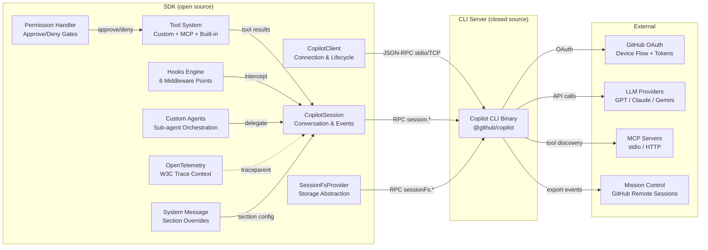

# GitHub Copilot SDK — Reversed Specification

**Source**: `refs/copilot/` (`github/copilot-sdk` @ `25b15be`, MIT License)
**Method**: MIAT Reverse Engineering (miatdiagram skill)
**Date**: 2026-05-18
**Purpose**: Upstream reference for OpenCMS copilot provider alignment

## Module Architecture

The Copilot SDK is a **client-side orchestration library** that connects to a **Copilot CLI server** (closed-source binary) via JSON-RPC 2.0. The SDK itself does NOT contain the AI model routing or OAuth device flow — those live in the server. The SDK exposes session management, tool orchestration, hooks, and event streaming.

### Block Diagram (Peer Modules)



### Stack Diagram (Layered Dependencies)

```
┌─────────────────────────────────────────────────────┐
│  Application Layer (user code)                       │
│  - createSession / sendAndWait / on(event)          │
│  - defineTool / registerHooks / approveAll          │
├─────────────────────────────────────────────────────┤
│  SDK Public API (nodejs/src/index.ts)               │
│  - CopilotClient, CopilotSession, defineTool       │
│  - 90+ exported types                               │
├─────────────────────────────────────────────────────┤
│  Session Layer (session.ts)                          │
│  - Event dispatch, tool execution, hook invocation  │
│  - Permission gating, elicitation, plan management  │
├─────────────────────────────────────────────────────┤
│  Client Layer (client.ts)                            │
│  - CLI spawn/connect, protocol negotiation          │
│  - Session CRUD, model listing, MCP config          │
├─────────────────────────────────────────────────────┤
│  Transport (vscode-jsonrpc)                          │
│  - Stdio pipes / TCP socket                         │
│  - Content-Length framing                           │
├─────────────────────────────────────────────────────┤
│  CLI Server (@github/copilot binary)                │
│  - Auth, LLM routing, tool execution, compaction   │
└─────────────────────────────────────────────────────┘
```

## Functional Purposes (IDEF0 Models)

| # | A0 Title | Scope | Chapter |
|---|----------|-------|---------|
| 1 | Manage CLI Connection Lifecycle | Spawn, connect, negotiate, disconnect | `idef0.01.json` |
| 2 | Orchestrate Conversation Session | Create, send, stream, resume, compact | `idef0.02.json` |
| 3 | Execute Tool Requests | Custom tools, MCP, permissions, hooks | `idef0.03.json` |
| 4 | Authenticate and Authorize | OAuth, BYOK, env vars, token exchange | `idef0.04.json` |
| 5 | Stream and Dispatch Events | 40+ event types, delta accumulation | `idef0.05.json` |

## File Index

```
README.md                          — this file
chapters/
  idef0.01.json                    — A0: Manage CLI Connection Lifecycle
  idef0.02.json                    — A0: Orchestrate Conversation Session
  idef0.03.json                    — A0: Execute Tool Requests
  idef0.04.json                    — A0: Authenticate and Authorize
  idef0.05.json                    — A0: Stream and Dispatch Events
  grafcet.01.json                  — Runtime: Connection lifecycle
  grafcet.02.json                  — Runtime: Session agent loop
  grafcet.03.json                  — Runtime: Tool execution flow
  grafcet.04.json                  — Runtime: Auth flow
  grafcet.05.json                  — Runtime: Event streaming
  protocol-datasheets.md           — JSON-RPC methods, OAuth endpoints, event envelope
  traceability.md                  — Evidence matrix + open questions
```
