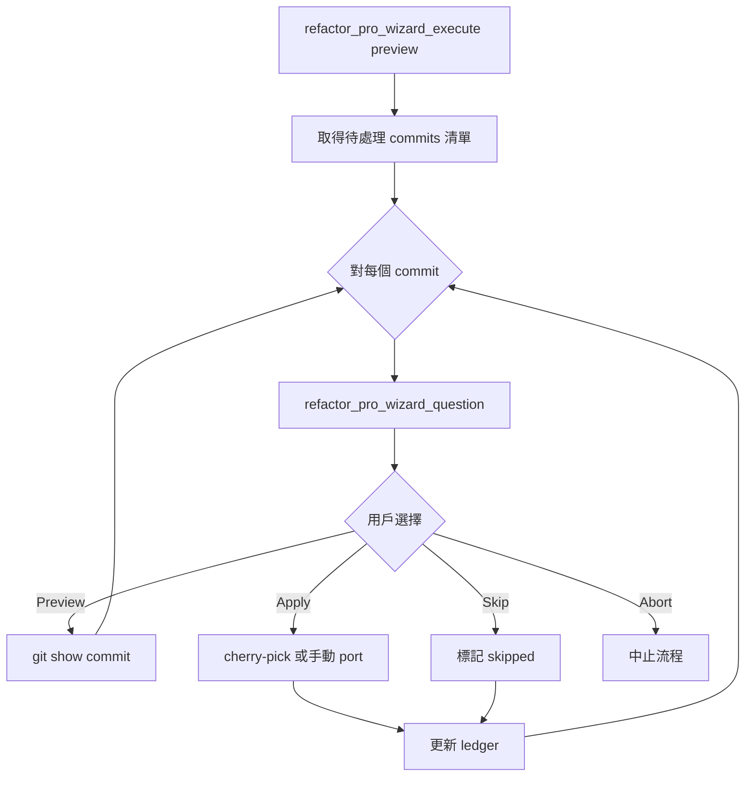

# Refactor Pro MCP Server

**Version**: 0.2.0  
**Script**: `scripts/refactor-pro-mcp.ts`  
**npm script**: `bun mcp:refactor-pro`

## Overview

Refactor Pro 是 refacting-merger 的進化版，新增**互動式精靈模式**，可在分析評估後，以問答導引方式協助使用者逐一重構 commits。

## 核心差異

| Feature             | refactor-pro (v0.2.0) | refacting-merger (v0.1.0) |
| ------------------- | --------------------- | ------------------------- |
| 分析 & 評分         | ✅                    | ✅                        |
| 產生計畫            | ✅                    | ✅                        |
| 更新 Ledger         | ✅                    | ✅                        |
| **互動式執行**      | ✅ **NEW**            | ❌                        |
| **問答導引**        | ✅ **NEW**            | ❌                        |
| agent-workflow 整合 | ✅ **NEW**            | ❌                        |

_(refacting-merger v0.1.0 已棄用)_

## 工具列表

### 1. 分析工具 (Analysis)

#### `refactor_pro_daily_delta`

分析 origin/dev vs HEAD 的 commit 差異。

**輸入**:

```json
{
  "sourceRemote": "origin",
  "sourceBranch": "dev",
  "targetRef": "HEAD",
  "ledgerPath": "docs/events/refactor_processed_commits_20260210.md"
}
```

**輸出**: CommitAnalysis[] (hash, subject, files, risk, logicalType, valueScore, defaultDecision)

---

### 2. 規劃工具 (Planning)

#### `refactor_pro_generate_plan`

產生 refactor plan markdown。

**輸入**:

```json
{
  "topic": "origin_dev_delta_round4",
  "outputPath": "docs/events/refactor_plan_20260210_round4.md",
  "ledgerPath": "docs/events/refactor_processed_commits_20260210.md"
}
```

---

### 3. 記錄工具 (Ledger)

#### `refactor_pro_update_ledger`

更新 commit ledger。

**輸入**:

```json
{
  "ledgerPath": "docs/events/refactor_processed_commits_20260210.md",
  "roundTitle": "Round 4 - wizard execution",
  "entries": [
    {
      "upstream": "4a73d51acd6cc2610fa962a424a6d7049520f560",
      "status": "integrated",
      "localCommit": "abc1234",
      "note": "workspace reset fix applied via cherry-pick"
    }
  ]
}
```

---

### 4. **NEW: 互動式精靈工具**

#### `refactor_pro_wizard_execute`

**核心新功能**：啟動互動式重構精靈。

**模式**:

- `preview`: 乾跑模式，列出待處理 commits，不實際修改
- `execute`: 執行模式，逐一引導用戶重構

**輸入**:

```json
{
  "planPath": "docs/events/refactor_plan_20260210_round4.md",
  "ledgerPath": "docs/events/refactor_processed_commits_20260210.md",
  "mode": "preview",
  "commitHash": "4a73d51" // optional: 只處理特定 commit
}
```

**輸出**:

```json
{
  "planPath": "/abs/path/to/plan.md",
  "ledgerPath": "...",
  "mode": "preview",
  "totalCommits": 8,
  "commits": [
    { "hash": "4a73d51", "action": "integrated" },
    { "hash": "83853cc", "action": "integrated" }
  ],
  "nextSteps": [
    "1. Agent should load agent-workflow skill",
    "2. For each commit, use refactor_pro_wizard_question to ask user",
    "3. If user chooses 'Apply', execute git cherry-pick or manual port",
    "4. Update ledger with local commit hash"
  ]
}
```

---

#### `refactor_pro_wizard_question`

**核心新功能**：向使用者提出選擇問題。

**輸入**:

```json
{
  "question": "如何處理 commit 4a73d51 (fix: workspace reset)?",
  "context": "Risk: medium, Files: packages/opencode/src/worktree/index.ts",
  "options": [
    {
      "label": "預覽 Diff",
      "value": "preview",
      "description": "使用 git show 查看變更"
    },
    {
      "label": "直接套用",
      "value": "apply",
      "description": "執行 cherry-pick 或手動 port"
    },
    {
      "label": "跳過",
      "value": "skip",
      "description": "標記為 skipped，不處理"
    },
    {
      "label": "中止",
      "value": "abort",
      "description": "停止整個精靈流程"
    }
  ],
  "defaultOption": "preview"
}
```

**使用方式**:
Agent 應該調用 `agent-workflow` skill，使用 Question tool 將選項呈現給用戶。

---

### 5. 輔助工具

#### `refactor_pro_skill_index`

列出 `.opencode/skills` 中的 skills。

#### `refactor_pro_skill_read`

讀取特定 skill 的 SKILL.md 與 references。

#### `refactor_pro_wizard_hint`

依據 phase (analysis/planning/approval/execution/ledger) 回傳下一步提示。

---

## 典型工作流程

### Phase 1-3: 與原 refacting-merger 相同

1. **Analysis**: `refactor_pro_daily_delta`
2. **Planning**: `refactor_pro_generate_plan`
3. **Approval**: 向用戶呈報計畫

### Phase 4: **NEW 互動式執行**



### Phase 5: 記錄

執行完畢後，呼叫 `refactor_pro_update_ledger` 批次寫入所有已處理的 commits。

---

## 與 agent-workflow 整合

Agent 應在 execution phase 載入 `agent-workflow` skill，遵循以下狀態機：

1. **ANALYSIS** → 禁止寫入，僅分析
2. **PLANNING** → 產生計畫文件
3. **WAITING_APPROVAL** → 等待用戶確認
4. **EXECUTION** → 使用 `refactor_pro_wizard_question` 逐一引導
5. **LEDGER** → 批次更新 ledger

---

## 範例對話

**User**: 請執行 refactor plan round4

**Agent**:

1. 呼叫 `refactor_pro_wizard_execute` (preview mode)
2. 發現 8 個 commits 待處理
3. 載入 `agent-workflow` skill
4. 對第一個 commit `4a73d51`，呼叫 `refactor_pro_wizard_question`:
   - Question: "如何處理 commit 4a73d51 (fix: workspace reset)?"
   - Options: [Preview Diff / Apply / Skip / Abort]
5. 用戶選擇 "Preview Diff"
6. Agent 執行 `git show 4a73d51`
7. 用戶看完後選擇 "Apply"
8. Agent 執行 `git cherry-pick 4a73d51` 或手動 port
9. 更新 ledger entry: `{ upstream: "4a73d51", status: "integrated", localCommit: "abc1234" }`
10. 繼續下一個 commit

---

## 環境變數

- `REFACTOR_PRO_ROOT`: 專案根目錄 (預設: `process.cwd()`)

---

## 與舊版相容性

`refacting-merger` (v0.1.0) 已正式棄用並移除，請全面遷移至 `refactor-pro`。

---

**最後更新**: 2026-02-10
